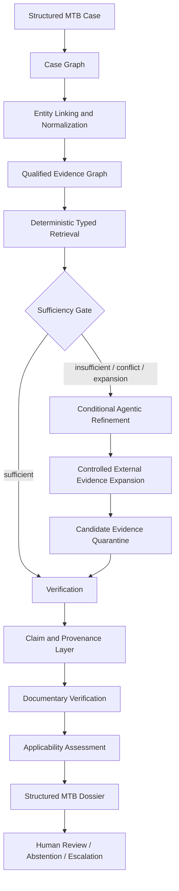
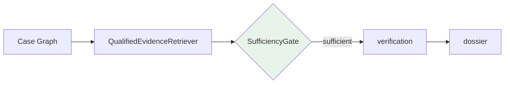
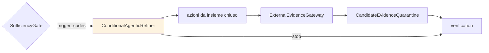
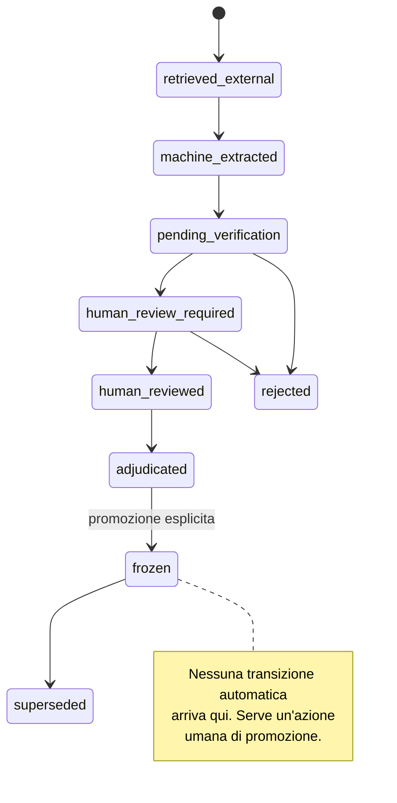
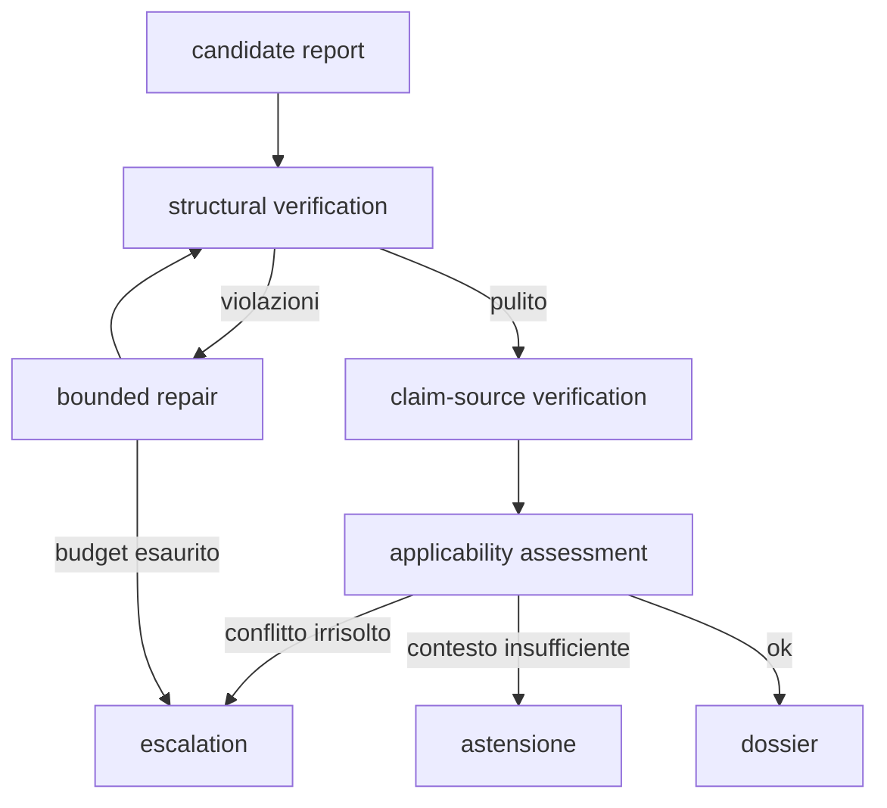
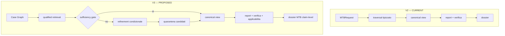

# MTB-GraphRAG V3 — specifica architetturale

**Stato: specifica congelata, non implementata.** Baseline V2 al commit `03aa927`,
branch `feat/model-selection-and-pilot-evaluation`.

Ogni componente è etichettato:

| Etichetta | Significato |
| --- | --- |
| **CURRENT** | esiste oggi nel repository, verificato leggendo il file |
| **REUSED** | esiste e la V3 lo usa senza modificarlo |
| **EXTENDED** | esiste e la V3 ne amplia il contratto |
| **NEW** | **proposto**, non esiste ancora |
| **OUT OF SCOPE** | esplicitamente fuori dalla V3 iniziale |

I nomi marcati NEW sono proposte. Possono essere adattati ai pattern del repository, ma
ogni variazione va motivata.

---

## 1. Mappa dei componenti V2 reali

Verificata leggendo i file, non dedotta.

| Componente | File | Responsabilità | V3 |
| --- | --- | --- | --- |
| `run_verified_pipeline` | `backend/pipeline/control/runner.py:112` | orchestratore condiviso: raccolta → replay → proiezione → report → verifica → repair → dossier | **REUSED** — resta il punto d'ingresso unico |
| `PipelineResult` | `control/runner.py:59` | esito completo di una run | **EXTENDED** — aggiunge decisione del gate e statement |
| `FixedPlanStrategy` | `control/strategies/fixed_plan.py` | piano tipizzato dichiarato, 0 chiamate al planner | **REUSED** — resta il percorso principale |
| `AgenticPlanStrategy` | `control/strategies/agentic_plan.py` | planner LLM in plan–act–observe | **EXTENDED** — attivazione condizionata dal gate |
| `CollectionStrategy` / `CollectionOutcome` | `control/strategies/protocol.py:18,27,46` | contratto della sola fase di raccolta | **REUSED** |
| `build_run` | `backend/comparison/live_runs.py:58` | sceglie la strategia e chiama la pipeline | **EXTENDED** |
| `default_tools` | `live_runs.py:40` | registry degli strumenti tipizzati | **EXTENDED** — nuove azioni di refinement |
| `EventLedger` | `backend/pipeline/agentic/ledger.py` | ledger append-only con catena di hash | **REUSED** |
| `ActionRecorder` | `control/recorder.py:21` | unico scrittore del ledger | **REUSED** |
| `replay_to_canonical_view` | `control/replay.py:47` | ricostruisce la vista canonica dagli eventi | **REUSED** |
| `CanonicalView` / `CanonicalRecord` | `control/contracts.py:186,206` | record deduplicati con osservazioni e conflitti | **EXTENDED** |
| `identity_key` / `canonical_record_id` | `control/canonical.py:108` | identità e deduplica dei record | **REUSED** |
| `OriginalClaim` / `ProvenanceRef` / `ConflictAnnotation` | `control/contracts.py:135,147,160` | claim con provenienza e conflitti | **EXTENDED** |
| `project_for_case` | `control/projection.py:79` | filtra i record ammessi per il caso | **EXTENDED** |
| `claim_grammar` | `control/claim_grammar.py` | testo, chiave, citazioni, presenza di una claim | **REUSED** |
| `render_candidate` | `control/rendering/candidate.py:16` | report candidato deterministico | **EXTENDED** |
| `TextStructuralVerifier` | `control/verification/structural_text.py` | verifica strutturale del testo | **REUSED** |
| `SourceVerifierPort` / `PubMedSourceVerifier` | `control/verification/source_port.py:72,80` | verifica claim ↔ fonte | **EXTENDED** |
| `DossierInvariantVerifier` | `control/verification/dossier_invariants.py:33` | invarianti del dossier | **EXTENDED** |
| `applicability_validator` | `backend/pipeline/agentic/applicability_validator.py` | validazione dell'applicabilità | **EXTENDED** |
| `RepairPlanner` / `execute_repair` / `escalation_for` | `control/repair.py:36,148,165` | repair limitato ed escalation | **REUSED** |
| `build_metrics` | `control/metrics.py:37` | metriche per run | **EXTENDED** |
| `SourceClinicalProfile` | `benchmarks/.../evaluation/contracts.py` | qualificatori clinici annotati a mano, 8 profili | **REUSED** — è già il Clinical Qualification Layer in forma embrionale |
| snapshot fingerprint | `benchmarks/.../pilot/audit_lib/snapshot.py` | identità riproducibile del grafo | **REUSED** |
| clinical/snapshot gold | `benchmarks/.../evaluation/{clinical,snapshot}_gold.py` | separazione dei due gold | **REUSED** |
| loss decomposition | `benchmarks/.../evaluation/loss_decomposition.py` | undici stati mutuamente esclusivi | **EXTENDED** |
| `run_identity` | `benchmarks/.../model_selection/run_identity.py` | `run_key` a tredici componenti, resume | **REUSED** |

**Non esiste oggi** un layer di rappresentazione dell'evidenza distinto dai record del
grafo, né un oggetto caso tipizzato, né un gate fra retrieval e refinement. Sono i tre
buchi che la V3 riempie.

## 2. Flusso V3

### Percorso deterministico — il principale

Zero chiamate al planner. È il percorso che il pilota V2 ha misurato a **2,1 s mediani**.

### Percorso agentico — condizionale

Si attiva **solo** dopo una decisione esplicita del gate, che registra trigger e obiettivo.

### Ciclo di vita dell'evidenza

### Ciclo di verifica

### V2 contro V3

## 3. Layer: responsabilità, contratti, errori

### 3.1 `CaseGraphBuilder` — **NEW**

| | |
| --- | --- |
| **Input** | richiesta strutturata o record clinico de-identificato |
| **Output** | `CaseGraph` conforme a `schemas/case_graph.schema.json` |
| **Invarianti** | ogni campo assente è `unknown` esplicito, mai inferito; nessun dato identificativo |
| **Dipendenze** | nessuna sul grafo: il Case Graph descrive il paziente, non la conoscenza |
| **Errore** | campo obbligatorio mancante → costruzione fallita, non valore inventato |
| **LLM** | **no**. Se in futuro servisse estrazione da testo libero, produce candidati con `review_status` = `machine_extracted` |

Sostituisce `CaseContext.from_request` (**CURRENT**, `control/contracts.py:54`) come
sorgente di verità, ma `CaseContext` resta l'adattatore verso gli strumenti esistenti.

### 3.2 Entity Linking and Normalization — **EXTENDED**

Riusa la normalizzazione già validata dall'audit (`pilot/audit_lib/normalize.py`,
`aliases.py`, `disease.py`), che impone i tre divieti: nessuna regola può fondere malattie
distinte, mutazione singola e composta, fusione e alterazione generica.

**Errore:** un identificatore non risolvibile resta non risolto e viene marcato, mai
sostituito con il più vicino.

### 3.3 `EvidenceStatementRepository` — **NEW**

| | |
| --- | --- |
| **Input** | record del grafo, profili clinici, candidati esterni |
| **Output** | `EvidenceStatement` con provenienza |
| **Invarianti** | ogni statement ha ≥1 `source_reference` strutturato; `review_status` non può salire a `frozen` senza promozione esplicita |
| **Errore** | statement non validabile contro lo schema → respinto, registrato, non riparato in silenzio |

### 3.4 `ClinicalQualificationLayer` — **NEW** (assorbe `SourceClinicalProfile` **REUSED**)

Confronta `CaseGraph` ↔ `EvidenceStatement.clinical_context` e produce un
**applicability comparison contract** (§ V3_EVIDENCE_MODEL).

**Confine deterministico/LLM:** il confronto è **deterministico**. Un modello può proporre
l'estrazione dei qualificatori da testo, mai il verdetto.

### 3.5 `QualifiedEvidenceRetriever` — **EXTENDED**

Estende il traversal tipizzato attuale (`backend/pipeline/cypher.py` **CURRENT**) con
filtri sulle dimensioni cliniche. **È il primo passo del flusso e non è saltabile.**

**Errore:** backend irraggiungibile → `backend_failure`, **non** astensione clinica. È
l'errore che il pilota ha commesso davvero: con Neo4j giù, N1 risultava
`correctly_abstained` per il motivo sbagliato.

### 3.6 `SufficiencyGate` — **NEW**

Vedi §6 e `schemas/sufficiency_decision.schema.json`. **Prevalentemente rule-based.** Un
LLM può fornire un segnale ausiliario, mai essere l'unico decisore.

### 3.7 `ConditionalAgenticRefiner` — **EXTENDED**

Avvolge `AgenticPlanStrategy` (**CURRENT**). Riceve trigger e obiettivi dal gate, un
insieme chiuso di azioni, limiti di costo e profondità.

**Non riceve mai:** clinical gold, claim attese, terapie attese, fonti attese, etichette
metriche, decisioni di audit, risultati held-out. Il controllo anti-fuga esiste già
(`model_selection/roles.py`, `assert_no_leakage`) ed è **REUSED**.

### 3.8 `ExternalEvidenceGateway` + `CandidateEvidenceQuarantine` — **NEW**

Vedi §8. **Nessun import automatico nella V3 iniziale.**

### 3.9 Claim, verifica, applicabilità — **REUSED / EXTENDED**

Interamente il backbone V2: `claim_grammar`, `TextStructuralVerifier`,
`SourceVerifierPort`, `applicability_validator`, `repair`, `escalation_for`.

### 3.10 `MTBDossierRenderer` — **EXTENDED**

Estende `render_candidate` e `DossierInvariantVerifier`. Vedi §9.

## 4. Invarianti V3

| # | Invariante | Dove si applica |
| --- | --- | --- |
| 1 | Ogni claim finale deriva da ≥1 `EvidenceStatement` | claim layer |
| 2 | Ogni `EvidenceStatement` ha provenienza esplicita | repository |
| 3 | Ogni fonte è un oggetto, non una stringa `citation_id` | schema |
| 4 | `documentary_status` e `applicability_status` restano separati | qualification |
| 5 | Il planner non può modificare il KG | tool registry |
| 6 | Il planner non può modificare il clinical gold | leakage guard |
| 7 | Il planner non può promuovere evidenza esterna a revisionata | quarantine |
| 8 | Il retrieval deterministico precede sempre il refinement | flusso |
| 9 | L'agente si attiva solo dopo decisione esplicita del gate | gate |
| 10 | Ogni attivazione registra trigger e obiettivo | ledger |
| 11 | L'evidenza esterna resta separata da quella congelata | quarantine |
| 12 | I risultati esterni non revisionati sono marcati come candidati | schema |
| 13 | Nessuna claim non verificata è presentata come consolidata | dossier |
| 14 | Conflitto irrisolto → escalation o astensione | verification |
| 15 | **Insufficienza di contesto ≠ non applicabilità** | qualification |
| 16 | **Assenza dal KG ≠ assenza di evidenza nel mondo** | dossier |
| 17 | **Backend irraggiungibile ≠ astensione valida** | retrieval |
| 18 | Il dossier conserva snapshot, tool path, claim, fonti, verdetti | dossier |
| 19 | Ogni campo clinico mancante resta `unknown` esplicito | case graph |
| 20 | La narrazione LLM non può alterare il significato del report verificato | rendering |

Gli invarianti 15, 16 e 17 nascono da errori osservati: il 17 è quello in cui sono
incorso sviluppando il runner del pilota.

## 5. Confini deterministico / LLM

| Componente | Deterministico | LLM ammesso | Vincolo |
| --- | --- | --- | --- |
| Case Graph | ✅ | ❌ | nessuna inferenza sui campi clinici |
| Normalizzazione | ✅ | ❌ | alias controllati, divieti di fusione |
| Retrieval tipizzato | ✅ | ❌ | Cypher parametrizzato |
| Sufficiency gate | ✅ | segnale ausiliario | mai unico decisore |
| Refinement | ❌ | ✅ | insieme chiuso di azioni, budget |
| Verifica strutturale | ✅ | ❌ | — |
| Verifica claim-fonte | parziale | ✅ | output tipizzato, schema validato |
| Applicabilità | ✅ | proposta di estrazione | verdetto deterministico |
| Rendering | ✅ | narrazione opzionale | non può cambiare il significato |

## 6. Punti di revisione umana

1. promozione di un candidato esterno a evidenza revisionata (**obbligatoria**);
2. escalation per conflitto irrisolto;
3. astensione per contesto clinico insufficiente;
4. `human_review_required` dal contratto di applicabilità;
5. seconda revisione indipendente del gold (già prevista, ancora aperta).

## 7. Versionamento e provenienza

Ogni artefatto porta: `snapshot_fingerprint`, `schema_version`, `statement_version`,
`case_version`, `rule_version` del gate, `model_revision`, `prompt_version`, `run_key`.

`run_key` (**REUSED**, tredici componenti) resta il meccanismo di identità e resume.

## 8. Criteri di astensione

| Condizione | Esito |
| --- | --- |
| traversal vuoto su grafo raggiungibile e verificato | **astensione valida** |
| traversal vuoto con backend irraggiungibile | **errore tecnico**, non astensione |
| contesto clinico insufficiente | `insufficient_case_context`, non `not_compatible` |
| conflitto irrisolto | escalation |
| solo candidati esterni non revisionati | astensione + sezione candidati marcata |

## 9. Roadmap implementativa

Ordine vincolante. Nessuna fase inizia prima del criterio di completamento della precedente.

| # | Fase | Componenti | Input → Output | Test | Rischio | Completamento | Rollback |
| --- | --- | --- | --- | --- | --- | --- | --- |
| 1 | Freeze V2 | tag su `03aa927` | — | suite offline verde | basso | tag creato, risultati archiviati | — |
| 2 | Schema contract | 3 JSON Schema | — → schemi | validazione + esempi | basso | esempi validano | eliminare schemi |
| 3 | Adapter V2→EvidenceStatement | `EvidenceStatementRepository` | record canonici → statement | round-trip, nessuna perdita | **medio** | copertura ≥95% dei record V2 | adapter disattivabile |
| 4 | Materializzazione fonti revisionate | profili → `source_references` | 8 profili → statement | i qualificatori dei profili sopravvivono | basso | 8/8 mappati | — |
| 5 | Case Graph builder | `CaseGraphBuilder` | richiesta → CaseGraph | i 4 casi costruiscono | basso | 4/4 | usare `CaseContext` |
| 6 | Qualified retrieval | `QualifiedEvidenceRetriever` | CaseGraph → statement | recall ≥ V2 sui 4 casi | **alto** | nessuna regressione | traversal V2 |
| 7 | Applicability deterministica | `ClinicalQualificationLayer` | caso+statement → contratto | i 3 stati di C1 corretti | **alto** | `applicability_status_accuracy` > 0 | validator V2 |
| 8 | Sufficiency gate | `SufficiencyGate` | retrieval → decisione | trigger sui 4 casi | medio | decisione riproducibile | gate sempre "sufficient" |
| 9 | Refinement condizionale | `ConditionalAgenticRefiner` | trigger → azioni | attivazione solo su trigger | medio | 0 attivazioni non richieste | disattivare |
| 10 | Quarantena esterna | `ExternalEvidenceGateway` | query → candidati | nessun import automatico | **alto** | 0 promozioni automatiche | disattivare gateway |
| 11 | Dossier V3 | `MTBDossierRenderer` | verifica → dossier | invarianti rispettati | basso | 15 sezioni presenti | renderer V2 |
| 12 | Development evaluation | — | 4 casi | protocollo V3 | basso | 4 bracci eseguiti | — |
| 13 | Validation cases | — | ≥8 nuovi casi | doppia annotazione | **alto** | adjudication completa | — |
| 14 | **Freeze V3** | — | — | protocollo congelato | — | tag + fingerprint | — |
| 15 | Held-out evaluation | — | 4–8 casi | una sola esecuzione | — | risultati riportati comunque | — |

**Il freeze alla fase 14 precede la valutazione held-out.** Guardare i risultati held-out
prima del freeze li consumerebbe, esattamente come è stato per i quattro casi development
rispetto alla selezione del modello.

## Open Decisions

| # | Decisione | Tipo | Note |
| --- | --- | --- | --- |
| A1 | Se `CaseGraph` sostituisce o affianca `CaseContext` | **necessaria prima dell'implementazione** | sostituirlo tocca ogni strumento |
| A2 | Se `EvidenceStatement` è materializzato nel KG o resta un layer di lettura | **necessaria** | materializzarlo richiede migrazione, fuori scope V3 iniziale |
| A3 | Se il sufficiency gate vive dentro `run_verified_pipeline` o prima | **necessaria** | dentro preserva il ledger; prima è più semplice |
| A4 | Soglia di attivazione agentica | ingegneristica + calibrazione | non calibrabile su 4 casi |
| A5 | Come rappresentare i regimi di combinazione | **richiede revisione clinica** | `KNOWN_INTERVENTIONS` attuale è una lista chiusa di 41 farmaci |
| A6 | Chi possiede la promozione dei candidati esterni | **richiede revisione clinica** | è un'azione con responsabilità clinica |
| A7 | Se il refinement può richiedere contesto clinico mancante all'utente | **rimandabile** | introduce interazione, cambia il modello d'uso |
