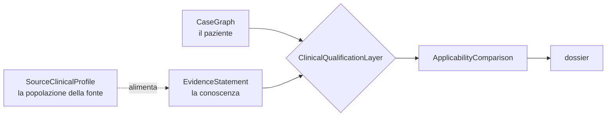

# MTB-GraphRAG V3 — modello dell'evidenza

**Specifica congelata, non implementata.** Schemi in `schemas/`, esempi in
`schemas/examples/`.

---

## 1. I tre oggetti e come si parlano

| Oggetto | Descrive | Stato |
| --- | --- | --- |
| **CaseGraph** | il paziente | **NEW** |
| **EvidenceStatement** | la conoscenza | **NEW** |
| **SourceClinicalProfile** | la popolazione di una fonte | **CURRENT**, 8 profili annotati a mano |



## 2. Chi possiede quale dato

Il rischio da evitare è duplicare `population`, `setting`, `therapy_line` in tre posti e
non sapere più quale sia autoritativo.

| Dato | Livello | Autoritativo | Note |
| --- | --- | --- | --- |
| popolazione dello studio | **source** | `SourceClinicalProfile` | annotato a mano, una volta per fonte |
| criteri di inclusione/esclusione | **source** | `SourceClinicalProfile` | idem |
| setting, stadio, linea della *proposizione* | **statement** | `EvidenceStatement.clinical_context` | può essere più stretto della fonte |
| direzione, biomarcatore, intervento | **statement** | `EvidenceStatement` | — |
| livello di evidenza | **statement** | `EvidenceStatement.evidence_level` | valore originale sempre preservato |
| stadio, setting, linea del *paziente* | **case** | `CaseGraph` | — |
| terapie precedenti del paziente | **case** | `CaseGraph.prior_therapies` | — |
| esito del confronto | **derived** | `ApplicabilityComparison` | ricalcolabile, mai memorizzato come verità |
| risoluzione di un conflitto | **reviewer-assigned** | `Conflict.resolution` | richiede un umano |

**Regola di non duplicazione.** `EvidenceStatement.clinical_context` **non copia** il
profilo della fonte: lo referenzia tramite `source_references[].source_id` e ne
restringe i campi solo quando la proposizione è più specifica dello studio. Un campo
identico al profilo si lascia a `unknown` e si legge dal profilo.

## 3. Perché non basta la coppia variante-farmaco

Nel KG V2 un'evidenza è un nodo con `significance`, `disease` come testo libero e
`citation_id` come array di stringhe. Mancano — misurato, non supposto — **tutti** i 24
qualificatori del pilota: setting, linea, stadio, resezione, esposizione precedente.

Tre conseguenze osservate:

1. **C1** — il grafo copre bene ADAURA (adiuvante) e AURA3 (T790M) e non copre FLAURA,
   l'unica fonte applicabile a un paziente in prima linea. Senza `clinical_context` non
   c'è modo di dirlo dentro il modello.
2. **K1** — l'evidenza pemigatinib è annotata su `Cholangiolocellular Carcinoma`. Senza
   `DiseaseConcept.specificity` e `parent_concept`, sottotipo e categoria si confondono.
3. **A2** — tre profili contengono G1202R, uno dei quali è una mutazione composta. Senza
   `Biomarker.is_compound` la distinzione vive solo in un'euristica sul nome.

## 4. Direzione e ambito: due assi, non uno

`direction` dice **il verso** (sensitivity, resistance, lack_of_benefit…).
`evidence_scope` dice **il tipo di affermazione** (therapeutic, diagnostic, prognostic…).

`predictive` **non sostituisce** sensitivity o resistance: dice che il biomarcatore
predice l'esito di un trattamento, non in quale verso. Collassare i due assi renderebbe
indistinguibile «predice risposta» da «predice mancata risposta».

## 5. Livelli di evidenza: preservare, non convertire

```json
{"system": "oncokb", "original_value": "LEVEL_1",
 "normalized_tier": "tier_1", "provenance": "assegnato dalla knowledge base"}
```

Quattro vincoli:

1. `original_value` è **sempre** preservato;
2. `system` dichiara la scala, e più scale coesistono;
3. `normalized_tier` è una lettura interna, non un'equivalenza dichiarata;
4. `not_mapped` è un valore legittimo — **meglio non mappato che mappato male**.

Il KG V2 mescola già scale diverse nello stesso campo: `evidence_level` contiene sia
`A`/`B` (CIViC) sia `LEVEL_1`/`LEVEL_2` (OncoKB), e `ORDER BY evidence_level` li ordina
lessicalmente. È il difetto che questa struttura elimina.

**Open decision E1:** quale tassonomia adottare come `normalized_tier`. Richiede
revisione clinica e verifica bibliografica.

## 6. Applicability comparison contract

Il confronto è **deterministico**. Un modello può proporre l'estrazione dei
qualificatori; il verdetto no.

```
ApplicabilityComparison
├── compared_dimensions[]        quali dimensioni sono state confrontate
├── matches[]                    dimensioni concordi
├── mismatches[]                 dimensioni discordi
├── unknown_case_fields[]        ignoto lato paziente
├── unknown_source_fields[]      ignoto lato fonte
├── blocking_mismatches[]        discordanze che impediscono l'applicabilità
├── non_blocking_mismatches[]    discordanze che non la impediscono
├── documentary_status           la fonte sostiene ciò che afferma?
├── applicability_status         riguarda questo paziente?
├── rationale_codes[]            motivi codificati, non prosa
├── supporting_sources[]         fonti che sostengono il verdetto
└── human_review_required        booleano
```

### Stati ammessi

| Stato | Significato |
| --- | --- |
| `compatible` | nessuna discordanza bloccante, nessun campo critico ignoto |
| `partially_compatible` | discordanze non bloccanti |
| `not_compatible` | almeno una discordanza bloccante |
| `insufficient_case_context` | il **paziente** ha campi critici ignoti |
| `insufficient_source_context` | la **fonte** ha campi critici ignoti |
| `conflicting_evidence` | statement contrapposti non risolti |
| `human_review_required` | serve un giudizio umano |
| `not_assessed` | non valutato |

**`insufficient_context` non collassa in `not_compatible`.** «Non sappiamo se si applica»
e «non si applica» portano un clinico a due azioni diverse: la prima a cercare il dato
mancante, la seconda a scartare l'opzione.

Le due dimensioni restano ortogonali:

| | applicabile | non applicabile |
| --- | --- | --- |
| **la fonte sostiene** | evidenza utilizzabile | **fonte valida, altra popolazione** ← ADAURA/AURA3 in C1 |
| **la fonte non sostiene** | claim non supportata | claim non supportata e fuori contesto |

Il pilota V2 misura `compatible_overstatement_rate` = **0.000** (mai presentato come
applicabile ciò che non lo è) ma `applicability_status_accuracy` = **0.000**: non emette
il giudizio nella forma richiesta. Questo contratto è ciò che colma la differenza.

## 7. Ciclo di vita e promozione

```
retrieved_external → machine_extracted → pending_verification
    → human_review_required → human_reviewed → adjudicated → frozen
                                      ↘ rejected        frozen → superseded
```

`frozen` è raggiungibile **solo** con un oggetto `promotion` in `provenance`
(`promoted_by`, `promoted_at`, `rationale`). Lo schema lo impone e lo script di
validazione lo verifica.

## 8. Catena di provenienza

```
EvidenceStatement → source_reference → source_span → extraction action
    → reviewer → graph import → snapshot fingerprint → retrieval action → report claim
```

Ogni anello è un campo reale dello schema. `presence_in_snapshot` distingue `node`,
`citation_only`, `absent` — la distinzione che l'audit ha reso necessaria: nel caso A2
tutti e tre i PMID attesi esistono **solo** come citazione.

## Open Decisions

| # | Decisione | Tipo | Note |
| --- | --- | --- | --- |
| E1 | Tassonomia per `normalized_tier` | **revisione clinica** + bibliografica | candidate: OncoKB, ESCAT, AMP/ASCO/CAP |
| E2 | Ontologia delle malattie (`oncotree`, `doid`, `ncit`) | **necessaria prima dell'implementazione** | il KG usa `doid` parzialmente |
| E3 | Sistema di normalizzazione delle varianti | **necessaria** | HGVS è lo standard ma il KG usa nomi CIViC |
| E4 | Rappresentazione dei regimi di combinazione | **revisione clinica** | `KNOWN_INTERVENTIONS` è oggi una lista chiusa di 41 farmaci |
| E5 | Fonte autoritativa del `regulatory_context` | **revisione clinica** | dipende dalla giurisdizione |
| E6 | Quali campi del caso sono *critici* per `insufficient_case_context` | **revisione clinica** | determina quando il sistema si astiene |
| E7 | Quali discordanze sono *bloccanti* | **revisione clinica** | setting probabilmente sì, ECOG probabilmente no |
| E8 | Se `EvidenceStatement` è materializzato nel KG o è un layer di lettura | **necessaria** | materializzarlo richiede migrazione |
| E9 | Chi possiede la promozione a `frozen` | **revisione clinica** | è un'azione con responsabilità clinica |
