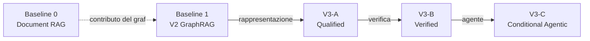

# MTB-GraphRAG V3 — protocollo sperimentale

**Congelato prima dell'implementazione.** Baseline V2 al commit `03aa927`.

---

## 1. Principio di attribuzione

Ogni braccio aggiunge **un solo gruppo di componenti** al precedente. Cambiare più cose
insieme produrrebbe una differenza non interpretabile: si saprebbe che V3 fa meglio di
V2, non *quale parte* lo fa.

| Confronto | Attribuisce | Componenti isolati |
| --- | --- | --- |
| B0 → B1 | contributo del grafo | traversal contro retrieval testuale |
| B1 → V3-A | **rappresentazione e retrieval** | CaseGraph, EvidenceStatement, retrieval qualificato |
| V3-A → V3-B | **verifica e qualificazione** | verifica documentale, applicabilità, dossier |
| V3-B → V3-C | **refinement agentico ed espansione** | sufficiency gate, agente condizionale, evidenza esterna |

## 2. Bracci

### Baseline 0 — Document RAG (**non implementato in questa fase**)

Misura quanto del risultato viene dal grafo e quanto dalle fonti.

| Elemento | Specifica |
| --- | --- |
| Corpus | gli abstract delle fonti citate dal clinical gold, più i profili clinici. Nessuna fonte che il grafo non abbia |
| Chunking | 512 token, overlap 64 |
| Retriever | denso + BM25, ibrido |
| Reranking | cross-encoder, top-k = 10 |
| Prompt | identico al braccio `free_llm_summary` dell'ablation V2 |
| Output | sintesi libera con citazioni |
| Metriche | stesse di report fidelity e applicability |

**Fairness constraint.** Stesse fonti, stesso modello, stesso budget di contesto, stessi
seed. Se B0 avesse accesso a fonti che il grafo non ha, misurerebbe la copertura del
corpus e non l'architettura.

### Baseline 1 — V2 GraphRAG (**già eseguita**)

Snapshot `ffc97bc7…`, traversal e report correnti. 24 run, 0 fallimenti. I risultati
esistono e **non vanno rieseguiti né reinterpretati**.

### V3-A — Qualified GraphRAG
CaseGraph, EvidenceStatement, Clinical Qualification Layer, retrieval tipizzato
qualificato, report strutturato. **Nessun refinement agentico, nessuna verifica.**

### V3-B — Verified Qualified GraphRAG
V3-A + verifica documentale, applicabilità, SourceClinicalProfile, dossier verificato,
escalation e astensione.

### V3-C — Conditional Agentic MTB-GraphRAG
V3-B + sufficiency gate, refinement condizionale, evidence expansion controllata.

## 3. Ablazioni

| # | Ablazione | Isola |
| --- | --- | --- |
| 1 | senza EvidenceStatement (record grezzi) | il layer di rappresentazione |
| 2 | senza qualificatori clinici | `clinical_context` |
| 3 | senza SourceClinicalProfile | i profili annotati a mano |
| 4 | senza source verification | la verifica documentale |
| 5 | senza applicability assessment | il confronto caso ↔ fonte |
| 6 | **agente sempre attivo** | il costo dell'attivazione incondizionata |
| 7 | **agente condizionale** | il beneficio del gate |
| 8 | senza external evidence expansion | l'espansione esterna |
| 9-11 | free / structured / verified report | il modo di riportare |

Le ablazioni 6 e 7 sono la coppia che risponde a RQ5. Il pilota V2 mostra perché serve:
sui quattro casi il planner sempre attivo ha riordinato gli strumenti senza cambiare il
retrieval, costando 5 chiamate e 10,1 s contro 2,1 s.

## 4. Research questions

| RQ | Domanda | Bracci | Metriche primarie |
| --- | --- | --- | --- |
| **RQ1** | Una rappresentazione evidence-centric e clinicamente qualificata migliora precisione e copertura rispetto al KG V2? | B1 vs V3-A | EvidenceStatement coverage, qualifier coverage, therapy/PMID/NCT coverage |
| **RQ2** | Il traversal oncologico tipizzato recupera evidenze più precise di un retriever documentale sugli stessi contenuti? | B0 vs V3-A | therapy/PMID precision-recall-F1, context-filter precision, disease-specificity accuracy |
| **RQ3** | Il reporting strutturato e verificato conserva più evidenza e produce meno claim non supportate della sintesi libera? | ablazioni 9-11 | structural coverage, unsupported claim rate, citation accuracy |
| **RQ4** | CaseGraph + EvidenceStatement + SourceClinicalProfile permettono di distinguere validità documentale e applicabilità? | V3-A vs V3-B | applicability status accuracy, compatible overstatement rate, not-compatible leakage rate |
| **RQ5** | Il refinement condizionale aggiunge evidenza utile nei casi insufficienti senza imporre il costo del planner sugli altri? | ablazioni 6-7, V3-B vs V3-C | gate activation precision/recall, evidence gain after activation, incremental latency e token cost |
| **RQ6** | L'espansione controllata verso fonti esterne migliora la copertura senza ridurre provenance e verificabilità? | ablazione 8, V3-C | external-source yield, provenance completeness, citation accuracy |

RQ3 ha già una risposta parziale dal pilota V2 (`structural_coverage` 1.000 contro 0.325
a retrieval congelato identico). La V3 la riverifica sui nuovi casi.

## 5. Metriche

Le metriche V2 sono **preservate**. Le nuove sono marcate ✚.

**Knowledge representation** — ✚ EvidenceStatement coverage, ✚ disease-context coverage,
✚ therapy-line coverage, ✚ setting coverage, ✚ prior-therapy coverage, ✚ population
coverage, ✚ evidence-direction coverage, source-node coverage, NCT coverage,
✚ identifier normalization accuracy.

**Retrieval** — therapy/PMID/NCT precision-recall-F1, ✚ EvidenceStatement
precision-recall-F1, ✚ context-filter precision, ✚ disease-specificity accuracy,
✚ resistance retrieval accuracy, ✚ compound-mutation accuracy, negative-case accuracy.

**Verification** — citation accuracy, citation coverage, unsupported claim rate,
contradiction rate, documentary status accuracy, ✚ source-span support accuracy,
structural coverage.

**Applicability** — applicability status accuracy, setting accuracy, therapy-line
accuracy, prior-therapy accuracy, ✚ population accuracy, missing-context detection,
compatible overstatement rate, not-compatible leakage rate, human-review routing accuracy.

**Agentic increment** ✚ — gate activation precision, gate activation recall, unnecessary
activation rate, evidence gain after activation, new supported claim gain, conflict
resolution rate, external-source yield, agentic fallback success, incremental latency,
incremental token cost, planner steps, unnecessary tool rate, stop-condition accuracy.

**Dossier** — qualifier preservation, ✚ provenance completeness, ✚ report completeness,
abstention accuracy, ✚ escalation accuracy.

**Non ancora misurabili.** `reviewer-actionability score` richiede una definizione
concordata con revisori clinici prima di poter essere calcolato; `review time` richiede
uno studio separato con revisori umani. Riportarli ora sarebbe inventare un numero.

## 6. Benchmark

| Insieme | Casi | Uso | Stato |
| --- | ---: | --- | --- |
| **Development** | 4 | sviluppo, selezione modello, ablazioni | esistono, già consumati dalla selezione |
| **Validation** | ≥8 | calibrazione delle soglie, confronto fra bracci | **da creare** |
| **Held-out** | 4-8 | valutazione finale, **una sola esecuzione** | **da creare, non guardare prima del freeze** |

I quattro casi correnti **restano development** e non costituiscono un test indipendente:
sono stati usati per scegliere il modello, quindi non possono anche misurarlo.

### Categorie da coprire

evidenza diretta · contesto dipendente · resistenza · compound mutation · combinazione
terapeutica · evidenza conflittuale · trial-only · fonte recente assente dal KG · vero
negativo · contesto clinico insufficiente · biomarcatore non actionability-related ·
malattia con sottotipo specifico · terapia presente ma non applicabile · evidenza
preclinica senza supporto clinico.

I quattro casi attuali coprono: evidenza diretta (K1), resistenza + compound (A2),
contesto dipendente (C1), vero negativo (N1). **Dieci categorie su quattordici sono
scoperte.**

### Procedura

1. **Unità di analisi:** la claim clinica per la loss decomposition; il caso per le
   metriche di orchestrazione; i **seed sono repliche, mai casi indipendenti**.
2. **Annotazione:** primo annotatore compila caso, claim attese, fonti, qualificatori.
3. **Seconda revisione indipendente:** pacchetto neutro, senza decisioni del primo
   annotatore né output di sistema. Il meccanismo esiste già (`second_review/`).
4. **Adjudication:** i disaccordi si risolvono in discussione esplicita, mai a
   maggioranza.
5. **Freeze:** solo dopo adjudication. Un caso non congelato non entra in valutazione.
6. **Prevenzione del leakage:** `assert_no_leakage` su ogni prompt; `leakage_overlap`
   dichiara quando la domanda del caso nomina già la risposta attesa — come per C1, dove
   la domanda cita osimertinib.
7. **Snapshot versioning:** ogni gold è legato a un fingerprint. Se lo snapshot cambia,
   lo snapshot gold va ricostruito, il clinical gold no.
8. **Aggregazione:** somma di numeratori e denominatori, più **macro-media per caso**.
   Mediare rapporti con denominatori diversi produce un numero che non corrisponde a
   nessun conteggio reale.

## 7. Target progettuali

**Obiettivi ingegneristici, non risultati garantiti.**

| Metrica | Target | V2 attuale |
| --- | ---: | ---: |
| KG therapy coverage | ≥ 0.80 | 0.75 / 1.00 / 1.00 / n.d. |
| PMID coverage | ≥ 0.80 | 0.50 / 0.50 / 0.67 |
| NCT coverage | ≥ 0.70 | **0.00 / 0.00 / 0.33** |
| EvidenceStatement recall | ≥ 0.80 | non misurabile in V2 |
| therapy precision | ≥ 0.70 | **0.167** |
| citation accuracy | ≥ 0.95 | **1.000** ✔ |
| unsupported claim rate | ≤ 0.05 | 0.139 |
| qualifier preservation | ≥ 0.80 | 0.333 |
| applicability accuracy | ≥ 0.75 | **0.000** |
| negative-case accuracy | = 1.00 | **1.000** ✔ |
| unnecessary agent activation | ≤ 0.20 | n.d. |

Quattro regole vincolanti:

1. **Non si raggiungono modificando il gold.**
2. **Non si raggiungono ottimizzando sui quattro casi development.**
3. **Un target mancato va riportato**, non omesso né rinegoziato a posteriori.
4. I target possono essere rivisti **solo prima del freeze del protocollo**, con
   motivazione documentata.

La copertura NCT a 0.00 su due casi mostra che alcuni target dipendono dal **dato**, non
dal sistema: nessun retriever può raggiungere 0.70 se i trial non sono nel grafo. Il
target è quindi sull'ingestione, non sul retrieval.

## 8. Criteri di fallimento

Invalidano le run e impongono di rifarle: fingerprint cambiato durante l'esecuzione ·
`GoldLeakageError` · bracci dell'ablation con record diversi · loss decomposition non
partizione · cache non isolate · `run_key` duplicata · un caso negativo che produce una
raccomandazione terapeutica · **assenza di risultati con backend irraggiungibile
registrata come astensione**.

L'ultimo è successo davvero durante lo sviluppo del runner V2.

## 9. Limiti dichiarati

- Quattro casi development **descrivono il campione**, non stimano una popolazione.
- I seed sono repliche: `run_to_run_agreement` con tre seed vale solo 1/3, 2/3 o 1.
- Nessun p-value come prova di efficacia; nessun intervallo di confidenza a questo n.
- Il modello è stato selezionato **su** i casi development: non ne è valutato in modo
  indipendente.
- Il confronto fra modelli cloud è esplorativo fra famiglie e scale differenti: non
  attribuisce causalmente alla taglia.
- Il clinical gold è in **prima annotazione**; la seconda revisione è aperta.

## 10. Linguaggio

**Ammesso:** valutazione tecnica, ricostruzione dell'evidenza, supporto alla revisione,
studio pilota, risultato sul campione, applicabilità stimata, revisione umana richiesta.

**Vietato:** validazione clinica, terapia corretta, raccomandazione clinica corretta,
utilità oncologica dimostrata, sistema pronto all'uso clinico.

Non è prudenza formale: il protocollo misura se un sistema conserva fatti recuperati da
un grafo. Non osserva esiti clinici, e nessuna metrica qui definita potrebbe sostenere
un'affermazione su un paziente.

## Open Decisions

| # | Decisione | Tipo | Note |
| --- | --- | --- | --- |
| X1 | Se implementare Baseline 0 | **necessaria prima di RQ2** | senza, RQ2 resta senza risposta |
| X2 | Numero definitivo di validation e held-out | **necessaria** | ≥8 e 4-8 sono minimi |
| X3 | Chi sono i due annotatori indipendenti | **revisione clinica** | il primo annotatore attuale non può essere anche il secondo |
| X4 | Soglia di attivazione del gate | ingegneristica + calibrazione | va calibrata su validation, mai su held-out |
| X5 | Se `reviewer-actionability` entra nella tesi | **rimandabile** | richiede uno studio con revisori |
| X6 | Se rieseguire B1 sui nuovi casi o riusare le run esistenti | **necessaria** | i casi nuovi vanno eseguiti anche su V2 per un confronto pari |
| X7 | Budget di costo per il refinement | ingegneristica | incide su RQ5 |
