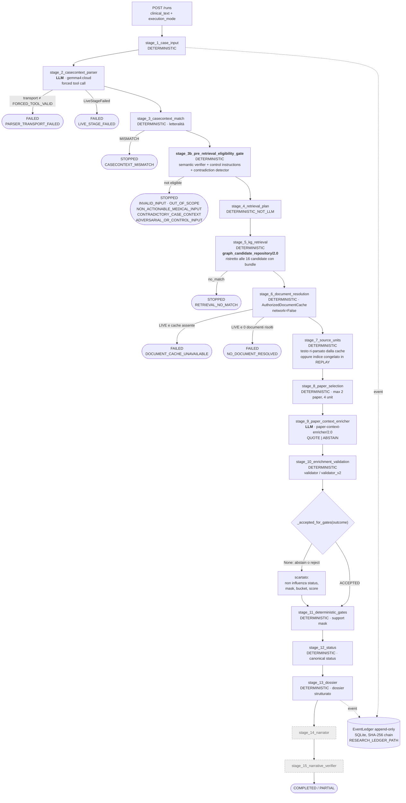

# 01 — Architettura del runtime, ricostruita dal codice

Questo documento **non** deriva da README, diagrammi o report precedenti. È
ricostruito seguendo import, entrypoint, dependency injection e chiamate
effettive, e verificato con un'analisi di raggiungibilità statica sull'AST
(`evaluation/deliverability/probes/probe_a_reachability.py`, output in
`evaluation/deliverability/runtime_component_matrix.csv`).

## Catena di attivazione reale

```
uvicorn backend.api.main:app
  └─ include_router(backend.api.research_routes, "/api/v1/research/pipeline")
       guardia: VERIFIABLE_PIPELINE_RESEARCH_ENABLED ∈ {1,true,yes,on}, altrimenti 404
       └─ POST /runs
            ├─ execution_mode.normalize_requested_mode(...)  → LIVE | REPLAY (HYBRID rifiutato)
            └─ run_store.get_store().start(case_id, clinical_text, mode)
                 └─ thread → RunStore._execute
                      ├─ _providers(mode)
                      │    LIVE   → live_providers.{parser_fn, enricher_fn, validate_fn}
                      │    REPLAY → replay.{parser_fn, enricher_fn, selection_fn, validation_fn}
                      ├─ DocumentRuntime.open()  se LIVE, altrimenti None
                      └─ orchestrator.run_case(...)   ← IL RUNTIME CANONICO
```

`orchestrator.run_case` (`backend/research_pipeline/orchestrator.py`, 732 righe)
è l'unico punto in cui la pipeline viene eseguita per una richiesta API.

## Diagramma del runtime reale



`stage_14` e `stage_15` (tratteggiati) sono nel contratto ma in
`NOT_IMPLEMENTED_STAGE_IDS`: vengono sempre chiusi `SKIPPED` con
`artifact_origin = NOT_APPLICABLE`. Il diagramma li mostra perché il contratto li
espone alla UI, non perché eseguano qualcosa.

## Tabella degli stage — come richiesto dal §3

| Stage | File · simbolo | Input | Output | Chiamante | LLM | Retrieval | Modifica stato canonico |
|---|---|---|---|---|:-:|:-:|:-:|
| 1 | `orchestrator.py` inline | `case_id`, testo | preview | `run_case` | no | no | no |
| 2 | `live_providers.parser_fn` / `replay.parser_fn` → `casecontext/prompt.py` | testo libero | `case_context_raw`, `transport_result` | `run_case` | **sì** | no | no — l'output è verificato a valle |
| 3 | `casecontext/match_verifier.py::verify_case_context`, `essential_fields_pass` | case_context + testo | record per campo, `essential_fields_pass` | `run_case` | no | no | **veto** (STOP) |
| 3b | `casecontext/pipeline.py::run` → `eligibility/gate.py` | testo + case_context | `eligibility{status, eligible, reason_codes, verified_fields, forbidden_downstream_stages}` | `run_case` | no | no | **veto** (STOP) |
| 4 | `orchestrator.py` inline | case_context | piano dichiarato | `run_case` | no | no | no |
| 5 | `retrieval/kg_retrieval.py::retrieve` | case_context | `associations`, `excluded_candidates`, `no_match` | `run_case` | no | **sì** | no |
| 6 | `documents/live_resolution.py::DocumentRuntime.resolve` | associations | `documents`, `manifest_hash`, cache hit/miss | `run_case` | no | no | no |
| 7 | `documents/live_resolution.py::DocumentRuntime.load_units` | resolution | `units_by_id` (con testo) | `run_case` | no | no | no |
| 8 | `retrieval/paper_selection.py::select_papers_for_association` | association + units | `selected_papers`, `excluded_papers` | `run_case` | no | no | no |
| 9 | `live_providers.enricher_fn` → `enrichment/transport_v2.py`, `prompt_v2.py` | case_context, candidate, drug, source unit **con testo** | `enrichment` (QUOTE/ABSTAIN), `transport_result` | `run_case` | **sì** | no | no — proposta |
| 10 | `enrichment/validator.py` / `validator_v2.py` | transport + enrichment + unit | `outcome` | `run_case` | no | no | **filtra** cosa arriva ai gate |
| 11 | `determinism/gates.py::evaluate_association` + `check_origin.py` | intent, candidate, validated | `support_mask`, `direction_consistencies` | `run_case` | no | no | **sì** |
| 12 | idem (stesso `evaluation` dict) | — | `status`, `gate_bucket`, `warnings` | `run_case` | no | no | **sì** |
| 13 | `dossier/builder.py::build_dossier_preview` | tutto il precedente | dossier strutturato | `run_case` | no | no | no |
| 14–15 | — | — | `SKIPPED` | `skip_remaining` | — | — | no |

Side effect trasversale: ogni transizione emette un evento su `EventLedger`
(SQLite append-only con catena SHA-256, `RESEARCH_LEDGER_PATH`, distinto dal
ledger della pipeline agentica di prodotto).

## Raggiungibilità: 637 moduli classificati

| Classificazione | Moduli |
|---|---:|
| `TEST_ONLY` (raggiunto solo dai test) | 192 |
| `TEST_CODE` | 135 |
| `DEAD_OR_UNREACHABLE` | 115 |
| `LEGACY_RETAINED_FOR_EXPERIMENT` | 103 |
| `CANONICAL_RUNTIME` | 51 |
| `SHADOW_EVALUATION` | 40 |

### Il risultato che cambia la lettura del progetto

```
backend.research_pipeline.retrieval.kg_retrieval        CANONICAL_RUNTIME
backend.research_pipeline.retrieval.kg_retrieval_v3     DEAD_OR_UNREACHABLE
backend.research_pipeline.retrieval.admission           SHADOW_EVALUATION
backend.research_pipeline.retrieval.repository_v3       SHADOW_EVALUATION
gca_v3.*  (contract, alterations, polarity, regimens,
           matching, materialize)                       SHADOW_EVALUATION
backend.research_pipeline.eligibility.gate              CANONICAL_RUNTIME
```

`kg_retrieval_v3.py` (147 righe) ha **zero riferimenti in tutto il repository** —
nessun modulo, nessun test, nessun documento, nessun JSON lo nomina. Verificato
con `grep -rn "kg_retrieval_v3"` su `*.py`, `*.md`, `*.json`: l'unico risultato è
il file stesso. È codice morto.

Il percorso v3 realmente esercitato passa da `repository_v3.py` + `admission.py`,
importati direttamente da `evaluation/run_runtime_v3_integration.py` e da
`backend/research_pipeline/tests/test_v3_runtime_admission.py`. Non dal runtime.

Conseguenza per la tesi: **le proprietà semantiche v3 — polarità della fonte,
AST delle alterazioni composte, policy sui regimi irrisolti — non sono
proprietà del runtime.** Sono proprietà di un percorso di valutazione parallelo.
Il dettaglio è in `02_target_vs_runtime.md`.

### Due runtime nella stessa app

`backend.api.routes` (prefisso `/api/v1`, **non gated**) raggiunge 103 moduli
classificati `LEGACY_RETAINED_FOR_EXPERIMENT`, fra cui
`backend.pipeline.agents.oncokb_enricher`, `backend.pipeline.agentic.runtime`,
`backend.pipeline.evidence.qualified_retriever` (950 righe) e
`backend.api.v3_presentation` (878 righe).

Attenzione al nome: `v3_presentation` è la **V3 di prodotto**, non
`graph_candidate_repository/3.0`. Due assi di versionamento indipendenti che
condividono la stringa "v3". È una fonte concreta di confusione da chiarire
nella tesi.

Il runtime legacy **non è raggiungibile** dal runtime di ricerca: nessun modulo
di `backend.research_pipeline` importa `backend.pipeline.evidence` o
`backend.pipeline.agents`. L'unico punto di contatto è
`backend.pipeline.agentic.ledger.EventLedger`, riusato come infrastruttura di
eventi, e `backend.pipeline.llm` per la risoluzione dell'endpoint. Nessuna
decisione legacy entra nel runtime di ricerca.

### `pipeline.run_case` non è più l'implementazione di riferimento

Il docstring di `orchestrator.py` (righe 3–12) afferma:

> «`pipeline.run_case` resta l'**implementazione di riferimento** […] Un test
> confronta i due percorsi sugli stessi input.»

Verificato: **quel test non esiste.** `run_store.py` importa da `pipeline` solo
`CallBudget`; `test_orchestrator.py` importa solo `CallBudget`;
`pipeline.run_case` è chiamato unicamente da tre test in
`test_promoted_components.py` (righe 326, 345, 357) con parser ed enricher finti,
e nessuno di essi confronta l'output con quello dell'orchestratore.

Inoltre `pipeline.run_case` **non contiene lo stage 3b**: passa da
`essential_fields_pass` direttamente a `retrieval_mod.retrieve`. Le due
implementazioni sono quindi divergenti sul punto architetturalmente più
importante — il gate pre-retrieval — e la divergenza non è coperta da alcun
test.

`pipeline.run_case` va classificata **DEAD_OR_UNREACHABLE a livello di
funzione** (il modulo risulta `CANONICAL_RUNTIME` solo perché `CallBudget` vive
lì).
