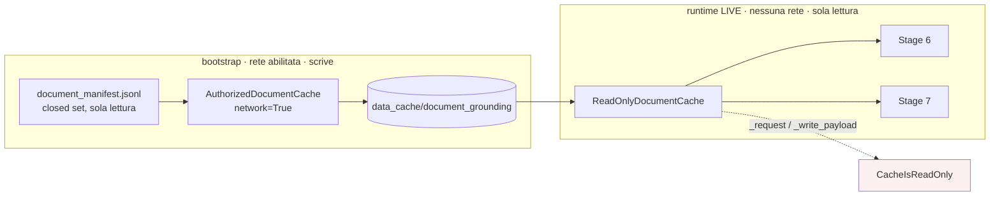

# Progetto del bootstrap

**VERIFIABLE RESEARCH PIPELINE — NOT CLINICALLY VALIDATED.**

## 1. La separazione che rende possibile la ricostruzione



Il runtime non è stato toccato. `ReadOnlyDocumentCache` continua a sollevare su
ogni percorso di rete e di scrittura: è la proprietà che rende verificabile
l'assenza di fetch durante una run, e sarebbe stata la prima cosa da sacrificare
se la cache si fosse potuta popolare da sé.

Il bootstrap vive in `scripts/`, fuori da `backend/`, perché non fa parte del
runtime.

## 2. Riuso, non riscrittura

`scripts/bootstrap_research_document_cache.py` non implementa alcun fetch. Usa
`AuthorizedDocumentCache` — la classe nata per popolare la cache — e i suoi
resolver:

| Prefisso | Resolver riusato | Percorso prodotto |
|---|---|---|
| `pmid:` | `resolve_pmid` | `pubmed/metadata/<pmid>.json` + `pubmed/abstracts/<pmid>.xml` |
| `pmcid:` | `resolve_pmc` | `pmc/xml/<PMCID>.xml` |
| `nct:` | `resolve_nct` | `clinical_trials/<NCT>.json` |

Ne conseguono, senza codice aggiuntivo: retry con backoff (3 tentativi, `404`/
`410` deterministici), rate limit `0.34 s` (≈3 req/s, limite NCBI senza chiave),
User-Agent da `DOCUMENT_GROUNDING_USER_AGENT`, hashing SHA-256, e soprattutto
**gli stessi nomi di file** del pilot. Inventare percorsi alternativi avrebbe
prodotto una cache che il manifest non sa indirizzare.

## 3. Idempotenza e resume

Lo stato è il filesystem, non un registro parallelo:

```python
if before == "PRESENT" and not force:
    return FetchOutcome(..., outcome=OUTCOME_SKIPPED, ...)
```

`PRESENT` richiede che **ogni** payload atteso esista e non sia vuoto; altrimenti
`PARTIAL` o `MISSING`, ed entrambi comportano il refetch.

Un dettaglio necessario: `AuthorizedDocumentCache` considera già risolto ciò che
compare nel proprio manifest e restituisce il record senza scaricare. Se il
payload è stato cancellato, quella scorciatoia produrrebbe un successo apparente
su un file inesistente. Prima del refetch la voce viene quindi dimenticata:

```python
forget_bootstrap_manifest_entry(cache, document_id)
```

Il file toccato è `<root>/manifests/documents.jsonl` — lo stato del bootstrap,
dentro la cache non versionata. Il manifest congelato non viene mai aperto in
scrittura.

## 4. Documenti storicamente non risolti

`probe_baseline_unavailable()` esegue il resolver reale su una directory
temporanea che viene distrutta subito dopo. Così la verifica «la sorgente è
cambiata?» ha una risposta, senza che un documento oggi disponibile entri nel
corpus per effetto collaterale. Il manifest congelato resta l'autorità su cosa il
runtime può risolvere: una riga senza `local_cache_path` produce
`DOCUMENT_UNAVAILABLE` anche se il file esistesse.

## 5. Verifica separata dal recupero

Due script distinti, perché rispondono a due domande diverse:

| Script | Domanda | Rete |
|---|---|---|
| `bootstrap_research_document_cache.py` | i payload sono nella cache? | sì |
| `verify_research_document_cache.py` | il runtime ci ritrova ciò che si aspetta? | no |
| `analyze_document_cache_drift.py` | perché gli hash divergono? | sì (esperimento) |
