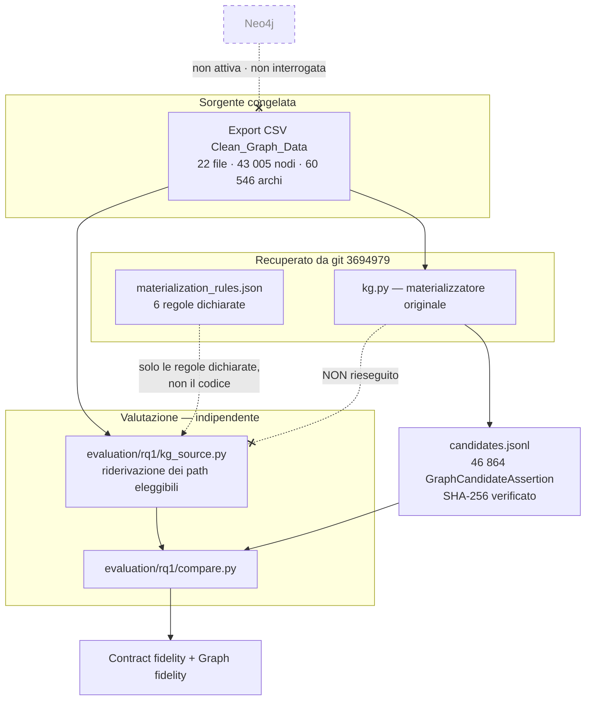

# 01 — Protocollo di valutazione

Stato: **CHECKPOINT A completato**.

## Scopo

Valutazione sperimentale dell'architettura della verifiable research pipeline.
Non è un'aggiunta di funzionalità cliniche e non modifica il significato clinico
di alcun record.

## Quattro livelli, tenuti separati

Il protocollo vieta l'uso ambiguo di "correttezza dei claim". I quattro livelli
non sono intercambiabili:

| Livello | Domanda | Misurato qui |
|---|---|---|
| **A — Graph fidelity** | La GraphCandidateAssertion riproduce correttamente una relazione presente nel KG? | **Sì**, RQ1 |
| **B — Document association quality** | Il PMID associato è pertinente a quella relazione? | **Parzialmente**, RQ2 (struttura e risolvibilità sì; pertinenza semantica solo dopo annotazione umana) |
| **C — Documentary support** | Nel documento esiste un passaggio coerente con la candidate? | **Parzialmente**, RQ2 (indicatori automatici raccolti, non promossi a gold) |
| **D — Clinical validity** | La relazione è clinicamente corretta e applicabile? | **No.** Richiede valutazione clinica esperta, fuori dallo scopo di questo studio |

> **Nessuna affermazione di questo studio riguarda il livello D.**

## Che cos'è una GraphCandidateAssertion

Una rappresentazione serializzata e normalizzata di una relazione clinicamente
rilevante presente nel Knowledge Graph, usata come candidata per il successivo
grounding documentale.

Non è una claim degli autori del paper citato, non è una prova documentale e non
è una raccomandazione clinica.

## Stato registrato all'avvio (CHECKPOINT A)

| Voce | Valore |
|---|---|
| Branch di partenza | `feature/v3-verifiable-pipeline-ui` |
| HEAD di partenza | `b115754e5dae2120f40663368197ff4220e7fca5` |
| Branch di lavoro | `research/v3-evaluation-pilot` (creato da `b115754`) |
| Worktree | principale, `C:\Users\paolo\Desktop\IspezioneDatasetTesi` |
| File tracciati modificati | **0** |
| File non tracciati | 11 (PDF/TeX di tesi, artefatti di run esplorative, `scripts/start_v3_product.ps1`) |
| Neo4j (porte 7687 / 7474) | **chiuse — servizio non attivo** |
| Repository candidate | `graph_candidate_repository/2.0`, 46 864 record |
| Document cache autorizzata | 43 documenti, 3 402 source unit |
| Parser CaseContext | `backend/research_pipeline/casecontext/` (`parser.py`, `prompt.py`, `match_verifier.py`) |
| Endpoint LLM | `https://api.ollama.com`, modello `gemma4:cloud` |
| Server attivi | nessuno avviato da questa sessione |

### Working tree non pulita: motivazione della prosecuzione

Il protocollo impone di fermarsi se la working tree non è pulita. La condizione
sostanziale — *«verifica che i cambiamenti della pipeline LIVE siano
committati»* — è soddisfatta: `git status --untracked-files=no` è **vuoto**, cioè
nessun file tracciato è modificato o in staging. Gli 11 file non tracciati sono
documenti di tesi (PDF/TeX), output di run esplorative precedenti e uno script di
avvio; nessuno è codice della pipeline e nessuno è stato toccato da questa
valutazione. Sono stati lasciati intatti e non compaiono in alcun commit.

## Identificazione della sorgente del Knowledge Graph

Il protocollo elenca quattro casi possibili. La situazione reale è **B + C**:

* il `manifest.json` del repository dichiara
  `"origin": "COMPLETE_KG_CSV_EXPORT"` e
  `"regenerable_from": …\data_expl\DatasetTESI\Dataset TESI\Clean_Graph_Data`;
* quella directory **esiste** e contiene i 22 file dell'export congelato;
* il materializzatore originale (`kg.py`, `models.py`, `pipeline.py`) e gli
  artefatti di materializzazione (`lineage.jsonl`, `source_index.json`,
  `coverage_report.json`, `manifest.json`, `hashes.json`) **non sono presenti sul
  branch corrente** ma sono integralmente recuperabili da git al commit
  `3694979` (branch `refactor/v3-document-grounded-claims`);
* `candidates.jsonl` su `HEAD` è **byte-identico** al blob prodotto da quel
  commit (`84c99f80958cec79a0c5e83e43079f7500c10bef`) e il suo SHA-256 coincide
  con quello dichiarato in `hashes.json`
  (`d6c65c26…71235d`). L'artefatto è quindi verificato.

**Neo4j non è la sorgente della materializzazione.** Non è attiva, non è stata
avviata, non è stata interrogata e non è stata modificata. Non è richiesta per
questa valutazione.

```
neo4j_required_for_runtime = false   (per RQ1; il runtime di prodotto è fuori scopo)
neo4j_used_read_only       = false   (non è stata usata affatto)
```

### Conseguenza: la completezza È misurabile

Poiché è disponibile l'export congelato da cui la materializzazione è stata
prodotta, l'insieme dei path eleggibili può essere **ricostruito indipendentemente**
e confrontato con le candidate. La clausola
`RQ1_COMPLETENESS_NOT_MEASURABLE_FROM_AVAILABLE_SOURCE` **non si applica**.

## Vincolo metodologico centrale: nessun confronto tautologico

Il materializzatore originale è recuperabile e sarebbe stato banale rieseguirlo e
confrontarne l'output con `candidates.jsonl`. Quel confronto avrebbe prodotto
`precision = recall = 1.0` **per costruzione**, misurando soltanto il determinismo
dello stesso codice.

`evaluation/rq1/kg_source.py` riderivava perciò i path leggendo direttamente le
tabelle CSV, secondo le sei regole dichiarate in `materialization_rules.json`, e
ricostruisce in modo indipendente i valori attesi di ogni campo.

Restano condivise due funzioni che sono **identità e non regole semantiche**: la
derivazione di `edge_id` da (file, riga, indice) e quella di
`candidate_id`/`payload_hash` dal payload, entrambe documentate in `schema.json`
come `deterministic_sha256_prefix`. Riprodurle serve a verificare il lineage e non
può mascherare un errore di contenuto, perché qualunque campo sbagliato cambia il
digest.

## Due livelli di fedeltà, riportati separatamente

La distinzione è necessaria perché una regola può essere implementata
correttamente e nondimeno perdere informazione:

* **Contract fidelity** — la candidate riproduce ciò che la regola dichiarata
  prescrive. Misura la correttezza dell'implementazione rispetto al proprio
  contratto.
* **Graph fidelity** — la candidate rappresenta fedelmente la relazione presente
  nel grafo. Un difetto qui è reale anche quando la contract fidelity è perfetta.

## Vincoli rispettati

* Nessun output LLM è usato come gold standard.
* Nessun validatore è stato indebolito.
* Nessun sinonimo *ad hoc* è stato introdotto (cfr. §11, caso BGJ398).
* Nessun record clinico è stato modificato.
* La route legacy e gli artefatti storici non sono stati toccati.
* Nessun `push`, nessun `merge`.

## Diagramma: sorgenti e confronto



## Ordine dei checkpoint

| Checkpoint | Contenuto | Stato |
|---|---|---|
| A | Audit sorgenti e misurabilità di RQ1 | ✅ |
| B | Correttezza e completezza full-corpus | ✅ |
| C | Audit associazioni PMID + campione manuale | in corso |
| D | Audit ufficiale OncoKB | in corso |
| E | Congelamento benchmark CaseContext | in corso |
| F | Smoke 35 casi | in corso |
| G | Repeatability 5 casi × 3 run | in corso |
