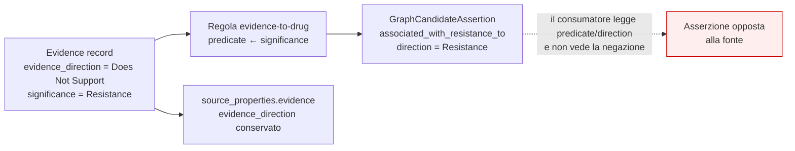

# 02 — RQ1a: fedeltà delle GraphCandidateAssertion

## Domanda di ricerca

Le GraphCandidateAssertion materializzate riproducono correttamente le relazioni
presenti nel Knowledge Graph sorgente?

## Unità di analisi

Il singolo **path eleggibile** del grafo, accoppiato 1:1 con la candidate
materializzata tramite la chiave di identità
`(materialization_rule_id, predicate, node_ids, sorted(edge_ids))`.

## Dataset

| Voce | Valore |
|---|---|
| Sorgente | export CSV congelato `Clean_Graph_Data` (22 file) |
| Fingerprint corpus | `8df07e828f97a77f…` (per file in `kg_source_fingerprint.json`) |
| Nodi / archi | 43 005 / 60 546 |
| Record Evidence | 4 860 |
| Artefatto valutato | `graph_candidate_repository/2.0/candidates.jsonl` |
| SHA-256 artefatto | `d6c65c26…71235d` — **verificato** contro `hashes.json` |
| Candidate | 46 864 |

## Ground truth

I path eleggibili riderivati indipendentemente dalle tabelle CSV
(`evaluation/rq1/kg_source.py`), **non** l'output del materializzatore originale.
Nessun LLM è coinvolto.

## Chiave canonica

Definita in `evaluation/rq1/canonical_key.py`. Include, quando presenti: disease,
gene, alteration, biomarker, intervention, direction, relazione, source record,
insieme degli identificatori documentali e identità del path.

Regole di normalizzazione:

* **Null** — `None`, stringa vuota e i marcatori degli export pandas (`nan`,
  `none`, `null`, `na`, `n/a`) collassano su `None`. È l'unico collasso ammesso:
  nessun sinonimo clinico, nessun fuzzy matching, nessuna mappatura di alias di
  farmaco.
* **Case** — le etichette libere sono confrontate in `casefold()` con spazi
  normalizzati; gli **identificatori** (`id`, `canonical_id`, PMID, NCT) non sono
  mai normalizzati per case: un identificatore che differisce per case è diverso.
* **Ordinamento** — gli insiemi sono ordinati *nella chiave*; l'ordine emesso è
  verificato separatamente, perché normalizzarlo e poi dichiararlo corretto
  sarebbe circolare.
* **Deduplicazione** — mai per gene, farmaco, PMID o parent record da soli. La
  proiezione semantica conserva disease e direction.

## Metodo

Confronto deterministico campo per campo su 16 campi
(`COMPARED_FIELDS`), più la verifica del lineage: `candidate_id` e `payload_hash`
devono derivare dal payload serializzato.

## Risultati — contract fidelity

| Metrica | Valore |
|---|---|
| Path eleggibili | 46 864 |
| Candidate materializzate | 46 864 |
| Path accoppiati | 46 864 |
| `materialization_precision` | **1.0** |
| `materialization_recall` | **1.0** |
| `field_completeness` | **1.0** |
| Candidate mancanti | **0** |
| Candidate spurie | **0** |
| Duplicati esatti | **0** |
| `candidate_id` ripetuti | **0** |
| Inversioni di direction (contratto) | **0** |

Fedeltà per campo — **46 864 / 46 864 su tutti e 16 i campi**: `predicate`,
`subject`, `object`, `disease`, `biomarkers`, `interventions`, `regimen`,
`direction`, `evidence_scope`, `diagnostic_scope`, `graph_path`, `node_ids`,
`edge_ids`, `evidence_record_ids`, `document_identifiers`,
`materialization_rule_id`.

Verifica del lineage:

* `payload_identity` — 46 864 / 46 864: ogni `candidate_id` e `payload_hash`
  deriva effettivamente dal payload serializzato del record;
* `expected_payload_identity` — 46 864 / 46 864: il payload **riderivato in modo
  indipendente dal CSV** produce lo stesso digest del payload materializzato, per
  tutti i record.

L'obiettivo del protocollo (`precision = 1.0`, `field fidelity = 1.0`) è
raggiunto, e nessun mismatch di contratto va trattato come bug perché non ce ne
sono.

## Risultati — graph fidelity

La contract fidelity perfetta **non** implica che la rappresentazione sia fedele
al grafo. Due difetti sistematici emergono, entrambi conseguenza delle regole
stesse e non della loro implementazione.

### Difetto 1 — `DIRECTION_INVERSION` (486 candidate)

Nella regola `gca/2.0/evidence-to-drug` il predicato è derivato **solo** da
`significance`; `evidence_direction` del record Evidence non entra né nel
predicato né nel campo `direction`, e sopravvive unicamente dentro
`source_properties`.

Quando `evidence_direction = "Does Not Support"`, la candidate afferma
l'associazione che il record sorgente **nega**.

| Voce | Valore |
|---|---|
| Candidate colpite | **486** |
| Quota su `evidence-to-drug` (3 370) | **14.4 %** |
| Record Evidence con `Does Not Support` | 513 / 4 860 |
| Predicati coinvolti | `associated_with_resistance_to` 273 · `associated_with_sensitivity_to` 213 |

Esempio (`GCA-499353360e32454349d54c68`):

| Campo | Valore |
|---|---|
| `predicate` | `associated_with_resistance_to` |
| `direction` | `Resistance` |
| subject → object | `R882` → `DAUNORUBICIN HYDROCHLORIDE` |
| disease | Acute Myeloid Leukemia |
| `evidence_direction` **sorgente** | **`Does Not Support`** |
| `evidence_statement` sorgente | *«Daunorubicin treatment resulted in **similar** overall survival and disease free survival in de novo AML patients with DNMT3A R882 mutation compared to those who do not harbor this mutation.»* |

Lo statement afferma esplicitamente l'**assenza** di differenza; la candidate
afferma una resistenza. Un consumatore a valle che legga `predicate` e
`direction` — cioè i campi previsti dal contratto — legge l'opposto della fonte.

### Difetto 2 — `ALTERATION_LOST` (1 091 candidate)

Le regole `evidence-statement` e `evidence-to-drug` prendono la **prima** variante
del profilo molecolare (`pvars[0]`) e il **primo** gene di quella variante. I
profili multi-variante vengono ridotti a una sola alteration, e la logica
booleana del profilo (AND / OR) è persa del tutto.

| Voce | Valore |
|---|---|
| Candidate colpite | **1 091** (535 `evidence-statement`, 556 `evidence-to-drug`) |
| Profili molecolari distinti coinvolti | **197** |
| Profili con logica **AND** | 883 candidate |
| Profili con logica **OR** | 196 candidate |
| Profili con **AND + OR** | 12 candidate |
| Varianti per profilo | 2 (955) · 3 (66) · 4–11 (70) |

Esempi:

| Profilo nel grafo | Varianti | Conservata | `subject` emesso |
|---|---|---|---|
| `EGFR T790M AND EGFR Exon 19 Deletion AND EGFR C797S` | 3 | T790M | `T790M` |
| `EML4::ALK Fusion AND ALK L1198F AND ALK C1156Y` | 3 | Fusion | `Fusion` |
| `LMNA::NTRK1 Fusion AND NTRK1 G595R AND NTRK1 G667C` | 3 | G595R | `G595R` |
| `NTRK1 Amplification OR NTRK3 Amplification OR NTRK2 Amplification` | 3 | Amplification | `Amplification` |

La perdita non è cosmetica. `EGFR T790M` da solo e
`EGFR T790M + Exon 19 Deletion + C797S` hanno implicazioni terapeutiche opposte
rispetto a osimertinib; ridurre il secondo al primo produce una candidate che
descrive un paziente diverso. Il caso `NTRK1 OR NTRK2 OR NTRK3` mostra inoltre
che **AND e OR sono indistinguibili** nell'output: una congiunzione e una
disgiunzione producono la stessa forma serializzata.

### Duplicati semantici — 344 gruppi, 1 028 record (2.19 %)

Non sono classificati come errore. La semantica della deduplicazione non è
definita nel contratto del repository, e §5 del protocollo vieta di trattarli come
difetti prima di quella definizione. Sono registrati in `duplicates.csv` per la
revisione.

## Failure cases

`evaluation/rq1_graph_candidate_fidelity/mismatches.csv` — 1 577 righe, tutte sul
layer `graph`; il layer `contract` è vuoto.

## Limitazioni

* La contract fidelity misura l'aderenza alle **sei regole dichiarate**, non la
  loro appropriatezza. Le regole sono l'oggetto dei due difetti sopra.
* La riderivazione indipendente legge le stesse tabelle CSV: un errore già
  presente *nell'export* rispetto al database originale non sarebbe visibile.
* Nessuna affermazione di validità clinica (livello D).

## Cosa non è stato dimostrato

* Che le sei regole di materializzazione siano clinicamente adeguate.
* Che le 486 candidate con inversione siano clinicamente dannose in uso reale —
  è dimostrato che contraddicono il proprio record sorgente.
* Che le 1 028 candidate semanticamente duplicate vadano deduplicate.

## Diagramma

