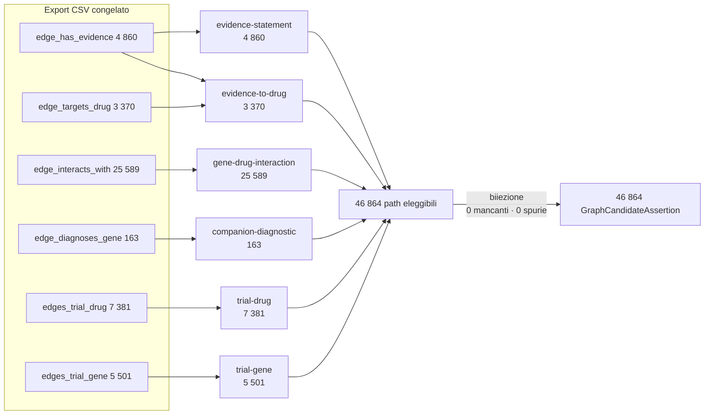

# 03 — RQ1b: completezza della materializzazione

## Domanda di ricerca

L'insieme delle GraphCandidateAssertion copre tutti i path eleggibili del
Knowledge Graph, senza aggiunte?

## Misurabilità

**La completezza è misurabile.** L'export CSV congelato dichiarato come
`regenerable_from` nel manifest esiste su disco, quindi l'insieme dei path
eleggibili è ricostruibile indipendentemente.

`RQ1_COMPLETENESS_NOT_MEASURABLE_FROM_AVAILABLE_SOURCE` **non si applica**.

## Metodo

Riderivazione dei path eleggibili applicando le sei regole dichiarate in
`materialization_rules.json` direttamente alle tabelle CSV, e confronto insiemistico
con le candidate tramite la chiave di identità del path.

## Risultati

| Metrica | Valore |
|---|---|
| Path eleggibili | **46 864** |
| Candidate materializzate | **46 864** |
| Path coperti | **46 864** |
| Path mancanti | **0** |
| Candidate spurie | **0** |
| `materialization_precision` | **1.0** |
| `materialization_recall` | **1.0** |
| Duplicati esatti (`payload_hash`) | 0 — `exact_duplicate_rate = 0.0` |
| Duplicati semantici | 344 gruppi / 1 028 record — `semantic_duplicate_rate = 0.0219` |
| Candidate multiple per path | 0 |
| Path multipli per candidate | 0 |
| Path esclusi con motivazione | **0** |

L'accoppiamento è **biiettivo**: ogni path eleggibile ha esattamente una
candidate e ogni candidate esattamente un path.

### Copertura per regola

| Regola | Eleggibili | Coperti | Mancanti |
|---|---|---|---|
| `gca/2.0/gene-drug-interaction` | 25 589 | 25 589 | 0 |
| `gca/2.0/trial-drug` | 7 381 | 7 381 | 0 |
| `gca/2.0/trial-gene` | 5 501 | 5 501 | 0 |
| `gca/2.0/evidence-statement` | 4 860 | 4 860 | 0 |
| `gca/2.0/evidence-to-drug` | 3 370 | 3 370 | 0 |
| `gca/2.0/companion-diagnostic` | 163 | 163 | 0 |
| **Totale** | **46 864** | **46 864** | **0** |

### Copertura per identificatore documentale

| Categoria | Candidate | Quota |
|---|---|---|
| Con almeno un PMID | 8 230 | 17.6 % |
| Con NCT | 12 882 | 27.5 % |
| **Senza alcun identificatore** | **25 752** | **54.9 %** |

Le tre categorie non sono disgiunte per costruzione, ma di fatto lo sono: nessuna
candidate porta insieme PMID e NCT.

### Zero esclusioni: osservazione, non assenza di controlli

Il materializzatore prevede cinque rami di esclusione
(`MISSING_EVIDENCE_OR_PROFILE`, `EMPTY_EVIDENCE_STATEMENT`, `MISSING_DRUG_NODE`,
`MISSING_INTERACTION_ENDPOINT`, `MISSING_COMPANION_DIAGNOSTIC_NODE`). Su questo
export **nessuno di essi si attiva**: tutti i record Evidence hanno uno statement
non vuoto, tutti i riferimenti a nodo si risolvono, tutti gli endpoint sono
presenti. L'export è internamente consistente; i rami di esclusione restano non
esercitati e quindi **non validati da questi dati**.

## Copertura per direction e per sorgente

Le regole `evidence-statement` e `evidence-to-drug` sono le uniche a portare una
`direction`. La copertura è totale in entrambe (4 860/4 860 e 3 370/3 370), quindi
non esistono direzioni sistematicamente scartate. La qualità della `direction` è
però compromessa per 486 candidate: cfr. `02_graph_candidate_fidelity.md`.

## Limitazioni

* La ricostruzione applica **le regole dichiarate**. Un path che quelle regole non
  contemplano — per esempio una relazione presente nel grafo ma non prevista da
  nessuna delle sei regole — non è contato come mancante, perché non è eleggibile
  per definizione. Questo studio misura la completezza *rispetto al contratto*,
  non l'esaustività del contratto rispetto al grafo.
* Le tabelle `trial_eligibility_criteria.csv` (21 MB) e
  `civic_publications.csv` non sono sorgenti di alcuna regola: il loro contenuto
  non è materializzato e non entra nel calcolo.

## Cosa non è stato dimostrato

* Che le sei regole coprano tutte le relazioni clinicamente rilevanti del grafo.
* Che i 1 028 duplicati semantici debbano essere unificati.

## Diagramma

