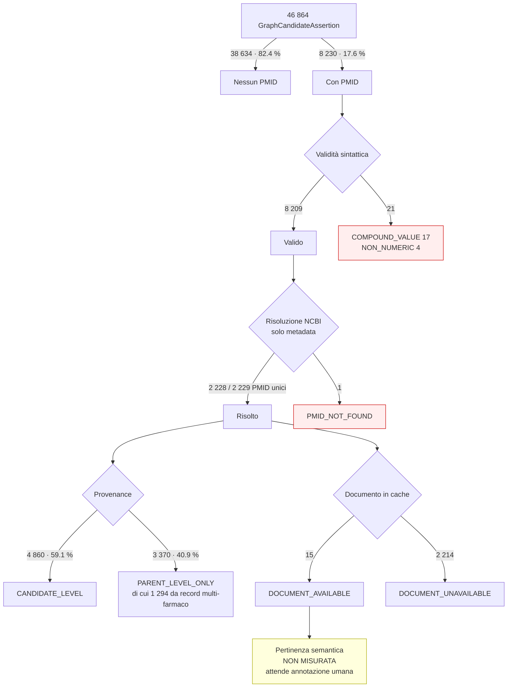

# 04 — RQ2: qualità delle associazioni candidate ↔ PMID

## Domanda di ricerca

I PMID associati alle GraphCandidateAssertion sono validi, risolvibili e
semanticamente pertinenti alla relazione disease–biomarker–intervention–direction?

## Unità di analisi

La **coppia candidate–PMID**, non il PMID unico. Lo stesso PMID può essere
associato a candidate diverse con qualità diversa; ridurre subito a PMID unici
cancellerebbe la variabile misurata.

## Dataset

| Voce | Valore |
|---|---|
| Candidate totali | 46 864 |
| Candidate **con** almeno un PMID | **8 230** (17.6 %) |
| Candidate **senza** PMID | **38 634** (82.4 %) |
| Righe identificatore grezze | 16 416 |
| Coppie candidate–PMID distinte | **8 230** |
| PMID unici | **2 229** |
| PMID per candidate | **sempre 1** (media 1.0) |

### Osservazione strutturale: i due scope non sono due fonti

Ogni candidate porta fino a due identificatori: uno con
`scope = "evidence_record"` (da `node_evidence.citation_id`) e uno con
`scope = "linked_publication"` (da `civic_evidence_publication_links.csv`).
Entrambi sono indicizzati per `evidence_id`, e **il PMID è sempre lo stesso**:

| Combinazione di scope | Coppie |
|---|---|
| `evidence_record` + `linked_publication` | 8 186 |
| solo `evidence_record` | 44 |

Le 16 416 righe grezze si riducono quindi a 8 230 coppie distinte. **Nessuna
candidate ha più di un PMID distinto.** La ridondanza dei due scope non aggiunge
supporto documentale: aggiunge una seconda registrazione della stessa citazione.

## 1. Validità sintattica

| Esito | Coppie |
|---|---|
| Sintatticamente valide | **8 209** (99.74 %) |
| Invalide | **21** (0.26 %) |

Cause, tutte presenti *nella sorgente*, non introdotte dalla materializzazione:

| Causa | Coppie | Esempio |
|---|---|---|
| `COMPOUND_VALUE` — più PMID in un solo campo | 17 | `29650534;27130468;27432227;29376144;24736079;29373100` |
| `NON_NUMERIC` — un DOI nel campo `citation_id` | 4 | `10.1182/blood-2021-148205` |

I 17 valori composti nascondono **23 PMID distinti** che nessun consumatore del
repository può raggiungere senza uno split. Il runtime di risoluzione documentale
(`documents/authorized_cache.expand_identifier`) *sa* dividere su `;` e `,`, ma il
repository materializzato conserva la stringa composta: la capacità esiste a
valle, l'artefatto congelato no.

Le 21 coppie invalide riguardano 21 candidate distinte; per ciascuna quello è
l'**unico** identificatore documentale, quindi la candidate resta di fatto priva
di una citazione utilizzabile.

Nessun valore è stato "riparato": normalizzare uno zero iniziale o dividere un
campo composto avrebbe inventato un identificatore che la sorgente non contiene.

## 2. Risolvibilità bibliografica

Metodo: API ufficiale NCBI E-utilities `esummary`, **solo metadata**, in batch da
200 identificatori, con almeno 0.40 s fra richieste (il limite pubblico è 3 req/s).
Log completo in `rq2_pmid_associations/ncbi_request_log.json`.

| Voce | Valore |
|---|---|
| PMID interrogati | 2 229 |
| Richieste HTTP | **12** |
| `PMID_RESOLVED_METADATA_ONLY` | **2 228** (99.96 %) |
| `PMID_NOT_FOUND` | **1** |
| Con DOI | 2 159 |
| Con PMCID | 1 197 (53.7 %) |
| Segnali di ritrattazione/erratum | **3** |

Nessun articolo completo è stato scaricato; nessun testo integrale è committato.

### Il PMID irrisolvibile

`174591` non esiste in PubMed. È associato a 2 candidate:

* `GCA-9508965be2bbc09632b45377` — `has_evidence_statement`, CDKN2A Loss, direction `Does Not Support`;
* `GCA-8e0771e0535ce8b82d9fcd9c` — `associated_with_resistance_to`, CDKN2A Loss → **PALBOCICLIB**, direction `Resistance`.

La seconda è anche un caso di `DIRECTION_INVERSION` (RQ1): afferma una resistenza
a palbociclib che il record padre nega, e la cita con un PMID inesistente. I due
difetti si compongono.

### Ritrattazioni ed errata

| PMID | Segnale | Candidate | Contesto |
|---|---|---|---|
| `18725974` | **`Retracted Publication`** | 1 | ERBB2 Amplification, `Supports` — titolo che inizia con «RETRACTED:» |
| `26466010` | `Published Erratum` | 2 | ALK Fusion → CRIZOTINIB, `Sensitivity/Response` |
| `28792849` | `Published Erratum` | 4 | BRCA1 Mutation → OLAPARIB, `Sensitivity/Response` |

Una candidate è quindi sostenuta da un articolo **ritrattato**. Il repository non
porta alcun campo di stato bibliografico: nulla, nell'artefatto, segnala che quella
citazione è stata ritirata. Il numero è piccolo (1 su 8 230), ma la *classe* di
problema non è mitigata da nessun controllo esistente.

## 3. Provenance

Il livello di provenance è determinato dalla regola di materializzazione, non
dallo scope:

| Livello | Coppie | Regola | Significato |
|---|---|---|---|
| `PMID_CANDIDATE_LEVEL` | **4 860** (59.1 %) | `evidence-statement` | Il PMID cita esattamente lo statement asserito |
| `PMID_PARENT_LEVEL_ONLY` | **3 370** (40.9 %) | `evidence-to-drug` | Il PMID è ereditato dal record Evidence padre |

Delle 3 370 coppie parent-level, **1 294 (38.4 %)** provengono da record Evidence
che riguardano **più farmaci** (cfr. `REGIMEN_SPLIT` in RQ1). In quei casi il paper
è la fonte di un'affermazione su un insieme di farmaci, mentre la candidate
afferma la relazione su **un solo** farmaco: la citazione è ereditata da un
enunciato più ampio di quello che la candidate sostiene.

> Il 40.9 % delle associazioni PMID **non** è candidate-level. Questa è la
> risposta strutturale alla seconda parte di RQ2, e non richiede annotazione umana.

## 4. Disponibilità documentale

| Voce | Valore |
|---|---|
| PMID nella cache documentale autorizzata | **15 / 2 229** (0.67 %) |
| `PMID_DOCUMENT_AVAILABLE` | **15** |
| `PMID_DOCUMENT_UNAVAILABLE` | **2 214** (99.3 %) |

La cache pilota contiene 43 documenti in tutto (17 PMID, 14 PMCID, 12 NCT). Il
livello **C — documentary support** del protocollo è quindi misurabile solo su una
frazione trascurabile del corpus: non è possibile, con questi dati, affermare
alcunché sulla presenza di un passaggio testuale coerente per la generalità delle
candidate.

## 5. Pertinenza semantica — **non misurata**

```
semantic_pmid_precision_claimed_without_gold = false
```

Gli indicatori automatici disponibili nella pipeline — `support_status`,
`coherence_status`, `core_support_mask`, `contradiction_detected`,
`negation_detected`, quote accettata / ABSTAIN — sono registrati come contesto per
il revisore ma **non sono usati come gold standard** e non entrano in nessuna
metrica. Il corpus `evidence_bundle` contiene 25 bundle in tutto, tutti prodotti
dalla stessa pipeline sotto valutazione: usarli come verità significherebbe far
giudicare il sistema a sé stesso.

Nessun LLM è stato usato per dichiarare la pertinenza di un PMID.

Il campione da annotare è pronto: `evaluation/gold/rq2_pmid_manual_review.csv`,
50 coppie stratificate, colonne `reviewer_relevant`, `reviewer_direction`,
`reviewer_specificity`, `reviewer_notes` **vuote**. Gli abstract sono presenti
come anteprima troncata a 400 caratteri per 33 delle 50 righe, richiesti solo per
i PMID del campione.

Stratificazione del campione: `retraction_or_erratum` 7 · `invalid_format` 7 ·
`document_available` 7 · `not_found` 2 · `candidate_level` 3 ·
`parent_level_single_drug` 3 · `parent_level_multi_drug` 3 · `sensitivity` 3 ·
`resistance` 3 · `does_not_support` 3 · `with_pmcid` 3 · `no_pmcid` 3 ·
`scope_evidence_record_only` 3.

## Tipi di pubblicazione

`Journal Article` 2 156 · `Case Reports` 254 · `Clinical Trial, Phase II` 195 ·
`Clinical Trial, Phase III` 122 · `Clinical Trial, Phase I` 106 ·
`Comparative Study` 100 · `Letter` 69 · `Clinical Trial` 60 · `Meta-Analysis` 43.

La presenza di 254 `Case Reports` e 69 `Letter` è rilevante per il livello di
evidenza: sono tipi di pubblicazione che non sostengono generalizzazioni
cliniche, ma nel repository non sono distinti in alcun modo dagli studi di fase
III.

## Limitazioni

* La risolvibilità è verificata contro PubMed a una data specifica; lo stato di
  ritrattazione può cambiare.
* I segnali di ritrattazione derivano dai `publication type` MeSH: un articolo
  ritrattato la cui indicizzazione non è ancora aggiornata non verrebbe rilevato.
  Il conteggio di 3 è quindi un **limite inferiore**.
* La disponibilità documentale riflette la cache pilota, non un tentativo di
  risoluzione esaustiva.

## Cosa non è stato dimostrato

* Che i PMID risolvibili siano **pertinenti** alla relazione asserita.
* Che le 4 860 associazioni candidate-level siano supportate dal testo.
* Che la quota di associazioni con direzione opposta o contesto parziale sia
  quella che gli indicatori automatici suggeriscono.

## Diagramma


