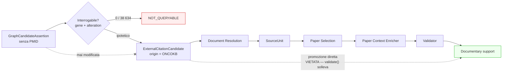

# 05 — RQ3: OncoKB come sorgente esterna di citazioni candidate

## Domanda di ricerca

Quando una GraphCandidateAssertion non possiede PMID, è tecnicamente,
metodologicamente e legalmente appropriato usare OncoKB come sorgente esterna di
citazioni candidate?

## Metodo

Audit di fattibilità e licenza, **senza integrazione**. Le fonti consultate sono
esclusivamente ufficiali (§12). I dettagli completi sono in:

* `evaluation/rq3_oncokb_fallback/licensing_report.md`
* `evaluation/rq3_oncokb_fallback/feasibility_report.md`
* `evaluation/rq3_oncokb_fallback/query_plan.json`

## Risposta breve

**No, non su questo corpus** — per due ragioni indipendenti, ciascuna sufficiente.

### 1. Legale: manca il permesso richiesto dalla licenza

La Licensing FAQ ufficiale di OncoKB stabilisce:

> «OncoKB cannot be used to train AI/ML models whether for academic or commercial
> purposes.»
>
> «**With explicit permission**, OncoKB may be used for benchmarking existing
> AI/ML models.»

L'uso previsto da RQ3 — misurare il guadagno di copertura che OncoKB offrirebbe a
una pipeline di grounding basata su LLM — è una valutazione di un sistema AI, cioè
la categoria per cui serve un permesso esplicito.

Un token API **è** presente e **autentica** (verificato con una sola chiamata a
`GET /api/v1/info`, che restituisce solo versioni: `dataVersion v7.4`,
`apiVersion v1.6.0`, `publicInstance: false`). Ma un token dimostra che un account
è approvato, non che sia stato concesso il permesso per il benchmarking.

```
oncokb_license_compatible               = undetermined
oncokb_authorized_token_available       = true
oncokb_explicit_benchmarking_permission = not_documented
```

Le istanze non autenticate non sono un'alternativa: `public.api.oncokb.org`
**esclude i dati terapeutici** e `demo.oncokb.org` copre **tre geni**
(BRAF, TP53, ROS1). Usarle come surrogato del database completo è esplicitamente
escluso dal §12.

### 2. Tecnica: la popolazione bersaglio non è interrogabile

L'evidenza OncoKB è chiavizzata su **(gene, alterazione, tipo di tumore,
farmaco)**. L'endpoint di annotazione richiede `hugoSymbol`/`entrezGeneId` e, di
fatto, `alteration` per individuare un'evidenza specifica.

Profilo delle 38 634 candidate senza PMID:

| Profilo | Candidate |
|---|---|
| `gene / — / — / intervention` | 25 589 |
| `— / — / — / intervention` | 7 381 |
| `gene / — / — / —` | 5 664 |

| Interrogabilità | Candidate |
|---|---|
| `QUERYABLE` | **0** |
| `NOT_QUERYABLE` | **38 634 (100 %)** |

**Nessuna** candidate priva di PMID possiede un'alterazione o una disease; 7 381
non possiedono nemmeno un gene.

La causa è strutturale e discende da RQ1: alteration, disease e direction
esistono **solo** sulle regole derivate da record Evidence, che coincidono
esattamente con le 8 230 candidate che **hanno già** un PMID.

> Le candidate che avrebbero bisogno del fallback sono precisamente quelle prive
> delle chiavi con cui il fallback andrebbe interrogato.

Quattro degli otto strati richiesti dal §15 — `gene+alteration+disease`,
`gene+disease senza alteration`, `sensitivity`, `resistance` — contengono **zero**
candidate. Il campione di 20 non è costruibile.

## I quattro casi di attivazione non sono lo stesso problema

| Caso | Popolazione | Esito |
|---|---|---|
| **A** `NO_DOCUMENT_IDENTIFIER` | 25 752 | Non interrogabile (manca alteration/disease/gene) |
| **B** `PMID_NOT_RESOLVABLE` | 2 | Interrogabile in linea di principio, popolazione troppo piccola |
| **C** `DOCUMENT_UNAVAILABLE` | 2 214 PMID | **Problema dominante**, ma è accesso al full text, non assenza di citazione: OncoKB non lo risolve |
| **D** `NO_EXPLICIT_SUPPORT` | non misurato | Usare OncoKB qui = cercare una fonte più favorevole dopo un documento non favorevole. **Vietato dal §13** |

## Il pilot non è stato eseguito

```
oncokb_calls_executed           = 1     (solo /api/v1/info, metadata)
oncokb_knowledge_data_retrieved = false
oncokb_pilot_executed           = false
oncokb_integrated_into_runtime  = false
coverage_gain                   = null
```

Eseguirlo avrebbe consumato chiamate verso una risorsa licenziata per dimostrare
un esito già determinato dalla struttura del corpus.

## Vincolo architetturale codificato

`evaluation/rq3/models.py` definisce `ExternalCitationCandidate` **fuori** dai
modelli del runtime. L'invariante è eseguibile: `validate()` solleva un errore se
`promoted_to_documentary_support` è vero. Un risultato OncoKB non modifica
retroattivamente la GraphCandidateAssertion e non è prova documentale finché non
ha attraversato la catena esistente.



## Decisione

```
ONCOKB_FALLBACK_BLOCKED_NO_AUTHORIZATION   (licenza)
ONCOKB_FALLBACK_LOW_YIELD                  (tecnica)
```

## Cosa servirebbe per rendere il fallback valutabile

1. Permesso scritto di OncoKB per l'uso in benchmarking (`contact@oncokb.org`),
   da conservare come allegato della tesi.
2. Una materializzazione che propaghi **alteration e disease anche alle regole
   non-Evidence** — cioè la correzione del limite documentato in RQ1. Senza di
   essa la popolazione bersaglio resta non interrogabile qualunque sia la licenza.
3. Una decisione esplicita sul caso `DOCUMENT_UNAVAILABLE`, che è
   quantitativamente il problema dominante (2 214 PMID su 2 229) e che OncoKB non
   affronta.

## Cosa non è stato dimostrato

* Che OncoKB non sarebbe utile su un corpus diverso, o su una materializzazione
  che conservi il contesto molecolare.
* Che la licenza vieti l'uso: lo stato è `undetermined`, non `incompatible`.
  Manca la documentazione di un permesso, non è stato ricevuto un diniego.
