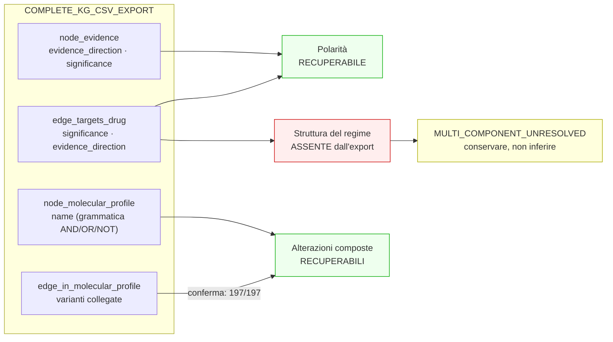

# 01 — Audit semantico della sorgente

Ispezione del `COMPLETE_KG_CSV_EXPORT` e del materializzatore originale
(`kg.py` al commit `3694979`) **prima** di definire il contratto v3.

Regola vincolante di questo audit: *non inventare una semantica non contenuta
nella sorgente*. Ogni campo del contratto v3 deve poter essere ricondotto a una
colonna osservata, oppure essere dichiarato indisponibile.

| Voce | Valore |
|---|---|
| Export | `data_expl/DatasetTESI/Dataset TESI/Clean_Graph_Data` (22 file) |
| Fingerprint | `0a7b847477f36b9f9e89a7ccdb150f5466078cbf17f6531e0fb485fd2b4c720b` |
| Materializzatore v2 | `3694979:…/document_grounded_claims/kg.py` |
| Repository v2 | `graph_candidate_repository/2.0`, sha256 `d6c65c26…71235d`, 46 864 record |

---

## A. Polarità

### Campi sorgente

La polarità è espressa da **due colonne indipendenti**, presenti sia sul nodo
Evidence sia sull'arco verso il farmaco:

| Tabella | Colonne rilevanti |
|---|---|
| `node_evidence.csv` | `evidence_direction`, `significance`, `evidence_type`, `evidence_level` |
| `edge_targets_drug.csv` | `evidence_level`, **`significance`**, **`evidence_direction`** |

### `evidence_direction` — posizione della fonte

| Valore | `node_evidence` | `edge_targets_drug` |
|---|---|---|
| `Supports` | 4 293 | 2 884 |
| **`Does Not Support`** | **513** | **486** |
| *(vuoto)* | 54 | 0 |

Tre valori distinti in tutto il corpus, di cui uno è l'assenza.

### `significance` — direzione proposta

`node_evidence.csv` porta **18 valori distinti**; l'arco verso il farmaco ne
porta **5**:

| `edge_targets_drug.significance` | Occorrenze |
|---|---|
| `Sensitivity/Response` | 2 158 |
| `Resistance` | 1 184 |
| `Reduced Sensitivity` | 14 |
| `Adverse Response` | 12 |
| *(vuoto)* | 2 |

Sul nodo Evidence compaiono inoltre: `Positive` 484 · `Predisposition` 478 ·
`Poor Outcome` 374 · `Uncertain Significance` 149 · `Oncogenicity` 130 ·
`Better Outcome` 122 · `Dominant Negative` 81 · `Gain of Function` 38 ·
`Loss of Function` 27 · `Negative` 9 · `Neomorphic` 9 ·
`Unaltered Function` 4 · `Protectiveness` 1 · *(vuoto)* 95.

> **v2 riconosceva solo due sottostringhe** (`resistance`, `sensitivity`/`response`)
> e collassava tutto il resto su `evidence_association`. Dei 18 valori, 15 erano
> indistinguibili nell'output.

### Le due colonne sono ortogonali

Tabella incrociata sull'arco verso il farmaco:

| `evidence_direction` × `significance` | Occorrenze |
|---|---|
| `Supports` × `Sensitivity/Response` | 1 945 |
| `Supports` × `Resistance` | 911 |
| **`Does Not Support` × `Resistance`** | **273** |
| **`Does Not Support` × `Sensitivity/Response`** | **213** |
| `Supports` × `Reduced Sensitivity` | 14 |
| `Supports` × `Adverse Response` | 12 |
| `Supports` × *(vuoto)* | 2 |

`significance` dice **quale relazione** è in gioco; `evidence_direction` dice
**se la fonte la sostiene**. Sono dimensioni indipendenti, e le 486 inversioni
documentate in RQ1 sono esattamente le due righe `Does Not Support`.

### Coerenza arco/nodo

Su tutti e 3 370 gli archi verso farmaco, `significance` ed `evidence_direction`
dell'arco **coincidono** con quelli del record Evidence padre (0 divergenze).
Non c'è quindi da scegliere quale fonte credere.

### Come v2 trattava questi campi

```python
significance = drug_edge["significance"] or erow["significance"]
predicate = "associated_with_resistance_to" if "resistance" in sig_lower else (
            "associated_with_sensitivity_to" if "sensitivity" in sig_lower
                                                or "response" in sig_lower
            else "evidence_association")
direction = significance or erow["evidence_direction"] or None
```

`evidence_direction` entra in `direction` **solo** se `significance` è vuoto —
cioè in 2 record su 3 370. In tutti gli altri casi la posizione della fonte
sopravvive unicamente dentro `source_properties`, non nei campi del contratto.

**Conclusione A: l'informazione di polarità è integralmente presente
nell'export. La perdita è del contratto v2, non della sorgente.**

---

## B. Alterazioni composte

### Campo sorgente

`node_molecular_profile.csv` → colonna `name` (1 939 profili).

### Grammatica osservata

| Operatore | Profili |
|---|---|
| `AND` | 133 |
| `OR` | 69 |
| `NOT` | 2 |
| Parentesi | 309 |
| `/` | 8 |
| `+` | 13 |
| `&` | 1 |
| `,` | 0 |
| `;` | 0 |

Profili con almeno un operatore booleano: **198**.
Profili con **sia** `AND` **sia** `OR`: **5**, tutti con parentesi esplicite.

### Le parentesi sono ambigue e la disambiguazione è deterministica

Delle 310 occorrenze di gruppo parentetico:

| Ruolo | Occorrenze | Esempio |
|---|---|---|
| **Raggruppamento** | **5** | `BRAF Amplification AND ( BRAF V600E OR BRAF V600K )` |
| Annotazione HGVS | 300 | `VHL R200W (c.598C>T)` |
| Suffisso descrittivo | 5 | `ALK Alternative Transcript (ATI)`, `VHL Null (Large deletion)` |

> Regola deterministica adottata: **un gruppo parentetico è un raggruppamento
> logico se e solo se contiene un operatore booleano al proprio interno.**
> Altrimenti fa parte del termine. La regola separa correttamente tutti e 310 i
> casi osservati.

### `NOT` — due soli casi, entrambi prefissi unari

```
4353  NOT KIT D816V
5696  MET Amplification AND NOT KRAS Mutation
```

### Espressioni annidate

Un solo livello di annidamento, sempre nella forma `X AND ( A OR B [OR C] )`.
Nessuna annidazione più profonda nel corpus.

### Gene ripetuto e gene implicito

Il gene è ripetuto esplicitamente su ogni termine
(`BRAF V600E AND BRAF V600M`, `EGFR T790M AND EGFR Exon 19 Deletion AND EGFR C797S`).
**Nessun caso di gene implicito** è stato osservato. Esistono profili
multi-gene (`BRCA1 Mutation OR BRCA2 Mutation`,
`ZMYM2::FGFR1 Fusion OR BCR::FGFR1 Fusion OR …`), quindi il gene non può essere
assunto costante nell'espressione.

### Validazione incrociata con la struttura del grafo

Per tutti e **197** i profili composti, il numero di termini ricavato dal nome
coincide con il numero di varianti collegate via `edge_in_molecular_profile.csv`:

```
compound profiles: 197 ; name-term count != linked-variant count: 0
```

Grammatica e struttura del grafo concordano perfettamente. Il parsing del nome
non è quindi un'interpretazione: è corroborato indipendentemente dagli archi.

### Perdita prodotta da v2

```python
pvars = profile_variants.get(profile_id, [])
variant_id = pvars[0][1]["source_variant_id"] if pvars else ""
```

v2 prende `pvars[0]` — la **prima** variante — e scarta le altre. Effetto
misurato in RQ1: **1 091 candidate** con `ALTERATION_LOST`, su **197** profili
distinti, e la distinzione `AND`/`OR` completamente assente dall'output.

**Conclusione B: la grammatica è ristretta, regolare e verificabile. Tutti i
198 profili composti sono parsabili in modo deterministico.**

---

## C. Regimi terapeutici

### Come i farmaci sono rappresentati

`edge_targets_drug.csv` — **cinque colonne in tutto**:

```
source_evidence_id, target_drug_concept_id, evidence_level,
significance, evidence_direction
```

### Numero di farmaci per source record

| Farmaci | Record Evidence |
|---|---|
| 1 | 2 076 |
| 2 | 457 |
| 3 | 88 |
| 4 | 22 |
| 5 | 4 |
| 8 | 1 |

**572 record multi-farmaco**, per **1 294 archi**.

### Ricerca esaustiva di semantica del regime

Ricerca su **tutte le colonne di tutte le 22 tabelle** dei termini
`interaction`, `combination`, `regimen`, `therapy_type`, `relation`, `role`,
`comparator`, `sequential`, `arm`. Unico risultato:

```
edge_interacts_with.csv: ['interaction_type', 'interaction_score']
```

`edge_interacts_with.csv` descrive le interazioni **gene–farmaco**
(`inhibitor`, `agonist`, `modulator`, …, `unknown` 18 837/25 589), **non** la
relazione fra farmaci di uno stesso record Evidence.

| Informazione cercata | Presente nell'export? |
|---|---|
| Tipo di interazione fra farmaci (combinazione / alternativa / sequenza) | **No** |
| Label raw del regime | **No** |
| Treatment name composto | **No** |
| Ruolo del componente (comparatore, backbone, …) | **No** |
| Ordine dei componenti | **No** (solo l'ordine di riga) |

### Gli archi fratelli sono indistinguibili

Per i 572 record multi-farmaco, gli archi fratelli **non differiscono in alcun
campo** oltre al farmaco: `significance`, `evidence_direction` ed
`evidence_level` sono identici su tutti i fratelli.

> Non esiste, nell'export, alcun segnale che distingua
> «A **e** B somministrati insieme» da «A **oppure** B, confrontati».

### I separatori nei nomi di farmaco non sono struttura di regime

197 `drug_name` contengono `/`, `+` o ` AND `, ma appartengono al **nome
proprio** del farmaco:

```
PI3K/MTOR KINASE INHIBITOR PF-04691502
SULFAMETHOXAZOLE / TRIMETHOPRIM
FUTUXIMAB/MODOTUXIMAB MIXTURE
```

Sono prodotti a combinazione fissa o inibitori multi-target, non regimi
ricostruibili. **Parsarli per dedurre un regime sarebbe un'inferenza non
supportata** ed è escluso.

### Il contratto v2 dichiarava una regola che non può implementare

`materialization_rules.json` dichiara:

> *«atomicity: one primary relation; **inseparable regimens remain units**»*

Il campo `regimen` è vuoto in **tutte** le 46 864 candidate v2, e nessuna
candidate ha più di un `intervention`. La regola promette una distinzione che i
dati non permettono di fare.

### Casi in cui la semantica è ricostruibile

| Situazione | Record | Ricostruibile? |
|---|---|---|
| Record Evidence con **1** farmaco | 2 076 | **Sì** — `SINGLE_AGENT`, senza ambiguità |
| Record Evidence con **≥2** farmaci | 572 | **No** — nessun campo distingue combinazione da alternativa |

**Conclusione C: `REGIMEN_SEMANTICS_UNAVAILABLE_IN_EXPORT` per tutti e 572 i
record multi-farmaco.** Nessuna inferenza dal numero di farmaci, dal PMID, dal
titolo o dal nome del farmaco è ammessa.

---

## Sintesi: cosa v3 può e non può correggere

| Problema | Informazione nella sorgente | Correzione possibile |
|---|---|---|
| **Polarità** | Completa (`evidence_direction` su nodo e arco) | **Sì, integralmente.** Separare direzione del grafo e posizione della fonte |
| **Alterazioni composte** | Completa e corroborata dagli archi | **Sì, integralmente.** Parsing deterministico con AST |
| **Regimi** | **Assente** | **No.** Rappresentabile solo come `MULTI_COMPONENT_UNRESOLVED`, conservando tutti i componenti come unità |

Il terzo caso è il più importante metodologicamente: la correzione corretta
**non** è ricostruire il regime, ma smettere di affermare implicitamente che
ogni farmaco porta individualmente la direzione del record.


