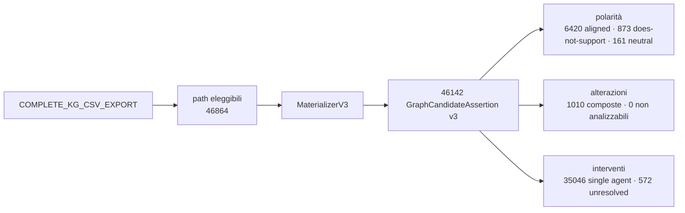

# 02 — Contratto v3

`graph-candidate-assertion/3.0` · repository `graph_candidate_repository/3.0` ·
schema hash `4b3f31e2bcee6315…`

Una GraphCandidateAssertion continua a significare **relazione candidata
derivata dal Knowledge Graph**. Non è: claim degli autori, evidenza
documentale, verità clinica, raccomandazione, supporto verificato.

## Campi nuovi rispetto a v2

| Gruppo | Campi |
|---|---|
| Polarità | `graph_direction`, `source_support_polarity`, `source_supported_direction`, `source_alignment_status`, `source_polarity_raw` |
| Alterazioni | `alteration_expression_raw`, `alteration_terms`, `alteration_expression_ast`, `alteration_parse_status`, `alteration_expression_hash`, `alteration_parse_warnings`, `alteration_canonical_expression` |
| Interventi | `intervention_expression_raw`, `intervention_components`, `intervention_structure`, `regimen_semantics_status`, `regimen_id`, `regimen_limitations` |
| Provenance | `source_path_ids`, `v2_candidate_ids`, `known_limitations` |

## Campi rimossi

`direction` — sostituito da `graph_direction` + `source_support_polarity`.
Conservarlo avrebbe mantenuto l'ambiguità silenziosa che il contratto v3 esiste
per eliminare.

## Identità

`candidate_id = "GCA3-" + sha256(payload)[:24]`, dove il payload include i campi
di polarità, l'AST dell'alterazione e la struttura dell'intervento. Due candidate
che differiscono solo per polarità hanno quindi id diversi — in v2 avrebbero
avuto lo stesso contenuto.

## Enum non prodotti da questa sorgente

Dichiarati nello schema ma **mai emessi**, perché l'export non li giustifica:

* `CONTRADICTS_ASSERTION`, `NEUTRAL_OR_NO_DIFFERENCE` — `evidence_direction` ha
  solo `Supports` / `Does Not Support` / vuoto;
* `COMBINATION_CONFIRMED`, `ALTERNATIVE_CONFIRMED`, `SEQUENTIAL_CONFIRMED` —
  l'export non distingue la relazione fra farmaci;
* ogni `component_role` diverso da `UNKNOWN`.

Restano nell'enum perché il contratto deve poterli esprimere se una sorgente
futura li portasse. **Non vengono prodotti per inferenza.**

## Regole v3

| Regola | Candidate | Differenza rispetto a v2 |
|---|---|---|
| `gca/3.0/evidence-statement` | 4 860 | espressione di alterazione completa; polarità separata |
| `gca/3.0/evidence-to-intervention` | 2 648 | **una per record Evidence**, non per arco farmaco |
| `gca/3.0/gene-drug-interaction` | 25 589 | invariata |
| `gca/3.0/trial-drug` | 7 381 | invariata |
| `gca/3.0/trial-gene` | 5 501 | invariata |
| `gca/3.0/companion-diagnostic` | 163 | invariata |

Gli identificatori sono versionati: riusare `gca/2.0/*` farebbe passare per
identiche regole che non lo sono.

