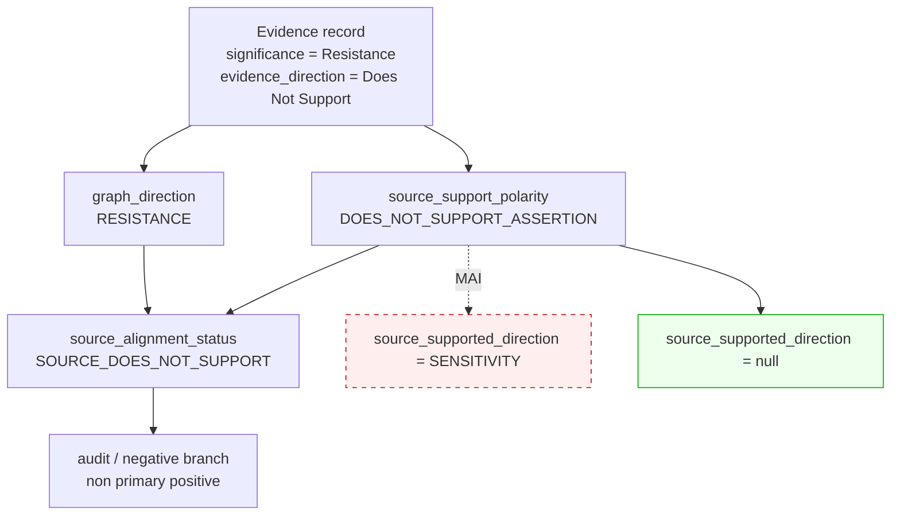

# 03 — Polarità della fonte

## Il problema in v2

`direction` derivava dalla sola `significance`; `evidence_direction` entrava solo
se `significance` era vuota — 2 record su 3 370. La posizione della fonte
sopravviveva unicamente dentro `source_properties`.

Effetto: **486 candidate affermavano l'associazione che il proprio record
sorgente nega.**

## La separazione v3

```json
{
  "graph_direction": "RESISTANCE",
  "source_support_polarity": "DOES_NOT_SUPPORT_ASSERTION",
  "source_supported_direction": null,
  "source_alignment_status": "SOURCE_DOES_NOT_SUPPORT"
}
```

* `graph_direction` — quale relazione il grafo propone (dai 18 valori di
  `significance` osservati, nessuno collassato);
* `source_support_polarity` — se la fonte la sostiene;
* `source_supported_direction` — la direzione esplicitamente sostenuta, **`null`
  ogni volta che la fonte non sostiene**;
* `source_alignment_status` — la sintesi deterministica delle due.

## La regola non negoziabile

```
Does Not Support Resistance  ≠  Supports Sensitivity
similar overall survival     ≠  sensitivity  ≠  resistance
```

`DOES_NOT_SUPPORT_ASSERTION` non produce mai la direzione opposta. Una fonte che
non sostiene una resistenza non sostiene per ciò stesso una sensibilità: riporta
tipicamente l'**assenza** di differenza. Tre test lo verificano, e un invariante
del contratto rende impossibile serializzare una candidate che lo violi.

## Distribuzione misurata

| `source_alignment_status` | Candidate |
|---|---|
| `SOURCE_ALIGNED` | 6420 |
| `SOURCE_DOES_NOT_SUPPORT` | **873** |
| `SOURCE_NEUTRAL` | 161 |
| `SOURCE_CONTRADICTS` | 0 |
| `SOURCE_ALIGNMENT_UNCLEAR` | 0 |
| `SOURCE_ALIGNMENT_NOT_AVAILABLE` | 38688 |

Le 38688 senza allineamento sono le regole
non-Evidence (gene-drug, trial, companion diagnostic): non portano polarità
nella sorgente, e **non viene assunto `SUPPORTS` per default**.

Le 161 `SOURCE_NEUTRAL` provengono da `significance` non
direzionali (`Uncertain Significance`, `Unaltered Function`) sostenute dalla
fonte: la fonte sostiene l'osservazione, ma l'osservazione non afferma un
effetto.

## Metriche

```
source_polarity_lost                          = 0
unsupported_candidates_promoted_as_supported  = 0
automatic_direction_inversions                = 0
```


