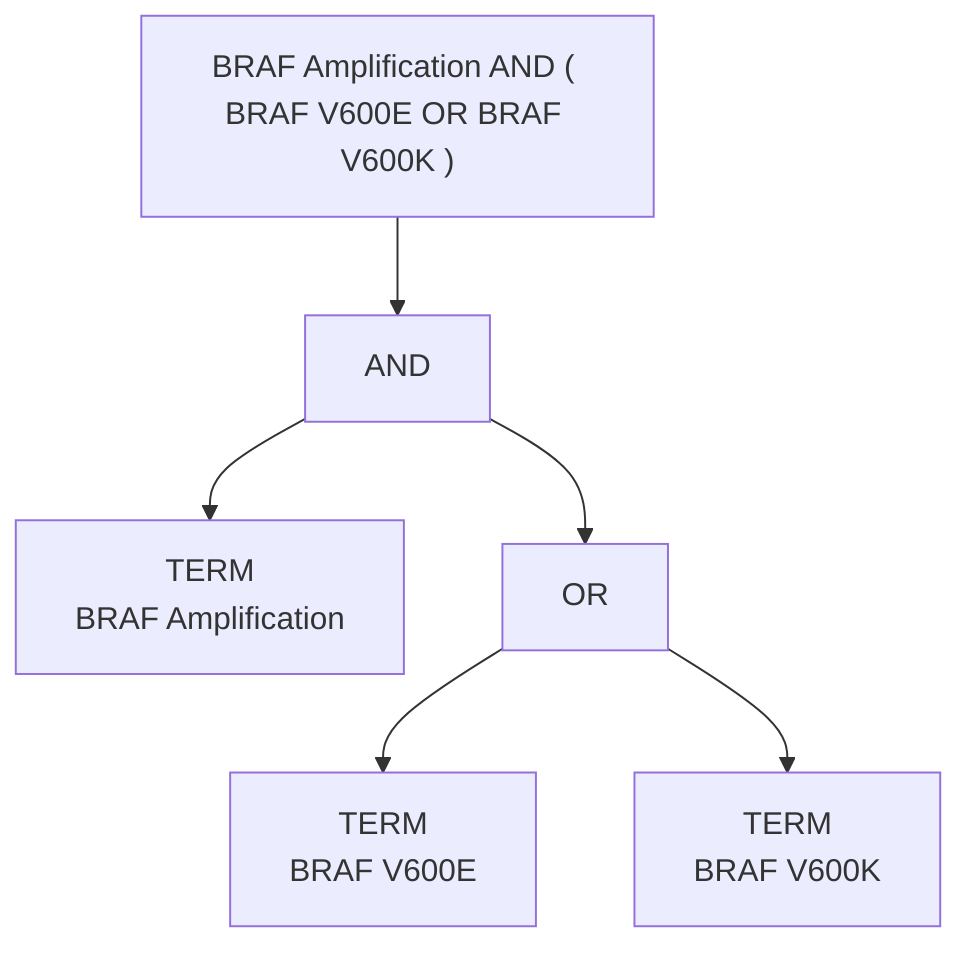

# 04 — Alterazioni composte

## Il problema in v2

```python
pvars = profile_variants.get(profile_id, [])
variant_id = pvars[0][1]["source_variant_id"] if pvars else ""
```

La **prima** variante, le altre scartate. 1 091 candidate colpite, 197 profili
molecolari distinti, e `AND`/`OR` indistinguibili nell'output serializzato.

## La grammatica implementata

```
expression := or_expr
or_expr    := and_expr ( "OR" and_expr )*
and_expr   := unary   ( "AND" unary )*
unary      := "NOT" unary | primary
primary    := "(" expression ")" | TERM
TERM       := <testo libero: gene + alterazione>
```

Precedenza `NOT` > `AND` > `OR`, parentesi esplicite. **Solo gli operatori
osservati nella sorgente**: nessuna grammatica clinica generale non supportata
dal corpus.

I separatori `/`, `+`, `&`, `,`, `;` **non** sono trattati come operatori:
appartengono al nome dell'alterazione o del farmaco.

## Disambiguazione delle parentesi

Le parentesi nell'export sono ambigue. La regola adottata è deterministica:

> un gruppo parentetico è un raggruppamento logico **se e solo se** contiene un
> operatore booleano al proprio interno

| Ruolo | Occorrenze |
|---|---|
| Raggruppamento logico | 5 |
| Annotazione HGVS — `VHL R200W (c.598C>T)` | 300 |
| Suffisso descrittivo — `ALK Alternative Transcript (ATI)` | 5 |

La regola separa correttamente **tutti e 310** i casi del corpus.

## Risultato sulla materializzazione

| `alteration_parse_status` | Candidate |
|---|---|
| `ATOMIC` | 6 498 |
| `PARSED_EXACT` | **1 010** |
| `MISSING` (regole non-Evidence) | 38 634 |
| **Fallimenti di parsing** | **0** |

Sui 1 939 profili molecolari dell'export: **0 espressioni non analizzabili**.

## Esempi verificati

| Raw | AST | Termini |
|---|---|---|
| `EGFR T790M AND EGFR Exon 19 Deletion AND EGFR C797S` | `AND(T,T,T)` | 3 |
| `BRAF Amplification AND ( BRAF V600E OR BRAF V600K )` | `AND(T, OR(T,T))` | 3 |
| `NTRK1 Ampl OR NTRK3 Ampl OR NTRK2 Ampl` | `OR(T,T,T)` | 3 |
| `MET Amplification AND NOT KRAS Mutation` | `AND(T, NOT(T))` | 2 |
| `KIF5B::RET Fusion AND ( RET G810C OR RET G810S OR RET G810R )` | `AND(T, OR(T,T,T))` | 4 |
| `VHL R200W (c.598C>T)` | `TERM` | 1 |

## Garanzie verificate da test

* il raw è **sempre** preservato;
* un'espressione non analizzabile **non** viene ridotta al primo termine: i
  termini restano vuoti e lo stato è `MALFORMED_EXPRESSION`;
* nessuna deduplicazione dei termini ripetuti — `BRAF V600E AND BRAF V600M`
  conserva due termini;
* l'ordine è preservato: riordinare cambierebbe `A AND ( B OR C )`;
* `AND` e `OR` producono **hash diversi**;
* i geni multipli sono conservati singolarmente (`NTRK1`, `NTRK3`, `NTRK2`);
* le fusioni restano intere (`EML4::ALK`).

```
compound_alteration_terms_lost     = 0
compound_operator_lost             = 0
compound_expression_parse_failures = 0
compound_alterations_preserved     = 1010
```

## Match futuro

`evaluate_alteration_expression` è definita, testata e **non collegata al
runtime**. La regola centrale:

| Espressione | CaseContext | Esito |
|---|---|---|
| `A AND B` | solo `A` | `PARTIAL_MATCH` — **mai** `FULL_MATCH` |
| `A AND B` | `A` e `B` | `FULL_MATCH` |
| `A OR B` | solo `A` | `FULL_MATCH` |
| `A` | nessun biomarcatore | `INSUFFICIENT_CASE_INFORMATION` |

In v2 questa distinzione non era esprimibile, perché `A AND B` era serializzato
come il solo `A`.


