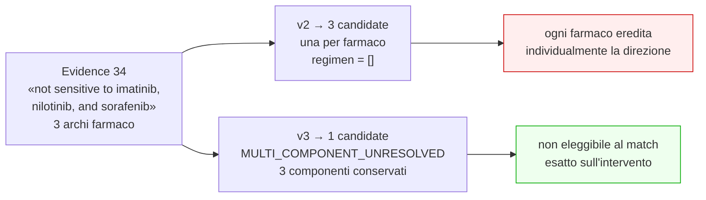

# 05 — Rappresentazione dei regimi

## Il vincolo della sorgente

`edge_targets_drug.csv` ha cinque colonne e **nessuna** descrive la relazione fra
i farmaci di uno stesso record Evidence:

```
source_evidence_id, target_drug_concept_id, evidence_level,
significance, evidence_direction
```

La ricerca su **tutte le colonne di tutte le 22 tabelle** dei termini
`interaction`, `combination`, `regimen`, `relation`, `role`, `comparator`,
`sequential`, `arm` ha prodotto un solo risultato: `interaction_type` su
`edge_interacts_with.csv`, che descrive le interazioni **gene–farmaco**, non i
regimi.

Gli archi fratelli di un record multi-farmaco **non differiscono in nulla** oltre
al farmaco: `significance`, `evidence_direction` ed `evidence_level` sono
identici su tutti.

> Non esiste alcun segnale che distingua «A **e** B somministrati insieme» da
> «A **oppure** B, confrontati».

## La decisione conservativa

Un record Evidence con più farmaci produce **una sola** candidate, a livello di
unità terapeutica:

```json
{
  "intervention_structure": "MULTI_COMPONENT_UNRESOLVED",
  "regimen_semantics_status": "SEMANTICS_UNAVAILABLE_IN_SOURCE",
  "intervention_components": [
    {"name": "SORAFENIB", "component_role": "UNKNOWN"},
    {"name": "IMATINIB",  "component_role": "UNKNOWN"},
    {"name": "NILOTINIB", "component_role": "UNKNOWN"}
  ],
  "regimen_limitations": ["REGIMEN_SEMANTICS_UNAVAILABLE_IN_EXPORT"]
}
```

Tutti i componenti sono conservati; nessuno è promosso individualmente; nessun
ruolo farmacologico è inventato; nessun farmaco principale è scelto.

## Cosa non è stato fatto

Vietato dal §12 ed evitato: dedurre la struttura dal numero di farmaci, dal PMID,
dal titolo del paper o dai separatori nei nomi — `SULFAMETHOXAZOLE / TRIMETHOPRIM`
è un nome proprio di prodotto, non un regime; chiamare un LLM; interrogare fonti
esterne.

## Risultato sulla materializzazione

| `intervention_structure` | Candidate |
|---|---|
| `SINGLE_AGENT` | 35 046 |
| **`MULTI_COMPONENT_UNRESOLVED`** | **572** |
| **`COMBINATION_CONFIRMED`** | **0** |
| `ALTERNATIVE_CONFIRMED` / `SEQUENTIAL_CONFIRMED` | 0 |
| `UNKNOWN` (regole senza intervento) | 10 524 |

`COMBINATION_CONFIRMED = 0` **non è un difetto**: è la misura del fatto che
l'export non consente di confermare nessuna combinazione. Un invariante del
contratto (`INV5`) impedisce di emetterla quando `regimen_semantics_status` è
`SEMANTICS_UNAVAILABLE_IN_SOURCE`.

Analogamente, `component_role` vale `UNKNOWN` su tutti i componenti: l'export non
contiene ruoli, e inventarli sarebbe la stessa classe di errore che v3 corregge.

## Conseguenza sul matching

Un regime irrisolto **non è eleggibile** al match esatto sull'intervento — non
perché i componenti siano ignoti (sono tutti conservati) ma perché non è noto se
vadano somministrati insieme o in alternativa.
`eligible_for_intervention_exact_match()` lo codifica.

## Metriche

```
unresolved_regimens_split_into_positive_components = 0
invented_regimen_semantics                         = 0
unresolved_regimen_count                           = 572
confirmed_regimen_count                            = 0
```

In v2 gli stessi record producevano **1 294** candidate positive indipendenti.


