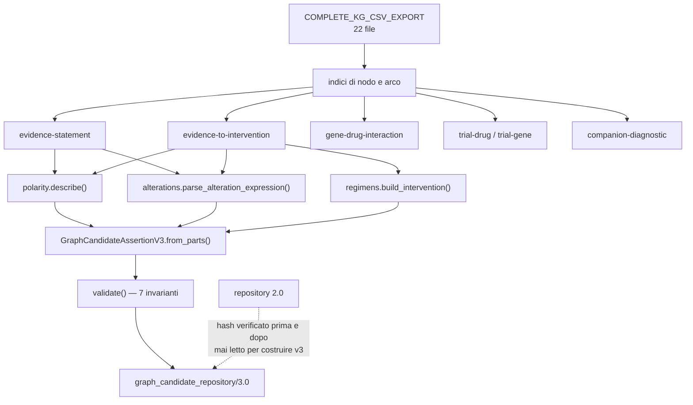

# 07 — Pipeline di materializzazione v3

## Rimaterializzazione, non conversione

v3 è costruita **dai CSV sorgente**. La conversione da `candidates.jsonl` v2 non
potrebbe recuperare ciò che v2 ha perso: le varianti scartate e la polarità non
sono più nell'artefatto.

```bash
python -m gca_v3.build_repository
```

Lo script verifica l'hash di v2 **prima e dopo** la scrittura e si rifiuta di
procedere se è cambiato.

## Moduli

| Modulo | Responsabilità |
|---|---|
| `gca_v3/polarity.py` | mappatura dei valori sorgente ai tre concetti di polarità |
| `gca_v3/alterations.py` | tokenizer, parser, AST, hash canonico |
| `gca_v3/regimens.py` | rappresentazione conservativa dell'intervento |
| `gca_v3/contract.py` | dataclass, schema, invarianti |
| `gca_v3/materialize.py` | le sei regole |
| `gca_v3/matching.py` | `evaluate_alteration_expression` (non collegata) |
| `gca_v3/repository.py` | selezione esplicita della versione |
| `gca_v3/build_repository.py` | scrittura degli artefatti e mapping v2→v3 |

## Le sei regole

| Regola | Unità eleggibile | Candidate | Differenza da v2 |
|---|---|---|---|
| `gca/3.0/evidence-statement` | riga di `edge_has_evidence` | 4 860 | AST completo + polarità separata |
| `gca/3.0/evidence-to-intervention` | **record Evidence** | 2 648 | v2: una per arco farmaco (3 370) |
| `gca/3.0/gene-drug-interaction` | riga di `edge_interacts_with` | 25 589 | invariata |
| `gca/3.0/trial-drug` | riga di `edges_trial_drug` | 7 381 | invariata |
| `gca/3.0/trial-gene` | riga di `edges_trial_gene` | 5 501 | invariata |
| `gca/3.0/companion-diagnostic` | riga di `edge_diagnoses_gene` | 163 | invariata |

Gli identificatori sono versionati `3.0` perché la semantica è cambiata: riusare
`gca/2.0/*` farebbe passare per identiche regole che non lo sono.

## Il predicato deriva dalla direzione, non dalla polarità

```python
"SENSITIVITY"          -> associated_with_sensitivity_to
"REDUCED_SENSITIVITY"  -> associated_with_reduced_sensitivity_to
"RESISTANCE"           -> associated_with_resistance_to
"ADVERSE_RESPONSE"     -> associated_with_adverse_response_to
altro                  -> evidence_association_with
```

La polarità resta in un campo proprio. Un predicato che la incorporasse
(`does_not_support_resistance_to`) renderebbe di nuovo il campo `predicate`
l'unica sede di due informazioni distinte — l'errore che v3 corregge.

## Artefatti prodotti

```
graph_candidate_repository/3.0/
  candidates.jsonl            46 142 record
  manifest.json               conteggi, hash, limiti dichiarati
  schema.json                 contratto ed enum
  candidate_index.json        id -> [regola, allineamento, struttura, parse]
  candidate_index_schema.json formato dell'indice
  lineage_index.jsonl         id -> path, nodi, archi, record Evidence
  v2_mapping.jsonl            relazione v2 <-> v3
  README.md
```

## Esclusioni

Nessuna: i cinque rami di esclusione (`MISSING_EVIDENCE_OR_PROFILE`,
`EMPTY_EVIDENCE_STATEMENT`, `MISSING_DRUG_NODE`, `MISSING_INTERACTION_ENDPOINT`,
`MISSING_COMPANION_DIAGNOSTIC_NODE`) esistono ma **non si attivano** su questo
export, esattamente come in v2. Restano non esercitati e quindi non validati da
questi dati.


