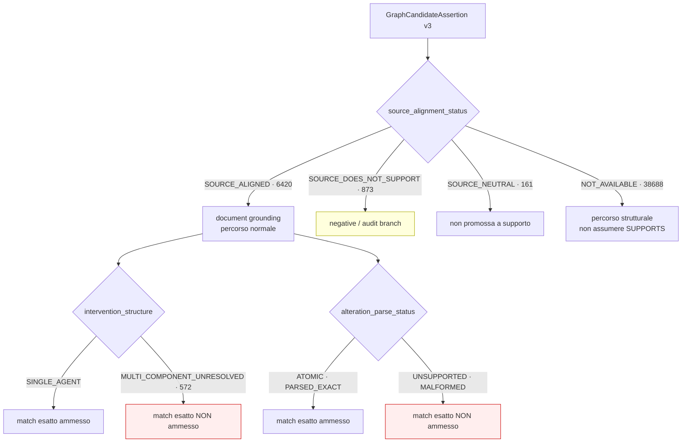

# 09 — Runtime admission policy

**Policy definita, non integrata.** Questo documento stabilisce come il runtime
dovrà trattare gli stati v3. Nessun gate clinico è stato modificato in questo
branch e nessun modulo del runtime importa `gca_v3`.

## Selezione della versione (§17)

```bash
GRAPH_CANDIDATE_REPOSITORY_VERSION=2.0|3.0   # default: 2.0
```

`gca_v3.repository.configured_version()` solleva
`UnsupportedRepositoryVersion` per un valore non riconosciuto invece di ricadere
sul default: un fallback silenzioso farebbe passare per una run v3 una run che
v3 non ha mai usato.

```
runtime_default_changed_to_v3 = false
```

## Ammissione per `source_alignment_status`

| Stato | Candidate | Trattamento |
|---|---|---|
| `SOURCE_ALIGNED` | 6 420 | **ammessa** al document grounding nel percorso normale |
| `SOURCE_DOES_NOT_SUPPORT` | 873 | conservata per **audit / negative branch**; mai presentata come relazione positiva supportata |
| `SOURCE_CONTRADICTS` | 0 | **contradiction branch** (nessuna candidate su questa sorgente) |
| `SOURCE_NEUTRAL` | 161 | **non promossa** a supporto positivo |
| `SOURCE_ALIGNMENT_UNCLEAR` | 0 | ammessa **solo con warning**, oppure esclusa secondo policy esplicita |
| `SOURCE_ALIGNMENT_NOT_AVAILABLE` | 38 688 | **non assumere `SUPPORTS` per default**; percorso strutturale, non di supporto |

Le 38 688 sono le regole non-Evidence (gene–drug, trial, companion diagnostic):
non portano polarità nella sorgente. Trattarle come allineate significherebbe
inventare un supporto che nessun record afferma.

## Ammissione per struttura dell'intervento

| Stato | Candidate | Trattamento |
|---|---|---|
| `SINGLE_AGENT` | 35 046 | eleggibile al match esatto sull'intervento |
| `MULTI_COMPONENT_UNRESOLVED` | 572 | **non eleggibile** al match esatto sull'intervento; conservata per audit |
| `*_CONFIRMED` | 0 | eleggibile, se una sorgente futura li producesse |

## Ammissione per stato dell'alterazione

| Stato | Trattamento |
|---|---|
| `ATOMIC`, `PARSED_EXACT` | eleggibile al match esatto sull'alterazione |
| `PARSED_WITH_WARNINGS` | eleggibile con warning |
| `MALFORMED_EXPRESSION`, `UNSUPPORTED_EXPRESSION`, `AMBIGUOUS_OPERATOR` | **non eleggibile** al match esatto |
| `MISSING` | nessun match sull'alterazione possibile |

## Regola composta per il match sull'alterazione

`evaluate_alteration_expression` (definita, testata, **non collegata**):

| Espressione | CaseContext | Esito | Ammissione |
|---|---|---|---|
| `A AND B` | solo `A` | `PARTIAL_MATCH` | **non** promuovibile a esatto |
| `A AND B` | `A` e `B` | `FULL_MATCH` | ammessa |
| `A OR B` | solo `A` | `FULL_MATCH` | ammessa |

## Piano di integrazione

1. **Ora** — v3 esiste, è testata, non è collegata. Default runtime `2.0`.
2. **Shadow** — stessa query su v2 e v3, confronto offline, nessun impatto sul
   dossier canonico e nessun calcolo di differenze nel frontend.
3. **Gate** — introdurre il Pre-Retrieval Eligibility Gate che applica questa
   policy, con test dedicati **prima** di collegarlo.
4. **Switch** — cambiare il default solo dopo che l'audit e i test di regressione
   sono verdi, e dopo che il campione manuale a 70 record è stato annotato.

Ogni passo richiede una decisione esplicita: nessuno di essi è implicito in
questo branch.


