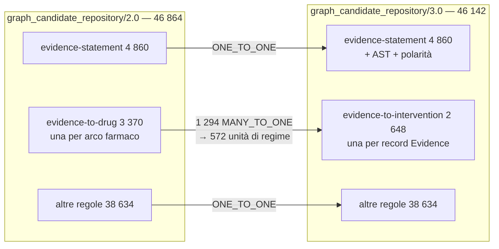

# 10 — Shadow comparison v2 vs v3

Confronto full-corpus. Nessun impatto sul dossier canonico; nessuna differenza
calcolata dal frontend.

## Cardinalità

| | v2 | v3 | Δ |
|---|---|---|---|
| Candidate | 46 864 | **46 142** | **−722** |

La differenza è **interamente spiegata** e non è una perdita:

```
3 370 archi farmaco (v2, una candidate per arco)
2 648 record Evidence con farmaci (v3, una candidate per record)
-------------------------------------------------------------
  −722
```

Nessun'altra regola cambia cardinalità: `evidence-statement` 4 860,
`gene-drug-interaction` 25 589, `trial-drug` 7 381, `trial-gene` 5 501,
`companion-diagnostic` 163 — identiche in entrambe le versioni.

> **v3 non è migliore perché produce meno candidate.** Produce meno candidate
> perché smette di affermare N relazioni positive indipendenti dove la sorgente
> ne descriveva una sola, non separabile. Il criterio di valutazione è la fedeltà
> semantica alla sorgente, non il conteggio.

## Copertura dei path

| Metrica | Valore |
|---|---|
| Path eleggibili | 46 864 |
| Path coperti da v3 | **46 864** |
| Path mancanti | **0** |
| Path spuri | **0** |
| `structural_precision` | **1.0** |
| `structural_recall` | **1.0** |

Ogni path eleggibile è rappresentato in v3; le 722 candidate in meno
corrispondono a path **fusi**, non persi. Il mapping lo documenta riga per riga.

## Guadagni semantici

| Dimensione | v2 | v3 |
|---|---|---|
| Candidate con polarità esplicita | **0** | **7 454** |
| `Does Not Support` visibile nel contratto | 0 | **873** |
| Alterazioni composte rappresentate | 0 | **1 010** |
| Termini di alterazione persi | 1 091 candidate | **0** |
| Regimi spezzati in componenti positivi | 1 294 | **0** |
| Regimi conservati come unità | 0 | **572** |

## Impatto previsto sul retrieval

| Effetto | Candidate |
|---|---|
| Rimosse dal percorso positivo (`DOES_NOT_SUPPORT` + `NEUTRAL` + `CONTRADICTS`) | **1 034** |
| Non eleggibili al match esatto sull'intervento | **572** |
| Non eleggibili al match esatto sull'alterazione | **0** |

Le 1 034 non sono cancellate: restano nel repository per audit, con lo stato che
ne spiega il trattamento. In v2 erano indistinguibili dalle candidate supportate.

## Mapping v2 → v3

| `relation_type` | Righe |
|---|---|
| `ONE_TO_ONE` | 45 570 |
| `MANY_TO_ONE` (`REGIMEN_UNIT_MERGED`) | **1 294** |
| `REMOVED_UNSUPPORTED` | 0 |
| `REMOVED_UNRESOLVED_REGIMEN` | 0 |
| `NEWLY_RECOVERED_COMPOUND` | 0 |
| `UNMAPPED` | 0 |
| **Totale** | **46 864** = candidate v2 |

Ogni candidate v2 è mappata. Le 1 294 `MANY_TO_ONE` confluiscono nelle 572 unità
di regime. **Nessun record storico è stato cancellato.**

`NEWLY_RECOVERED_COMPOUND = 0` merita una nota: le alterazioni composte non
generano *nuove* candidate — arricchiscono quelle esistenti. Il recupero è di
**contenuto**, non di cardinalità.

## Casi sintetici esistenti

I cinque casi congelati del runtime restano rappresentati in v3: le loro
relazioni sono `ONE_TO_ONE` nel mapping. Nessun caso perde la propria candidate.


