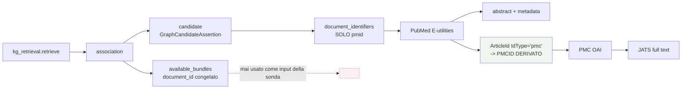

# Da dove arriva l'identificatore

**VERIFIABLE RESEARCH PIPELINE — NOT CLINICALLY VALIDATED.**

Artefatto: `selected_candidates.json`, `provenance_probe.json`.

## 1. La catena reale



## 2. Cosa contiene la candidate

`kg_retrieval.py:139` costruisce le associazioni con due cose distinte: la
`candidate` intera e i suoi `available_bundles`. Solo la prima è provenance del
grafo; il `document_id` dei bundle appartiene all'artefatto congelato del pilot.

Esempi reali:

| Candidate | `document_identifiers` | Bundle che la citano |
|---|---|---|
| `GCA-0a52f20ab5e3e93c15582f2e` | `[{pmid: 24658966, scope: evidence_record}, {pmid: 24658966, scope: linked_publication}]` | `pmid:24658966` |
| `GCA-0062c0237b990701837a1cc4` | `[{pmid: 27870574}]` | `pmid:27870574` **e** `pmcid:PMC6716598` |
| `GCA-050c5cdbcf4d664afe303e0a` | `[{pmid: "26698910;25727400;31358542;27432227;24675041"}]` | `pmcid:PMC3129369`, `pmcid:PMC4808052`, `pmid:24675041` |

Tre osservazioni:

1. **Solo PMID.** Nessuna candidate porta un PMCID.
2. **Campi composti.** Un `pmid` può contenere più identificatori separati da
   `;`. `expand_identifier()` li separa in modo deterministico — nessuna
   euristica.
3. **Relazione uno-a-molti.** Una candidate può legittimamente riferirsi a più
   documenti. Non è ambiguità: `paper_selection` ne seleziona al massimo due, con
   criteri documentati.

## 3. Dove nasce il PMCID

`authorized_cache.py:269-272`, mentre si parsa la risposta `efetch` di PubMed:

```python
pmcid = None
for node in article.findall(".//ArticleId"):
    if node.attrib.get("IdType", "").lower() == "pmc":
        pmcid = (node.text or "").strip().upper()
```

Il PMCID è **dichiarato da PubMed nella risposta stessa**. Non esiste alcuna
tabella di mapping nel repository, nessun inserimento manuale, nessuna
inferenza. È una trasformazione deterministica di un payload ufficiale.

Verifica sul manifest: 14 delle 17 righe `pmid:` portano un `pmcid` negli
`identifiers`, ottenuto esattamente così. Le altre 3 non hanno PMC.

## 4. I tre casi selezionati

Scelti da criteri applicati ai dati reali, non a mano
(`select_candidates()` in `scripts/probe_live_document_fetch.py`).

| Slot | Candidate | PMID dalla provenance | PMCID derivato | Percorso |
|---|---|---|---|---|
| **A** | `GCA-0a52f20ab5e3e93c15582f2e` | `24658966` | nessuno | PubMed abstract |
| **B** | `GCA-0000980ba01970f893f8e4d7` | `15705718` | **`PMC248481`** | PubMed → PMC full text |
| **C** | `GCA-003ca9889b3d8906d4674f37` | `23724867` | `PMC4081656` | PMC nega → degrado ad abstract |

In tutti e tre `human_identifier_input_required = false` e
`bundle_document_id_used_as_input = false`.

Il PMCID derivato in B e C **coincide con quello registrato nella baseline del
2026-08-03**: la derivazione è riproducibile, non fortunata.
