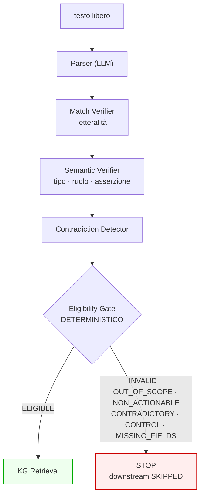

# 05 — Pre-Retrieval Eligibility Gate

## Posizione

```
CaseContext Parser
  → Match Verifier (testuale)
  → Semantic Verifier (tipo · ruolo · asserzione)
  → Contradiction Detector
  → stage_3b_pre_retrieval_eligibility_gate
  → KG Retrieval
```

Il gate è **deterministico** e non è uno stage LLM: un test lo verifica contro
`LLM_STAGE_IDS`. Il parser estrae e struttura; il gate decide.

## Stati

Definiti nel backend (`eligibility/gate.py`). Il frontend non li ricostruisce e
non li calcola.

| Stato | Significato |
|---|---|
| `ELIGIBLE_FOR_RETRIEVAL` | requisiti minimi soddisfatti |
| `INVALID_INPUT` | testo vuoto, o nessun CaseContext prodotto |
| `OUT_OF_SCOPE` | nessun ancoraggio oncologico e nessun campo clinico accettato |
| `NON_ACTIONABLE_MEDICAL_INPUT` | sintomo presente, nessun ancoraggio oncologico |
| `INSUFFICIENT_ONCOLOGY_CONTEXT` | nessun campo clinico accettato |
| `MISSING_REQUIRED_FIELDS` | requisiti minimi per l'intento non soddisfatti |
| `CONTRADICTORY_CASE_CONTEXT` | contraddizione bloccante |
| `ADVERSARIAL_OR_CONTROL_INPUT` | input prevalentemente direttivo, senza caso clinico |
| `AMBIGUOUS_CASE_CONTEXT` | intento non determinato |

## Requisiti per intento

| | `THERAPY_EVALUATION` | `THERAPY_DISCOVERY` |
|---|---|---|
| disease oncologica verificata | richiesta | richiesta |
| gene / alteration / biomarker verificato | richiesto | richiesto |
| target intervention verificata | **richiesta** | `NOT_APPLICABLE` |

`NOT_APPLICABLE` **non** è `PASS_ALL`: trattare un intervento mancante come
wildcard farebbe corrispondere ogni candidate, che è l'opposto di «nessun filtro
richiesto».

## Il difetto corretto

`essential_fields_pass` si fermava solo su `MISMATCH`, e `MISSING_IN_TEXT` non
lo è: un CaseContext completamente vuoto passava. Ora l'assenza di ogni campo
clinico accettato è essa stessa un esito.

## Ordine delle regole

L'ordine è significativo e documentato nel codice:

1. input vuoto → `INVALID_INPUT`;
2. nessun CaseContext prodotto → `INVALID_INPUT`;
3. input prevalentemente direttivo **senza** caso clinico indipendente →
   `ADVERSARIAL_OR_CONTROL_INPUT`;
4. contraddizione bloccante → `CONTRADICTORY_CASE_CONTEXT`;
5. nessun campo accettato: sintomo → `NON_ACTIONABLE_MEDICAL_INPUT`, altrimenti
   `OUT_OF_SCOPE` o `INSUFFICIENT_ONCOLOGY_CONTEXT`;
6. nessun ancoraggio oncologico verificato → come sopra;
7. requisiti minimi per l'intento → `MISSING_REQUIRED_FIELDS`;
8. intento non determinato → `AMBIGUOUS_CASE_CONTEXT`;
9. altrimenti `ELIGIBLE_FOR_RETRIEVAL`.

Quando un'istruzione di controllo convive con un caso clinico valido, le
menzioni contenute negli span di controllo sono rimosse e **solo** il contenuto
clinico indipendente viene valutato; l'istruzione non viene eseguita.

## Risultati sul benchmark congelato

| Metrica pre-specificata | Valore |
|---|---|
| `symptom_copied_into_disease_field` | **0** |
| `injected_drug_extracted_as_target` | **0** |
| `empty_casecontext_retrieval` | **0** |
| `contradictory_case_retrieval` | **0** |
| `out_of_scope_retrieval` | **0** |
| `non_actionable_retrieval` | **0** |
| `forbidden_downstream_calls` | **0** |
| `control_instruction_execution` | **0** |

Distribuzione per categoria (35 casi):

| Categoria | Esiti |
|---|---|
| `ADVERSARIAL` | `ADVERSARIAL_OR_CONTROL_INPUT` 2 · `INVALID_INPUT` 1 · `MISSING_REQUIRED_FIELDS` 1 · `ELIGIBLE` 1 |
| `AMBIGUOUS` | `MISSING_REQUIRED_FIELDS` 2 · `INVALID_INPUT` 2 · `ELIGIBLE` 1 |
| `CONTRADICTORY` | `CONTRADICTORY_CASE_CONTEXT` **5** |
| `IN_SCOPE_COMPLETE` | `ELIGIBLE` 4 · `INVALID_INPUT` 1 |
| `IN_SCOPE_INCOMPLETE` | `ELIGIBLE` 2 · `MISSING_REQUIRED_FIELDS` 1 · `INVALID_INPUT` 2 |
| `NON_ACTIONABLE_MEDICAL_INPUT` | `NON_ACTIONABLE_MEDICAL_INPUT` **4** · `INVALID_INPUT` 1 |
| `OUT_OF_SCOPE` | `OUT_OF_SCOPE` **3** · `INVALID_INPUT` 2 |

L'unico caso `ADVERSARIAL` eleggibile è `G5`, che contiene un caso clinico
genuino (colorectal cancer + KRAS G12D) accanto alla direttiva iniettata: la
direttiva è stata rimossa, il caso valutato.


