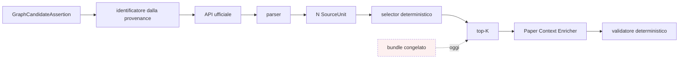

# Implicazioni architetturali

**VERIFIABLE RESEARCH PIPELINE — NOT CLINICALLY VALIDATED.**
**Analisi, non mandato di integrazione.**

## 1. Il buco è colmabile



Il tratteggio è la dipendenza che il selector rimpiazzerebbe. Sui dati
disponibili la sostituzione non degrada nulla a valle: stessa decisione in 8
casi su 8, stessi tassi di validazione, +6% di token.

## 2. Cosa cambierebbe in `paper_selection`

Oggi:

```python
source_unit_ids = bundle["source_unit_ids"]
resolved_units = [uid for uid in source_unit_ids if ...]
```

Domani, in un runtime operativo, la lista arriverebbe dal selector quando il
bundle non esiste. **Ma questa fase non lo implementa**: `paper_selection` non è
stato toccato, e il modulo del selector non è importato da alcun componente del
runtime — verificato da un test che scandisce il package.

La forma dell'integrazione non è ovvia e va progettata a parte: servono almeno
una decisione su cosa fare quando *entrambe* le fonti sono disponibili, e una
sul comportamento in caso di `NO_RELEVANT_SOURCE_UNIT`.

## 3. Proprietà da non perdere

| Proprietà attuale | Perché va preservata |
|---|---|
| Le unità mostrate al modello sono tracciabili | Il validatore verifica la quote contro *quelle* unità; un insieme non registrato rende la verifica non riproducibile |
| Il fallimento è un esito | `NO_RELEVANT_SOURCE_UNIT` deve restare visibile, non diventare «mostra le meno peggio» |
| Nessun LLM nella selezione | Un ranking generato da un modello non è contestabile riga per riga |
| Provenance completa | `selector_version`, `input_hash`, `ranking_hash` devono finire nel ledger come già fanno `manifest_hash` e `content_hash` |

## 4. Quello che il selector non può fare

Il controllo negativo lo dimostra: il punteggio distingue in aggregato un
documento pertinente da uno che non lo è (mediana 7.08 contro 0.00), ma le code
si sovrappongono e il 22.9% delle coppie non collegate supera il minimo delle
collegate.

**Il selector ordina dentro un documento; non decide se il documento serva.**
Nel runtime attuale la questione non si pone — il legame candidate/documento
viene dalla provenance della GCA. Si porrebbe in un'architettura che volesse
anche scegliere quali documenti leggere, e lì servirebbe un criterio diverso.

## 5. Rischi da istruire prima di integrare

| Rischio | Nota |
|---|---|
| Overfitting implicito | Pesi e prior scelti dopo aver visto le statistiche di 25 bundle; nessun set di controllo |
| Generalizzazione ad articoli nuovi | Mai testata: i documenti «live» sono riscaricati, non nuovi |
| Dipendenza dal dominio | Le feature sono geni, varianti e farmaci; fuori dall'oncologia molecolare il ranking perderebbe i propri appigli |
| Contaminazione degli esperimenti | Se la selezione diventa dinamica, due run sullo stesso caso potrebbero mostrare unità diverse se il documento cambia |
| Granularità | Il selector eredita il taglio del parser; su documenti con paragrafi molto lunghi il budget di token cresce |

## 6. Raccomandazione

Il componente mancante esiste, è semplice, deterministico e — sui dati
disponibili — non peggiora nulla. Ma i dati disponibili sono venticinque bundle
dello stesso corpus che ha definito il gold.

La direzione è giusta. La prova non è ancora sufficiente a giustificare una
modifica del runtime canonico, e nulla in questa fase la richiede.
