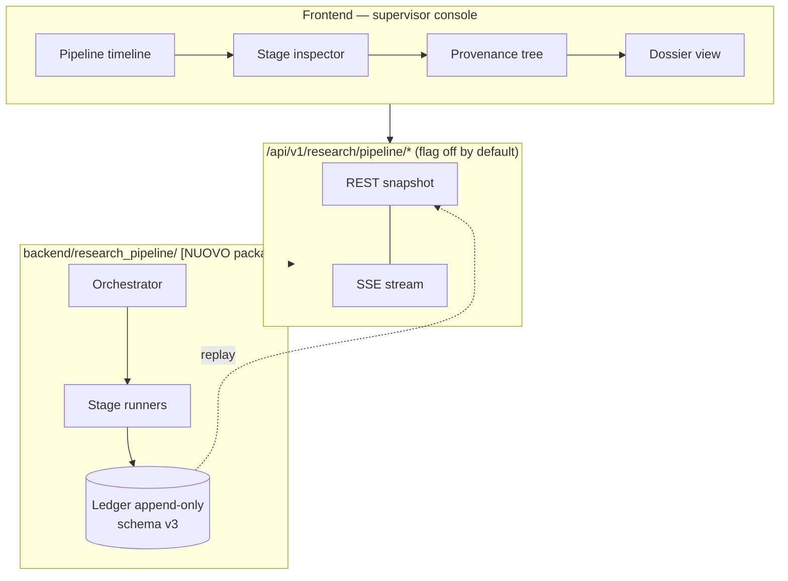

# Verifiable research pipeline — system design (derivato)

**Branch:** `feature/v3-verifiable-pipeline-ui`
**Base:** `2063c28` (audit Fase A)
**Data:** 2026-08-04
**Stato:** derivato dal codice esistente, in attesa di approvazione

## 0. Provenienza di questo documento

Il SYSTEM DESIGN originale non è stato fornito. Su indicazione dell'utente
questo documento **lo sostituisce** ed è la fonte architetturale del lavoro.

Non è inventato: ogni contratto qui sotto è **estratto** dal codice del pilot
(`6ee64c5`) o dal runtime di prodotto. Dove propongo qualcosa di nuovo, è
marcato **[NUOVO]**. Dove il codice esistente non copre un requisito del prompt,
è marcato **[NOT_IMPLEMENTED]** e resta tale: non viene simulato.

Il design system Cohere fornito dall'utente vale **solo** per la §18 (aspetto
visivo) e non ha effetti architetturali.

## 1. Destinazione

**VERIFIABLE RESEARCH RUNTIME**, non *clinically validated production runtime*.

Vincoli fissati dall'utente e assunti come non negoziabili:

1. namespace separato `/api/v1/research/pipeline/*`;
2. feature flag `VERIFIABLE_PIPELINE_RESEARCH_ENABLED`, default **off**;
3. nessun endpoint esistente modificato o sostituito;
4. marcatura esplicita in UI: *Research pipeline · Experimental component · Not
   for clinical decision-making*;
5. QUOTE e ABSTAIN entrambi presentati come esiti normali;
6. nessun mock: si riusano i casi sintetici e le SourceUnit congelate;
7. il vecchio `llm_claim_extractor` resta fuori dal flusso principale.

## 2. Architettura in tre strati



Il ledger è la sola fonte di verità della run. REST serve snapshot derivati;
SSE trasmette gli stessi eventi in append-only. La UI non calcola nulla di
canonico.

## 3. Collocazione del codice — decisione approvata

**Move**, non copy: i moduli vivono in `backend/research_pipeline/`; il harness
in `benchmarks/` importa da lì.

Complicazione reale: su questo branch **non c'è nulla da spostare**. I moduli
esistono solo su `research/v3-end-to-end-pipeline-interaction-pilot` @ `6ee64c5`.
Il "move" si realizza quindi così:

1. i moduli entrano su questo branch **direttamente** in
   `backend/research_pipeline/`, estratti da `6ee64c5`;
2. il branch del pilot **non viene toccato** (nessun push, nessun merge): resta
   come registro storico del pilot;
3. quando i due branch verranno riconciliati, la copia in `benchmarks/` andrà
   sostituita da import verso `backend/research_pipeline/`. Questo è debito
   tecnico dichiarato, non risolvibile senza merge.

### 3.1 Confine del package

I moduli core sono **quasi privi di dipendenze esterne**: importano solo
fratelli e stdlib. Verificato su `retrieval.py`, `paper_selection.py`,
`enrichment_validator.py`, `casecontext_parser.py`,
`paper_context_enricher_v2*.py`.

```
backend/research_pipeline/
├── contracts.py          [NUOVO]  PipelineRun, PipelineStage, StageProducer
├── orchestrator.py       [NUOVO]  da pipeline.py::run_case, con emissione eventi
├── events.py             [NUOVO]  vocabolario eventi della pipeline
├── casecontext/          parser, prompt, match_verifier
├── retrieval/            retrieval, paper_selection
├── enrichment/           enricher_v2, prompt, transport, validator
├── determinism/          deterministic_pipeline  (gate, status, support mask)
├── dossier/              dossier
├── data_access.py        [NUOVO]  loader dei dati congelati — vedi §3.2
└── cases/                case_definitions  (5 casi sintetici)
```

Esclusi deliberatamente: `llm_claim_extractor/` (vecchio Claim Extractor),
`paper_context_enricher.py` v1, `*_prompt_v1_1.py`, `run_pilot.py`,
`run_pilot_v1_1_enrichment.py` — RESEARCH_ONLY, restano nel harness.

### 3.2 Due rotture da gestire nel move — [NUOVO]

**a) Percorsi calcolati sulla posizione del file.** `retrieval.py` fa
`ROOT = Path(__file__).resolve().parents[3]` e da lì risolve
`candidates.jsonl` (72,5 MB) ed `evidence_bundles.jsonl` (35 KB). Spostare il
modulo **rompe il caricamento**. Il percorso diventa configurazione esplicita in
`data_access.py`, non derivazione dalla posizione del sorgente.

**b) Il runner dipende dal vecchio Claim Extractor.** `run_pilot_v2.py` importa
`_load_source_units`, `_load_supporting_maps` da
`llm_claim_extractor/run_pilot.py`. Sono **loader di dati congelati**, non
logica di estrazione. Vanno reimplementati in `data_access.py`: è la condizione
per tenere il vecchio extractor fuori dal flusso, come richiesto.

I due file dati (72,5 MB) **non vengono duplicati**: `data_access.py` li legge
dal percorso configurato in `benchmarks/`, in sola lettura.

## 4. Contratti congelati

Estratti dal codice. Dettaglio completo in
`docs/verifiable_pipeline/pipeline_stage_contracts.md`.

| Dominio | Valori | Origine |
|---|---|---|
| `query_intent` | `THERAPY_EVALUATION`, `THERAPY_DISCOVERY` | `models.py` |
| `match_status` | `MATCH`, `MISMATCH`, `UNCERTAIN`, `MISSING_IN_TEXT` | `models.py` |
| `match_field` | disease, biomarker, alteration, previous_intervention, target_intervention, query_intent | `models.py` |
| `enrichment_outcome` | 10 valori | `models.py` |
| `evidence_kind` | RESPONSE, BENEFIT, RESISTANCE, DIAGNOSTIC, MECHANISTIC, OTHER | `models.py` |
| `status` | DIRECT, PARTIAL, AMBIGUOUS, CONTRADICTED, DISCOVERED, NO_MATCH | `deterministic_pipeline.py` |
| `gate_bucket` | PRIMARY, WARNING, REJECTED, DISCOVERY | idem |
| `direction_consistency` | CONSISTENT, CONFLICTING, UNRELATED | idem |
| `stop_reason` | PARSER_TRANSPORT_FAILED, CASECONTEXT_MISMATCH, RETRIEVAL_NO_MATCH, CALL_BUDGET_EXCEEDED | `pipeline.py` |

**Nessuno di questi enum viene esteso o modificato.** Congelare significa
adottarli come sono.

## 5. Separazione dei ruoli — invariante centrale

`dossier.py` la codifica già alla fonte:

```python
"gemma_role": "paper_context_enricher_only",
"gemma_never_decides": ["support_status", "direction", "contradiction",
                        "gate", "score", "bucket"],
```

`deterministic_pipeline.evaluate_association` consuma **solo** enrichment con
outcome `ENRICHMENT_ACCEPTED` o `ENRICHMENT_ACCEPTED_WITH_WARNING`. Un
enrichment rigettato o grezzo non raggiunge mai il calcolo dello status.

Questa invariante diventa un **test di contratto**, non una dichiarazione: la
suite deve fallire se un enrichment non validato influenza status, mask, gate o
bucket.

## 6. Mappatura stage — 9 reali contro 15 richiesti

Il pilot ha 9 stage; il prompt ne elenca 15. La mappatura è esplicita, non
inventata:

| §8 | Stage UI | Pilot | Nota |
|---:|---|---|---|
| 1 | Case Input | `stage_1_free_text` | — |
| 2 | CaseContext Parser | `stage_2_casecontext_parser` | LLM |
| 3 | Match Verifier | `stage_3_casecontext_match` | deterministico |
| 4 | Retrieval Plan | `stage_4_retrieval` | **fuso con 5** |
| 5 | KG Retrieval | `stage_4_retrieval` | **fuso con 4** |
| 6 | Document Resolution | — | **replay di artefatti congelati**, §7 |
| 7 | Source Unit | — | idem |
| 8 | Paper Selection | `stage_5_paper_selection` | — |
| 9 | Paper Context Enricher | `stage_6_gemma_enrichment` | LLM |
| 10 | Enrichment Validation | `stage_7_validation` | deterministico |
| 11 | Deterministic Gates | `stage_8_deterministic_pipeline` | **fuso con 12** |
| 12 | Status | `stage_8_deterministic_pipeline` | **fuso con 11** |
| 13 | Dossier Builder | `stage_9_dossier` | — |
| 14 | Dossier Narrator | — | **[NOT_IMPLEMENTED]** |
| 15 | Narrative Verifier | — | **[NOT_IMPLEMENTED]** |

Gli stage 4/5 e 11/12 restano **fusi nell'esecuzione** ma sono **presentati
separati** in UI, perché il codice produce già output distinguibili
(`retrieval_result["associations"]` vs il piano di query; `support_mask`/`gate_bucket`
vs `status`). Non introduco una separazione artificiale nel runtime per
compiacere la UI.

Gli stage 14–15 **non vengono simulati**. La UI li mostra come non eseguiti, con
la stessa onestà con cui la spec precedente dichiarava "Narrazione LLM non
eseguita".

## 7. Document Resolution e SourceUnit — semantica di replay

`run_case` riceve `source_units_by_id` **già materializzato**. Negli stage 6–7
non avviene alcun fetch: sono replay di artefatti congelati.

La UI deve dichiararlo, altrimenti il relatore crede di osservare una
risoluzione documentale che in quella run non è avvenuta. Etichetta prevista:

> Artefatto congelato — risolto in una run precedente, non recuperato ora.

**Conseguenza di sicurezza, verificata.** `source_unit_index.jsonl` contiene
**solo locatori**: `char_start`, `char_end`, `page`, `section`,
`paragraph_index`, `sentence_index`, `content_hash` (SHA-256), `document_id`,
`parser`, `parser_version`, `unit_type`, `locator_confidence`. **Nessun campo
di testo.**

Regola di contratto che ne discende: l'API espone il **record indice** e la
**quote validata** (già bounded), **mai** il testo del documento ottenuto
unendo l'indice al document store. Il join resta interno all'enricher.

## 8. Gate — decisione approvata

Espongo **le 4 assi reali** del `support_mask` e dichiaro esplicitamente i 6
gate mancanti come `NOT_IMPLEMENTED`.

| Asse | Valori | Come è ottenuta |
|---|---|---|
| `disease` | SUPPORTED | **ereditata** dal match strutturale, non ricalcolata |
| `biomarker` | SUPPORTED | **ereditata**, idem |
| `intervention` | SUPPORTED, DISCOVERED | dal query intent |
| `direction` | SUPPORTED, CONTRADICTED, UNRELATED_EVIDENCE, NO_DOCUMENT_SIGNAL, NOT_APPLICABLE | dagli enrichment validati |

In `evaluate_association` il mask parte da `{"disease": "SUPPORTED",
"biomarker": "SUPPORTED"}` **hardcoded**. Presentarli come gate valutati sarebbe
falso. La UI li marca *ereditato dallo STAGE 4* con link all'evidenza di
retrieval che li giustifica.

`NOT_IMPLEMENTED` espliciti: source gate, provenance gate, completeness,
negation, contradiction come gate autonomo (esiste solo come esito di
`direction`), score.

## 9. Event model

Riuso del ledger esistente (`agentic/ledger.py`, schema v2), che fornisce già
append-only con trigger SQLite, hash-chain verificabile, `payload_hash`,
`parent_action_id` (causation), `generating_action_id` (lineage),
`tool_name`/`tool_version` (producer), sanitizzazione dei segreti pre-scrittura
e bounding che scarta `abstract`/`full_text`/`body`.

**Manca solo `stage_id`.** Migrazione **v2 → v3 additiva**, nella disciplina
documentata da `ledger_schema.py`: `ALTER TABLE ADD COLUMN`, mai
rebuild-and-copy, perché in un archivio di audit è indistinguibile da una
manomissione.

Dettaglio in `docs/verifiable_pipeline/pipeline_event_model.md`.

## 10. Trasporto

SSE per l'avanzamento append-only, REST per snapshot e dettaglio. Nessun
polling aggressivo. Nessun risultato simulato quando il backend è offline: la UI
mostra uno stato di errore esplicito.

Contratti in `api_contract.md` e `sse_contract.md`.

## 11. Stato frontend

Una sola rappresentazione canonica della run, derivata da
`snapshot REST + eventi SSE` tramite un reducer puro e testabile. Il browser non
calcola status, gate, score o bucket. Le sole aggregazioni ammesse in UI sono
quelle dichiaratamente derivate (conteggi), etichettate come tali.

## 12. Rischi accettati

| Rischio | Mitigazione |
|---|---|
| Campione minuscolo (7 chiamate, 2 quote accettate) | dichiarato in UI; nessuna generalizzazione |
| Duplicazione moduli fra branch fino al merge | debito tecnico dichiarato in §3 |
| `candidates.jsonl` 72,5 MB in sola lettura | nessuna copia, percorso configurato |
| `evidence_kind` fuori enum (3/7 nella v1) | già gestito come `REJECTED_SCHEMA`; resta visibile |
| Vitest bloccato su Windows (`spawn EPERM`) | da verificare in Fase C prima di dichiarare test passanti |

## 13. Cosa questo design non fa

- non tocca `/api/v1/v3/retrieve` né alcun endpoint esistente;
- non modifica gate, scoring, corpus o repository di prodotto;
- non promuove il vecchio Claim Extractor;
- non implementa narratore e verificatore narrativo;
- non produce raccomandazioni cliniche;
- non presenta il pilot come validazione clinica.
