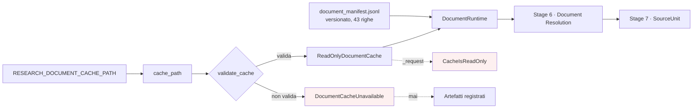

# Cache documentale nel runtime di ricerca

**VERIFIABLE RESEARCH PIPELINE — NOT CLINICALLY VALIDATED.**

## 1. Configurazione

Una sola variabile canonica:

```
RESEARCH_DOCUMENT_CACHE_PATH=/percorso/della/cache
```

`RESEARCH_PIPELINE_CACHE_ROOT` resta accettata perché già documentata. In assenza
di entrambe si usa `<data_root>/data_cache/document_grounding` — relativo alla
radice dei dati, **non** alla directory di lavoro del processo.

Prima esistevano due meccanismi non allineati: `RESEARCH_PIPELINE_CACHE_ROOT` in
`data_access` e `DOCUMENT_GROUNDING_CACHE` in `authorized_cache`, quest'ultimo
relativo alla cwd. Due variabili per la stessa cache, di cui una si comportava
diversamente a seconda di dove il backend veniva avviato.

Nessun percorso assoluto è cablato nel sorgente.

## 2. Sola lettura, imposta

`AuthorizedDocumentCache` è nata per **popolare** la cache: il costruttore crea
sette directory e i metodi scrivono sul manifest. Riusarla per leggere avrebbe
significato che una run di sola lettura può modificare la cache.

`ReadOnlyDocumentCache` eredita i soli parser e rende ogni percorso di scrittura
un errore:

```python
_request(url)            -> CacheIsReadOnly
_write_payload(rel, buf) -> CacheIsReadOnly
_record(record)          -> CacheIsReadOnly
```

Non chiama `super().__init__()`: creare directory è già una scrittura. Un test
verifica che aprire una cache inesistente non ne crei la cartella.

Conseguenza diretta: **nessun fetch di rete documentale è possibile** durante
Document Resolution, perché il metodo che lo farebbe solleva.

## 3. Validazione all'avvio

`validate_cache()` restituisce `(utilizzabile, reason_codes)`:

| Reason code | Condizione |
|---|---|
| `CACHE_PATH_NOT_FOUND` | Il percorso non esiste |
| `CACHE_PATH_NOT_A_DIRECTORY` | Esiste ma non è una directory |
| `CACHE_LAYOUT_INCOMPLETE` | Mancano `pubmed/`, `pmc/` o `clinical_trials/` |
| `CACHE_NOT_READABLE` | Permessi insufficienti |

Il controllo di layout esiste perché una directory vuota qualsiasi non è una
cache: accettarla produrrebbe zero documenti risolti, indistinguibili da
documenti realmente non disponibili.

`require_cache()` solleva `DocumentCacheUnavailable` invece di restituire un
valore degradato. **Non esiste un percorso che, non trovando la cache, rigiochi
un artefatto registrato.**

## 4. Cosa la run espone

`GET /api/v1/research/pipeline/config` e ogni snapshot di run:

```json
{
  "document_cache_available": true,
  "cache_path_redacted": ".../data_cache/document_grounding",
  "cache_version": "authorized-document-cache/1.0",
  "manifest_hash": "ece9d25d74b3050f222343d3f31dc22d20d39d1883957f431c4280ef9326006b",
  "manifest_rows": 43,
  "document_count": 40,
  "documents_with_text": 40,
  "documents_unavailable": 3,
  "source_unit_count": 3402,
  "reason_codes": []
}
```

Il percorso locale non è mai esposto per intero: `redact_path()` mostra le ultime
due componenti con un prefisso ASCII (`.../`), scelto perché questo valore
finisce in log e console Windows, dove un'ellissi tipografica si rende come byte
illeggibili.

Cache hit e miss sono per stage, nelle metriche dello stage 6.

## 5. Nessuna duplicazione

- La cache resta dove è, fuori dal repository (`.gitignore:68` → `data_cache/`).
- Nessun documento viene copiato nel repository o nel frontend.
- Nessun articolo è committato.
- Hash e lineage sono preservati: `content_hash` dal manifest, `manifest_hash`
  della run, `retrieved_at` e `license_status` nel lineage di ogni documento.

## 6. Flusso



## 7. Contenuto verificato

Cache del pilot, misurata il 2026-08-06:

| Sottocartella | File | Testo |
|---|---:|---|
| `pubmed/abstracts/` | 17 XML | sì |
| `pubmed/metadata/` | 17 JSON | solo metadata |
| `pmc/xml/` | 11 JATS | sì |
| `clinical_trials/` | 12 JSON | sì |
| `local_pdf/` | 0 | — |

40 documenti risolvibili su 43 righe di manifest. Le 3 mancanti sono
`PMC_RESOLUTION_FAILED` e restano `DOCUMENT_UNAVAILABLE`: sono il caso reale di
documento non disponibile, non simulato.

## 8. Riferimenti

- `backend/research_pipeline/documents/cache_runtime.py`
- [live_document_pipeline_audit.md](live_document_pipeline_audit.md) — §2
- [live_document_resolution.md](live_document_resolution.md)
