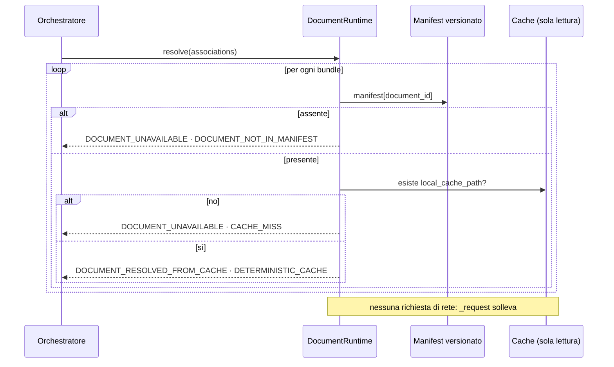

# Document Resolution live — stage 6

**VERIFIABLE RESEARCH PIPELINE — NOT CLINICALLY VALIDATED.**

## 1. Cosa faceva prima

Nulla. `orchestrator.py`, righe 330–341 della versione precedente:

```python
replayed = {"replayed": True, "note": "artefatto congelato: risolto in una run precedente"}
documents = [
    {"document_id": bundle["document_id"], "bundle_id": bundle["bundle_id"], **replayed}
    for association in retrieval_result["associations"]
    for bundle in association["available_bundles"]
]
```

Enumerava i `document_id` già presenti nei bundle del retrieval e li marcava
rigiocati — **anche quando la cache era disponibile** e la risoluzione sarebbe
stata possibile. Nessun accesso alla cache, nessuna availability, nessun reason
code.

## 2. Cosa fa ora

Per ogni bundle di ogni associazione, durante la run:

1. cerca il `document_id` nel manifest versionato;
2. verifica che `local_cache_path` risolva a un file nella cache;
3. classifica availability, tipo di documento e disponibilità del testo;
4. registra cache hit/miss, reason code e lineage.

**Nessun fetch di rete.** La cache è aperta in sola lettura e il suo metodo
`_request` solleva `CacheIsReadOnly`: non è una promessa, è un vincolo.

## 3. Output per documento

```json
{
  "document_id": "pmid:19223544",
  "bundle_id": "EB-b4c48ba003913f278ff182a6",
  "candidate_id": "GCA-008ae3aad1a64c118318ef79",
  "availability": "ABSTRACT_AVAILABLE",
  "resolved": true,
  "cache_hit": true,
  "document_type": "ABSTRACT",
  "source": "NCBI E-utilities",
  "metadata_only": false,
  "abstract_available": true,
  "full_text_available": false,
  "content_hash": "…",
  "reason_codes": ["DOCUMENT_RESOLVED_FROM_CACHE"],
  "lineage": {
    "resolver_version": "live-document-resolution/1.0",
    "manifest_hash": "ece9d25d…",
    "retrieved_at": "…",
    "license_status": "PUBLIC_METADATA_ABSTRACT"
  }
}
```

### Tipi di documento

| `availability` | `document_type` | Testo |
|---|---|---|
| `PMC_XML_AVAILABLE` | `FULL_TEXT_ARTICLE` | sì |
| `ABSTRACT_AVAILABLE` | `ABSTRACT` | sì |
| `LOCAL_PDF_AVAILABLE` | `LOCAL_PDF` | sì |
| `METADATA_ONLY` + `nct:` | `CLINICAL_TRIAL_RECORD` | sì (registro) |
| `METADATA_ONLY` (altro) | `METADATA_RECORD` | no |

I record ClinicalTrials sono `METADATA_ONLY` nel vocabolario del resolver ma
hanno testo strutturato — brief summary, descrizione dettagliata, condizioni,
interventi. Trattarli come privi di testo escluderebbe l'intera classe dei trial
dalla selezione dei paper.

## 4. Documento non disponibile

| Reason code | Condizione |
|---|---|
| `DOCUMENT_UNAVAILABLE` + `DOCUMENT_NOT_IN_MANIFEST` | Il `document_id` non è nel manifest |
| `DOCUMENT_UNAVAILABLE` + `NO_LOCAL_CACHE_PATH` | Il manifest non indica un file locale |
| `DOCUMENT_UNAVAILABLE` + `CACHE_MISS` | Il manifest lo prevede, il file non c'è |

**Il corrispondente artefatto REPLAY non viene usato.** Un documento assente
resta assente.

## 5. Esiti dello stage

| Condizione | Stato | Arresto |
|---|---|---|
| Tutti risolti | `SUCCEEDED` | — |
| Alcuni non disponibili | `WARNING` | la run prosegue con i risolti |
| Nessuno risolto, modalità LIVE | `FAILED` | `NO_DOCUMENT_RESOLVED` |
| Cache assente, modalità LIVE | `FAILED` | `DOCUMENT_CACHE_UNAVAILABLE` |

I due arresti non sono in `CORRECT_STOP_REASONS`: sono guasti, non esiti. Una run
che li riporta non ha una risposta, e non deve poterne mostrare una presa
altrove.

## 6. Flusso



## 7. Osservato

Checkpoint A, run `3312ad67`, 2026-08-06:

```
documents=1  resolved=1  cache_hits=1  cache_misses=0
pmid:19223544  ABSTRACT  ABSTRACT_AVAILABLE  DOCUMENT_RESOLVED_FROM_CACHE
network_fetch_used=false
artifact_origin=DETERMINISTIC_CACHE  execution_mode=LIVE
```

CASE-3 ha risolto 4 documenti su 4, CASE-4 2 su 2.

## 8. Riferimenti

- `backend/research_pipeline/documents/live_resolution.py`
- [document_cache_runtime.md](document_cache_runtime.md)
- [live_source_unit_loading.md](live_source_unit_loading.md)
