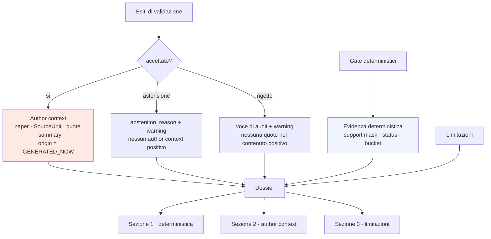

# Dossier della run live

**VERIFIABLE RESEARCH PIPELINE — NOT CLINICALLY VALIDATED.**

## 1. Ricostruito a ogni run

`build_dossier_preview` è invariato e viene eseguito allo stage 13 di **ogni**
run, live o replay. Non esiste un dossier memorizzato che sopravviva a una run e
venga riproposto: `artifact_origin = GENERATED_NOW` sempre.

## 2. Tre sezioni che restano separate

| Sezione | Contenuto | Prodotta da |
|---|---|---|
| Evidenza deterministica | support mask, direction consistency, gate bucket, status | codice |
| Author context | paper, SourceUnit, quote, summary, validazione | modello **validato** |
| Limitazioni | `research_only_pilot`, `no_new_document_fetched`, `gemma_used_only_as_enricher` | fisse |

La separazione è la ragione per cui il dossier esiste in questa forma: un
riassunto che mescolasse le prime due renderebbe indistinguibile ciò che è stato
calcolato da ciò che è stato proposto da un modello.

## 3. Comportamento per esito

**Quote accettata** → l'author context riporta paper, SourceUnit, quote,
summary, esito di validazione. `origin = GENERATED_NOW`.

**Astensione** → `abstention_reason` e warning. **Nessun author context
positivo.** L'astensione non è un vuoto da riempire.

**Quote rigettata** → voce di audit e warning. **Nessuna quote nel contenuto
positivo.** La proposta resta leggibile per capire cosa il modello aveva
suggerito e perché è stata scartata.

## 4. Osservato

| Caso | Status | Gate bucket | Author context | Warning |
|---|---|---|---|---|
| CASE-1 | `PARTIAL` | `WARNING_BUCKET` | 1 quote accettata | `VALIDATED_ENRICHMENT_DOES_NOT_ADDRESS_DIRECTION` |
| CASE-3 | `AMBIGUOUS` | `WARNING_BUCKET` | nessuno | `NO_VALIDATED_ENRICHMENT_AVAILABLE` |
| CASE-4 | `AMBIGUOUS` | `WARNING_BUCKET` | nessuno | `NO_VALIDATED_ENRICHMENT_AVAILABLE` |
| CASE-5 | — | — | — | run `STOPPED`, nessun dossier |

CASE-1 merita attenzione. La quote accettata dice che le mutazioni KRAS
conferiscono **resistenza** a panitumumab, e la candidate del grafo asserisce una
relazione di resistenza. La pipeline non ne ha fatto un claim positivo: lo status
è `PARTIAL` con l'avvertenza che la citazione validata non parla della direzione
dell'effetto. Il gate non ha promosso, e non poteva: solo esiti accettati
raggiungono i gate, e l'accettazione riguarda la letteralità della citazione, non
il suo significato clinico.

CASE-5 non ha dossier: `GET /runs/{id}/dossier` risponde 409 con il motivo
(`RETRIEVAL_NO_MATCH`), invece di restituire una struttura vuota che sembrerebbe
un risultato.

## 5. Flusso

## 6. Dopo un riavvio

Il dossier è ricostruito dal payload dell'evento `DOSSIER_BUILT`. Verificato:
`GET /runs/{id}/dossier` → 200 dopo riavvio, con `candidate_therapies` e
`limitations` presenti.

Nessun testo documentale integrale vi transita: `build_candidate_therapy_entry`
copia campi selezionati della candidate, mai la candidate grezza, quindi
`source_properties` — che contiene evidence statement in testo libero — non entra.

## 7. Riferimenti

- `backend/research_pipeline/dossier/builder.py` — invariato
- `frontend/src/research/DossierView.tsx`
- [live_enrichment_validation.md](live_enrichment_validation.md)
