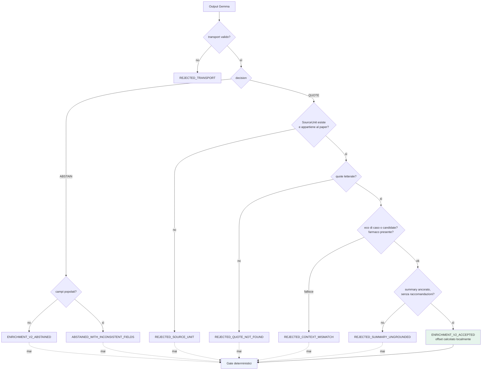

# Validazione live — stage 10

**VERIFIABLE RESEARCH PIPELINE — NOT CLINICALLY VALIDATED.**

## 1. Il validatore v2 non era raggiungibile

`PaperContextEnrichmentV2Validator` era scritto, completo e testato. Non era
collegato a nessun percorso di esecuzione.

L'orchestratore, in assenza di `validate_fn` iniettato, usava il validatore
**v1**, che apre così:

```python
if transport_result != "FORCED_TOOL_VALID":
    return _result("REJECTED_TRANSPORT", [f"TRANSPORT_RESULT:{transport_result}"])
```

Ma l'enricher v2 produce `V2_TRANSPORT_VALID`. **Ogni enrichment LIVE veniva
quindi rigettato come guasto di trasporto prima di qualunque verifica
semantica.** Il v1 cercava inoltre `enrichment["abstain"]` e
`enrichment["drug"]`, campi che il contratto v2 non ha.

In modalità replay il difetto non si manifestava: l'esito arrivava dal file
congelato. Per questo non era mai stato notato.

**Il validatore non è stato modificato. È stato collegato.**

## 2. Cosa riceve

`live_providers.validate_fn` proietta l'enrichment sui soli cinque campi del
contratto v2.0 — `decision`, `source_unit_id`, `author_claim_quote`,
`author_context_summary`, `abstention_reason`. Il validatore deve vedere ciò che
il modello ha prodotto, non i metadati aggiunti localmente dopo.

`case_context_text` e `candidate_text` alimentano i controlli anti-eco: una quote
che coincide con il testo del caso o con la candidate non proviene dal documento.

## 3. Controlli per `QUOTE`

| # | Controllo | Esito in caso di fallimento |
|---|---|---|
| 1 | `source_unit_id` non vuoto | `REJECTED_SOURCE_UNIT` |
| 2 | SourceUnit esistente | `REJECTED_SOURCE_UNIT` |
| 3 | SourceUnit appartenente al paper | `REJECTED_SOURCE_UNIT` |
| 4 | Quote non vuota | `REJECTED_QUOTE_NOT_FOUND` |
| 5 | Quote continua (niente ellissi) | `REJECTED_QUOTE_NON_CONTIGUOUS` |
| 6 | Quote **letterale** nel testo dell'unità | `REJECTED_QUOTE_NOT_FOUND` |
| 7 | Quote non copiata dal CaseContext | `REJECTED_CONTEXT_MISMATCH` |
| 8 | Quote non copiata dalla candidate | `REJECTED_CONTEXT_MISMATCH` |
| 9 | Farmaco richiesto presente nel passaggio | `REJECTED_CONTEXT_MISMATCH` |
| 10 | Summary senza raccomandazioni cliniche | `REJECTED_CLINICAL_RECOMMENDATION` |
| 11 | Summary senza linguaggio di status/gate | `REJECTED_SUMMARY_UNGROUNDED` |
| 12 | Summary ancorato alla quote (overlap ≥ 0.25) | `REJECTED_SUMMARY_UNGROUNDED` |

Il controllo 6 usa `quote not in unit_text`: confronto letterale, non fuzzy. Un
summary vuoto è **accettato** con `ENRICHMENT_V2_ACCEPTED_SUMMARY_EMPTY`, perché
il prompt lo consente esplicitamente.

L'offset è calcolato **localmente** dopo l'accettazione (`unit_text.find(quote)`).
Il modello non lo produce mai.

## 4. Controlli per `ABSTAIN`

| Condizione | Esito |
|---|---|
| Nessun campo di quote popolato | `ENRICHMENT_V2_ABSTAINED` |
| `source_unit_id`, quote o summary popolati | `ENRICHMENT_V2_ABSTAINED_WITH_INCONSISTENT_FIELDS` |

Un'astensione con campi popolati non viene mai promossa: i campi restano
visibili come audit, e l'esito non raggiunge i gate.

## 5. Cosa raggiunge i gate

Solo `ENRICHMENT_V2_ACCEPTED` e `ENRICHMENT_V2_ACCEPTED_SUMMARY_EMPTY`, tradotti
al vocabolario dei gate da `_accepted_for_gates()`. Ogni altro esito —
astensioni e rigetti inclusi — restituisce `None` e **non può in nessun caso**
influenzare status, support mask, gate o bucket.

L'adattamento vive al confine, nell'orchestratore, non dentro
`gates.evaluate_association`: la regola di decisione resta quella del pilot,
invariata e verificabile.

## 6. Cosa mostra la UI

Per ogni validazione: proposta originale strutturata, esito, reason code,
quote accettata o rigettata, offset, warning, campi ignorati. Lo stage 10 dichiara
`revalidated_during_run: true` quando la validazione è stata eseguita davvero.

## 7. Osservato

| Caso | Paper | Decisione | Esito | Reason code |
|---|---|---|---|---|
| CASE-1 | `EB-b4c48ba0…` | QUOTE | **`ENRICHMENT_V2_ACCEPTED`** | — (offset 95) |
| CASE-4 | `EB-6a291f12…` | QUOTE | **`REJECTED_CONTEXT_MISMATCH`** | `DRUG_NOT_PRESENT_IN_PASSAGE` |
| CASE-4 | `EB-e887ef4f…` | ABSTAIN | `ENRICHMENT_V2_ABSTAINED` | — |
| CASE-3 | `EB-88339243…` | ABSTAIN | `ENRICHMENT_V2_ABSTAINED_WITH_INCONSISTENT_FIELDS` | `FIELDS_POPULATED_DESPITE_ABSTAIN:['source_unit_id']` |
| CASE-3 | `EB-bd6ce2f5…` | ABSTAIN | `ENRICHMENT_V2_ABSTAINED` | — |

Il rigetto di CASE-4 è istruttivo: il modello ha citato correttamente una frase
su **BGJ398**, ma il farmaco richiesto era **infigratinib**. Sono lo stesso
composto sotto due nomi, e il validatore — che confronta stringhe e non conosce
sinonimi — ha rigettato. È un falso negativo, ed è il comportamento voluto: la
soluzione a una tabella di sinonimi mancante non è allentare il controllo.

## 8. Flusso



## 9. Riferimenti

- `backend/research_pipeline/enrichment/validator_v2.py` — **invariato**
- `backend/research_pipeline/live_providers.py` — collegamento
- [live_provenance.md](live_provenance.md)

## 10. Documentary validity is not decision-level support

Literal quote validation establishes that the quoted text occurs in the
authorized SourceUnit and that the SourceUnit belongs to the selected document.
It does not by itself establish `DIRECT` evidence for the clinical association.
The deterministic gate receives only the verified query intent, the GCA
candidate and accepted validated AuthorContext. With no validated enrichment
the runtime remains `AMBIGUOUS`; a validated quote that lacks sufficient
semantic support or carries a warning can remain `PARTIAL`. This is the
conservative behavior of the evaluated runtime, not a claim that every valid
quote is decision-level evidence.
