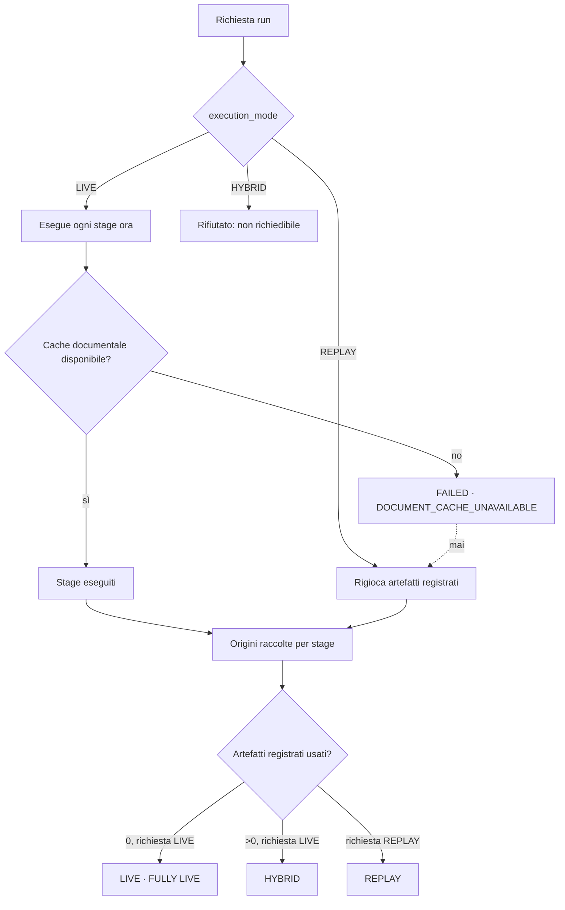

# Modalità di esecuzione e origine degli artefatti

**VERIFIABLE RESEARCH PIPELINE — NOT CLINICALLY VALIDATED.**

Il runtime precedente aveva un solo campo per due domande diverse:
`output_preview.replayed`, un booleano che l'orchestratore scriveva in modo
incondizionato sugli stage 6 e 7. Ne seguivano due letture sbagliate — uno stage
realmente eseguito appariva rigiocato, e un documento letto dalla cache appariva
equivalente a una risposta del modello registrata.

Ora gli assi sono due e indipendenti.

## 1. `execution_mode` — cosa è stato chiesto e cosa è accaduto

| Valore | Significato |
|---|---|
| `LIVE` | Ogni stage applicabile è stato eseguito al momento della run |
| `REPLAY` | La run rigioca artefatti reali registrati in precedenza |
| `HYBRID` | Run avviata in LIVE che ha comunque usato almeno un artefatto registrato |

`HYBRID` **non è richiedibile**. `normalize_requested_mode()` lo rifiuta: è una
constatazione sulla run, non una richiesta. Ammetterlo come input darebbe modo di
dichiarare in partenza una run mista e poi mostrarla come tale senza che nessuno
stage lo giustifichi.

La modalità richiesta e quella effettiva sono campi distinti:

- `requested_mode` — cosa ha chiesto il chiamante, memorizzato;
- `execution_mode` — **derivato**, mai memorizzato.

`PipelineRun.execution_mode` è una `@property`. Se fosse un campo potrebbe
divergere dagli stage che dovrebbe riassumere.

## 2. `artifact_origin` — da dove viene *questo* stage

| Valore | Significato | Conta come replay? |
|---|---|---|
| `GENERATED_NOW` | Prodotto ora | no |
| `RECORDED_REAL_RUN` | Artefatto registrato in una run precedente | **sì** |
| `DETERMINISTIC_CACHE` | Letto dalla cache autorizzata durante la run | no |
| `NOT_APPLICABLE` | Stage non implementato | no |
| `NOT_EXECUTED` | Saltato o fallito | no |

### La distinzione che conta

`DETERMINISTIC_CACHE` **non** è `RECORDED_REAL_RUN`.

- Un documento PubMed letto dalla cache locale è la **fonte**. Leggerlo durante
  la run è parte dell'esecuzione, non una sua sostituzione.
- Una risposta di `gemma4:cloud` registrata al commit `6ee64c5` è un **output**
  di un'esecuzione passata. Riusarla significa non aver eseguito quello stage.

Per questo `REPLAYED_ORIGINS` contiene solo `RECORDED_REAL_RUN`, e la UI usa il
badge `CACHED DOCUMENT`, distinto da `REPLAY`.

## 3. Regola di classificazione

```python
def classify_run_mode(requested, origins):
    if requested == REPLAY:
        return REPLAY
    return HYBRID if count_replay_artifacts(origins) > 0 else LIVE
```

Deliberatamente asimmetrica:

- **un solo** artefatto registrato declassa una run LIVE a HYBRID;
- **nessuna** combinazione di stage promuove a LIVE una run avviata in REPLAY.

Il declassamento è automatico e non disattivabile. `PipelineStage.__post_init__`
rifiuta la combinazione `execution_mode=LIVE` con
`artifact_origin=RECORDED_REAL_RUN`: non è un controllo di stile, è ciò che
rende impossibile costruire lo stato che si vuole evitare.

## 4. Cosa vede la UI

In testa alla run, calcolati **dal backend**:

```
Execution mode:        LIVE
Document cache:        AVAILABLE
LLM calls:             2
Replay artifacts used: 0
```

`Replay artifacts used` è mostrato anche quando vale zero: un campo che compare
solo se diverso da zero non distingue "nessun artefatto" da "non misurato".

`FULLY LIVE` compare solo con `execution_mode == LIVE` **e**
`replay_artifacts_used == 0`.

## 5. Badge per stage

| Origine | Badge |
|---|---|
| `GENERATED_NOW` | `LIVE` |
| `DETERMINISTIC_CACHE` | `CACHED DOCUMENT` |
| `RECORDED_REAL_RUN` | `REPLAY` |
| `NOT_APPLICABLE` | `NOT IMPLEMENTED` |
| `NOT_EXECUTED` | `SKIPPED` |
| qualsiasi, con `status == FAILED` | `FAILED` |

`FAILED` prevale sull'origine: per uno stage fallito ciò che conta è che non ha
prodotto un risultato.

## 6. Diagramma



L'arco tratteggiato è quello che **non** esiste: nessun percorso porta da un
fallimento LIVE al replay.

## 7. Riferimenti

- `backend/research_pipeline/execution_mode.py` — vocabolario e classificazione
- `backend/research_pipeline/contracts.py` — invarianti su stage e run
- `frontend/src/research/RunModeHeader.tsx` — intestazione
- `frontend/src/research/tokens.ts` — `badgeFor()`
- [live_vs_replay.md](live_vs_replay.md) — confronto operativo
