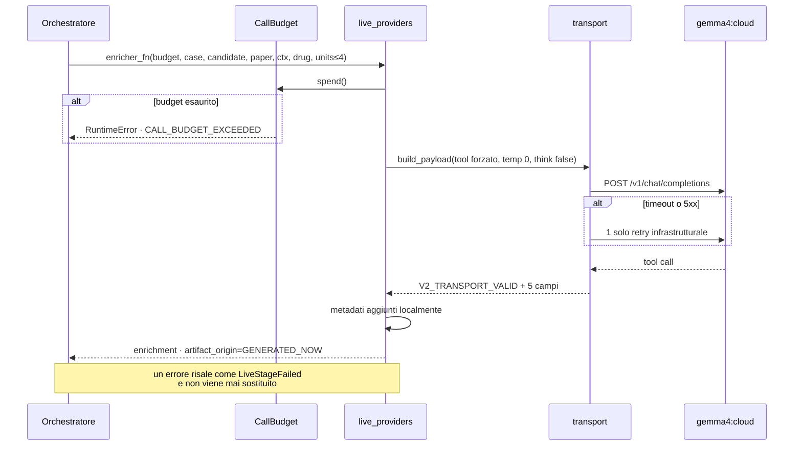

# Paper Context Enricher live — stage 9

**VERIFIABLE RESEARCH PIPELINE — NOT CLINICALLY VALIDATED.**

## 1. Configurazione

| Voce | Valore |
|---|---|
| Modello | `gemma4:cloud` |
| Provider | Ollama Cloud |
| Prompt | `paper-context-enricher-prompt/2.0` |
| Transport | `paper-context-enrichment-transport/2.0` |
| Tool | `submit_paper_context_enrichment_v2` |
| Etichetta transport | `OLLAMA_FORCED_TOOL_CHOICE_V2` |

```
temperature = 0      top_p = 1.0     think = false
max_tokens  = 1024   stream = false  tool_choice = forzato
```

L'endpoint ha formato compatibile con Chat Completions
(`/v1/chat/completions`), ma **nessun servizio o modello OpenAI è coinvolto**.

### Come si raggiunge Ollama Cloud

In questo ambiente l'app Ollama locale fa da proxy autenticato verso Ollama
Cloud: `gemma4:cloud` non è un modello scaricato in locale — `POST /api/show` lo
risolve come modello cloud con capability `tools`. È esattamente il percorso che
il pilot ha usato al commit `6ee64c5`, e il tag registrato negli artefatti è lo
stesso. `RESEARCH_PIPELINE_LLM_BASE_URL` punta a `http://localhost:11434`; il
transport funziona identicamente contro `https://api.ollama.com` con
`OLLAMA_API_KEY`.

## 2. Tre difetti che rendevano il percorso inutilizzabile

**Transport cablato.** `transport.py` aveva endpoint e modello come costanti di
modulo, senza header di autorizzazione. `llm_config.py` conteneva la
configurazione corretta e **nessun modulo lo importava**. Ora l'endpoint è
risolto a ogni chiamata da `llm_config`, con header `Bearer` quando serve.

**Argomenti sfalsati.** L'orchestratore chiama
`call_enricher_fn(budget, case_id, candidate_id, paper_id, …)`, mentre
`call_enricher_v2` comincia da `case_id`. Passarla direttamente faceva scivolare
ogni argomento di una posizione: il budget finiva in `case_id`. `live_providers`
adatta la firma.

**Budget dichiarato e non applicato.** `CallBudget` esisteva e la docstring di
`pipeline.run_case` diceva che sono i chiamanti a spenderlo. Nessun chiamante lo
faceva. Ora `parser_fn` ed `enricher_fn` lo spendono, e superarlo solleva.

## 3. Cosa Gemma decide, e cosa no

Decide **solo**:

```
decision: QUOTE | ABSTAIN
```

più, per `QUOTE`: `source_unit_id`, `author_claim_quote`,
`author_context_summary`; per `ABSTAIN`: `abstention_reason`.

Non produce — e il transport rifiuta strutturalmente chiavi extra:

`evidence_kind` · support status · gate · score · bucket · recommendation ·
claim ufficiale · `candidate_id` · `paper_id` · offset · hash.

Tutto questo è aggiunto o calcolato localmente **dopo** un transport valido:
`enrichment_id`, `case_id`, `candidate_id`, `paper_id`, modello, versioni,
`payload_hash`, timestamp, lineage. La sola normalizzazione applicata all'output
del modello è il trim degli spazi esterni — nessuna correzione di punteggiatura,
nessuna traduzione, nessuna ricostruzione di quote, nessun recupero via regex,
nessun secondo passaggio LLM.

## 4. Cosa viene inviato

Per ogni chiamata: il CaseContext, un sommario minimo della candidate
(`candidate_id`, disease, biomarkers), il farmaco richiesto, e **al massimo 4
SourceUnit** di **un solo** paper.

Non viene inviato: nessun articolo integrale, nessun dato reale di paziente
(i casi sono sintetici), nessuna credenziale, nessuna API key nel prompt, nessun
username, nessun percorso locale, nessuna cache completa.

Massimo 2 paper per associazione → al massimo 8 estratti per candidate, tutti già
presenti nella cache PubMed/PMC/ClinicalTrials.

## 5. Retry

Solo infrastrutturale: timeout, errore HTTP 5xx, connessione interrotta.
`MAX_RETRIES_INFRA_ONLY = 1`. **Mai** un retry semantico: un ABSTAIN non viene
richiesto una seconda volta sperando in una QUOTE. Ogni retry è registrato in
`retry_count` ed esposto nelle metriche dello stage.

Retry osservati nelle run live: **0**.

## 6. Fallimento

Un errore di chiamata risale come `LiveStageFailed`, mai catturato per
sostituire il risultato:

```
stage_9  FAILED  LIVE_STAGE_FAILED  artifact_origin=NOT_EXECUTED
run      FAILED  stopped_at=LIVE_STAGE_FAILED
```

È la differenza fra «il modello si è astenuto» e «non ho parlato con il modello».
Un fallback le renderebbe indistinguibili.

## 7. Osservato — 10 chiamate reali

| Caso | Paper | Decisione | Token in/out | Latenza | Retry |
|---|---|---|---:|---:|---:|
| CASE-1 | `EB-b4c48ba0…` | **QUOTE** | 1638/127 | 3.3 s | 0 |
| CASE-4 | `EB-6a291f12…` | QUOTE | 2136/154 | 3.6 s | 0 |
| CASE-4 | `EB-e887ef4f…` | **ABSTAIN** | 1645/76 | 5.4 s | 0 |
| CASE-3 | `EB-88339243…` | **ABSTAIN** | 1103/123 | 61.5 s | 0 |
| CASE-3 | `EB-bd6ce2f5…` | **ABSTAIN** | 2050/98 | 3.5 s | 0 |

Più 5 chiamate al CaseContext Parser (CASE-1, CASE-3, CASE-4, CASE-5 × 2).
Totale **10 su 10 autorizzate**.

Quote prodotta da CASE-1, verificata letterale in
`SU-6e4d5a52c9be05f545487ad0` all'offset 95:

> patients with mCRC bearing KRAS mutations are clinically resistant to therapy
> with panitumumab or cetuximab.

Il modello ha ri-derivato la stessa frase del pilot in una chiamata nuova. Non è
la risposta registrata: latenza, token e timestamp sono di questa run.

## 8. Flusso



## 9. Riferimenti

- `backend/research_pipeline/live_providers.py`
- `backend/research_pipeline/enrichment/enricher_v2.py`, `prompt_v2.py`,
  `transport_v2.py` — logica invariata
- `backend/research_pipeline/llm_config.py`
- [live_enrichment_validation.md](live_enrichment_validation.md)
