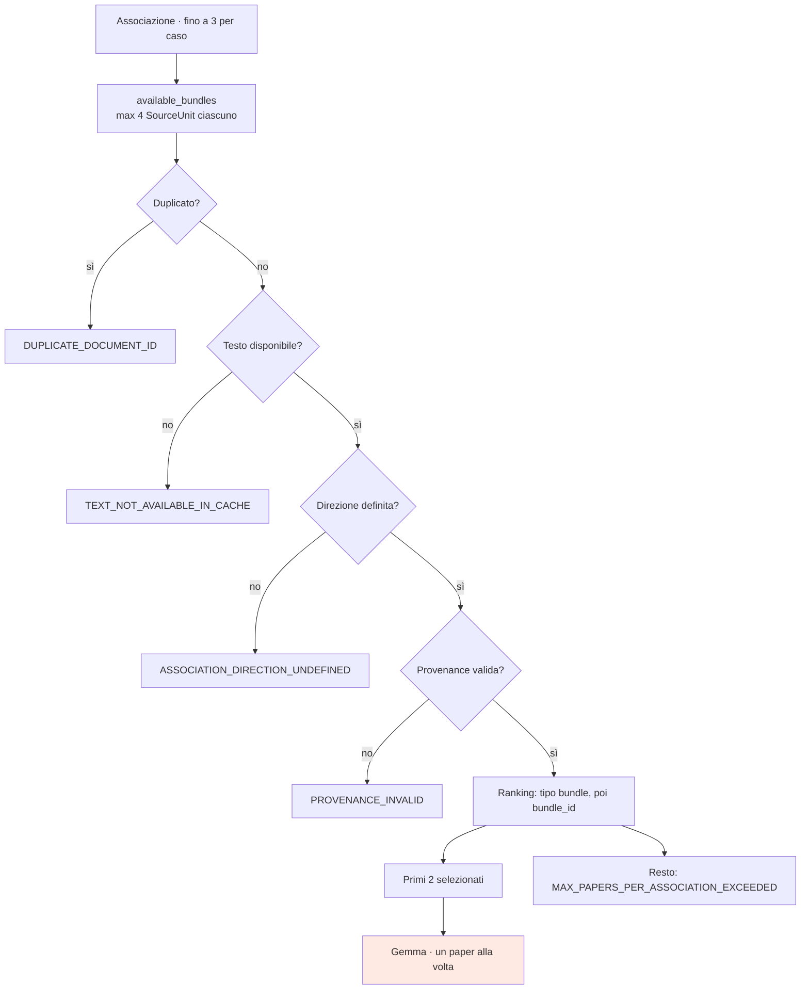

# Paper Selection live — stage 8

**VERIFIABLE RESEARCH PIPELINE — NOT CLINICALLY VALIDATED.**

## 1. Il codice non è cambiato

`retrieval/paper_selection.py` è invariato. Aveva già la logica giusta — 9
criteri ordinati, tetto di 2 paper, deduplicazione per `document_id`, ranking per
tipo di bundle. Non aveva **input con testo**.

Cambiato l'input, la selezione ha cominciato a selezionare. È la prova più diretta
che il difetto stava a monte: nessuna riga di logica decisionale è stata toccata.

## 2. Criteri

| # | Criterio | Dove è applicato |
|---|---|---|
| 1 | Disease compatibility | `kg_retrieval._match_candidate` |
| 2 | Biomarker compatibility | idem |
| 3 | Intervention compatibility | idem (solo `THERAPY_EVALUATION`) |
| 4 | Direzione o relazione pertinente | `paper_selection` |
| 5 | Testo disponibile | `paper_selection` |
| 6 | SourceUnit complete | `paper_selection` |
| 7 | Provenance valida | `paper_selection` |
| 8 | Priorità all'evidenza diretta | `_BUNDLE_TYPE_RANK` |
| 9 | Deduplicazione | `seen_document_ids` |

I criteri 1–3 sono già garantiti dal match del retrieval e registrati in
`match_reason_codes`; la selezione applica 4–9.

Ranking deterministico: `(priority_rank, bundle_id)`. Nessun caso di parità è
risolto in modo arbitrario — a parità di tipo decide l'ID, che è stabile.

`FULLTEXT_LOCAL_CONTEXT_BUNDLE` < `ABSTRACT_BUNDLE` < `TRIAL_BUNDLE`. Il ranking è
per **tipo di bundle**, mai per un'etichetta di supporto: usare il ground truth
per scegliere cosa mostrare al modello renderebbe circolare l'esperimento.

## 3. Tetti

| Limite | Valore | Dove |
|---|---:|---|
| Associazioni per caso | 3 | `kg_retrieval.MAX_ASSOCIATIONS_PER_CASE` |
| Paper per associazione | **2** | `paper_selection.MAX_PAPERS_PER_ASSOCIATION` |
| SourceUnit per documento | **4** | `kg_retrieval.MAX_SOURCE_UNITS_PER_DOCUMENT` |

Il tetto di 4 unità è applicato **a monte**, quando il retrieval costruisce
`available_bundles`. È ciò che limita quanto testo può raggiungere il modello, e
va letto insieme al tetto di 2 paper: al massimo 8 estratti per associazione.

## 4. Reason code di esclusione

| Codice | Significato |
|---|---|
| `TEXT_NOT_AVAILABLE_IN_CACHE` | Nessuna unità con testo (era la norma, ora l'eccezione) |
| `DUPLICATE_DOCUMENT_ID` | Documento già selezionato per questa associazione |
| `ASSOCIATION_DIRECTION_UNDEFINED` | La candidate non dichiara una direzione |
| `PROVENANCE_INVALID` | Manca `document_id` o `bundle_id` |
| `MAX_PAPERS_PER_ASSOCIATION_EXCEEDED` | Oltre il tetto di due |

Ogni paper escluso porta il proprio motivo: un'esclusione senza spiegazione
sarebbe indistinguibile da un difetto.

## 5. Gemma non sceglie i paper

La selezione è **deterministica e a monte**. Il modello riceve un `paper_id` e le
sue SourceUnit già scelte; non vede gli altri paper, non può chiederne altri, e
non ha modo di influenzare la selezione — che avviene prima di qualunque chiamata.

Lo stage 8 dichiara `recomputed_during_run: true` quando la selezione è stata
ricalcolata (modalità LIVE) e `false` quando proviene da un artefatto registrato.

## 6. Osservato

| Caso | Considerati | Selezionati | Unità/paper | Esclusi |
|---|---:|---|---|---|
| CASE-1 | 1 | `EB-b4c48ba0…` | 4 | — |
| CASE-3 | 4 | `EB-88339243…`, `EB-bd6ce2f5…` | 4, 5 | 2 × `MAX_PAPERS_PER_ASSOCIATION_EXCEEDED` |
| CASE-4 | 2 | `EB-6a291f12…`, `EB-e887ef4f…` | 3, 3 | — |

Nessuna esclusione per `TEXT_NOT_AVAILABLE_IN_CACHE` in modalità LIVE: è la
misura del cambiamento.

## 7. Flusso

## 8. Riferimenti

- `backend/research_pipeline/retrieval/paper_selection.py` — invariato
- [live_source_unit_loading.md](live_source_unit_loading.md)
- [live_gemma_enrichment.md](live_gemma_enrichment.md)
