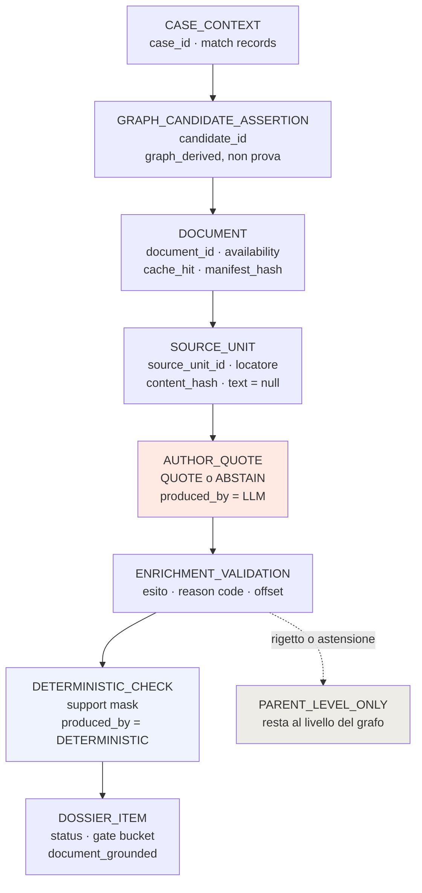

# Provenance della run live

**VERIFIABLE RESEARCH PIPELINE — NOT CLINICALLY VALIDATED.**

## 1. La catena

`GET /api/v1/research/pipeline/runs/{run_id}/provenance` restituisce, per ogni
candidate, una catena a otto livelli:

```
CASE_CONTEXT
  → GRAPH_CANDIDATE_ASSERTION
    → DOCUMENT
      → SOURCE_UNIT
        → AUTHOR_QUOTE
          → ENRICHMENT_VALIDATION
            → DETERMINISTIC_CHECK
              → DOSSIER_ITEM
```

Ogni livello è costruito **dagli stage di questa run**, letti dal loro
`output_preview`. Il lineage di un artefatto registrato non viene mai riusato
come lineage di una run nuova: in modalità LIVE gli stage 6 e 7 riportano
`manifest_hash` e `resolver_version` di **questa** esecuzione, e gli stage 9 e 10
timestamp e `payload_hash` prodotti ora.

## 2. Cosa porta ogni nodo

| Livello | Identità | Origine |
|---|---|---|
| `CASE_CONTEXT` | `case_id` | parser + match records |
| `GRAPH_CANDIDATE_ASSERTION` | `candidate_id` | `graph_derived: true`, `documentary_proof: false` |
| `DOCUMENT` | `document_id`, `bundle_id` | availability, cache hit, `manifest_hash` |
| `SOURCE_UNIT` | `source_unit_id` | locatore, `content_hash`, **`text: null`** |
| `AUTHOR_QUOTE` | `paper_id`, `source_unit_id` | modello, prompt, transport, `produced_by: LLM` |
| `ENRICHMENT_VALIDATION` | esito | reason code, offset |
| `DETERMINISTIC_CHECK` | check id | `produced_by: DETERMINISTIC` |
| `DOSSIER_ITEM` | status, gate bucket | `document_grounded` |

Al livello `SOURCE_UNIT` il campo `text` è **sempre** `null`. Il testo non
transita per l'API, nemmeno in una run LIVE in cui il backend ce l'ha.

## 3. `document_grounded`

Vero **solo** con almeno una quote accettata. Una candidate senza citazione
validata è marcata `PARENT_LEVEL_ONLY`: resta sostenuta dal grafo, e presentarla
come prova documentale è esattamente la lettura che la separazione fra candidate
e document support esiste per impedire.

Le quote rigettate e le astensioni restano visibili in campi distinti
(`rejected_quotes`, `abstentions`) per audit — mai nel contenuto positivo.

## 4. Osservato

| Caso | `provenance_level` | Perché |
|---|---|---|
| CASE-1 | `DOCUMENT_GROUNDED` | quote accettata su `pmid:19223544` |
| CASE-3 | `PARENT_LEVEL_ONLY` | due astensioni reali |
| CASE-4 | `PARENT_LEVEL_ONLY` | una quote rigettata, una astensione |

CASE-4 è il caso che conta: la candidate asserisce *Sensitivity/Response*, il
documento non la sostiene, e la catena si ferma al livello del grafo. Nessuna
promozione a positivo.

## 5. Diagramma



Il nodo `AUTHOR_QUOTE` è l'unico prodotto da un modello. `DETERMINISTIC_CHECK` e
`DOSSIER_ITEM` non lo sono mai: `PipelineStage.__post_init__` rifiuta un producer
LLM su qualunque stage diverso da 2 e 9.

## 6. Dopo un riavvio

La provenance è ricostruita dagli eventi del ledger, con la stessa forma. Il
livello `SOURCE_UNIT` resta senza testo perché il testo non è mai entrato nel
ledger.

Verificato: `GET /runs/{id}/provenance` → 200 dopo riavvio del backend, catena
`CASE_CONTEXT … DOSSIER_ITEM` completa.

## 7. Riferimenti

- `backend/api/research_routes.py` → `get_provenance`
- `backend/research_pipeline/determinism/check_origin.py`
- [run_persistence.md](run_persistence.md)
