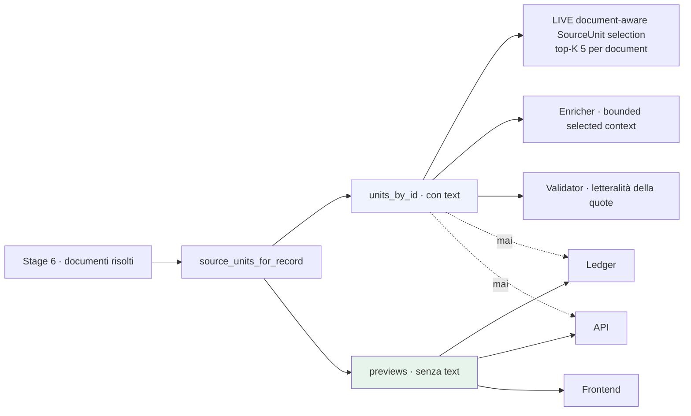

# SourceUnit live — stage 7

**VERIFIABLE RESEARCH PIPELINE — NOT CLINICALLY VALIDATED.**

## 1. Il difetto a monte di tutti gli altri

`run_store` passava all'orchestratore l'**indice** delle SourceUnit:

```python
source_units_by_id=da.load_source_unit_index()   # locatori e hash, nessun testo
```

`data_access.load_source_units()` — la funzione che il testo lo carica davvero —
non era chiamata da nessun percorso di esecuzione. Aveva solo test.

La conseguenza si propagava fino in fondo. `paper_selection` ammette un bundle
solo se almeno una sua unità ha `text` non vuoto:

```python
resolved_units = [uid for uid in source_unit_ids
                  if uid in source_units_by_id
                  and (source_units_by_id[uid].get("text") or "").strip()]
```

Con l'indice nudo la condizione era falsa per ogni bundle. Ogni paper veniva
escluso con `TEXT_NOT_AVAILABLE_IN_CACHE`, zero paper raggiungevano Gemma, e il
validatore avrebbe rigettato ogni quote con `QUOTE_NOT_LITERAL_IN_SOURCE_UNIT`.

È la ragione documentata per cui `replay.py` esisteva. Non era un difetto
nascosto: era una scelta consapevole, ora rimossa alla radice invece che aggirata.

## 2. Cosa fa ora

Per ogni documento **risolto** dallo stage 6, ri-parsa le SourceUnit dal
contenuto in cache:

| Availability | Parser | Unit type |
|---|---|---|
| `ABSTRACT_AVAILABLE` | `PubMedAbstractParser` | `TITLE`, `ABSTRACT`, `ABSTRACT_SENTENCE` |
| `PMC_XML_AVAILABLE` | `JatsXmlParser` | sezioni e paragrafi JATS |
| `LOCAL_PDF_AVAILABLE` | `PdfDocumentParser` | pagine |
| `nct:*` | costruzione diretta | `TRIAL_TITLE`, `BRIEF_SUMMARY`, `DETAILED_DESCRIPTION`, `CONDITION`, `INTERVENTION` |

Un documento che non si lascia interpretare produce
`SOURCE_UNIT_PARSE_FAILED` come **dato**, non come eccezione: la run prosegue con
gli altri documenti.

## 3. La ricostruzione è esatta, e lo si può provare

`source_unit_id` è derivato dall'hash del contenuto
(`SourceUnit.from_document_text`). La coincidenza degli ID **è** la prova che il
testo ri-parsato è byte-identico a quello del pilot.

Verificato sull'intero manifest:

```
SourceUnit ricostruite:        3402
con testo non vuoto:           3402
indice committato:             3402
ID in comune:                  3402
content_hash coincidenti:      3402
```

Su `SU-6e4d5a52c9be05f545487ad0`, l'unità della quote accettata di CASE-1:

```
document:      pmid:19223544
unit_type:     ABSTRACT_SENTENCE
content_hash:  6e4d5a52c9be05f5…   (identico all'indice)
length:        203
```

Un test lo verifica a ogni esecuzione della suite.

## 4. Due proiezioni separate nella struttura dati

`SourceUnitBundle` tiene distinte:

- **`units_by_id`** — con `text`. Non lascia il backend. È ciò su cui il
  validatore verifica la letteralità di una quote.
- **`previews`** — locatore, hash, tipo, ID, estratto troncato. È la sola forma
  che raggiunge ledger, API e frontend.

La separazione vive nella **struttura dati**, non nel punto di serializzazione:
esporre il testo richiederebbe un errore deliberato, non una dimenticanza.

### Preview di una SourceUnit

```json
{
  "source_unit_id": "SU-6e4d5a52c9be05f545487ad0",
  "document_id": "pmid:19223544",
  "unit_type": "ABSTRACT_SENTENCE",
  "locator": {
    "section": null, "paragraph_index": 0, "sentence_index": 3,
    "char_start": 812, "char_end": 1015, "page": null,
    "confidence": "STRUCTURAL"
  },
  "index": 3,
  "exact_text_available": true,
  "length": 203,
  "text_preview": "…primi 180 caratteri…",
  "content_hash": "6e4d5a52…",
  "selectable": true,
  "reason_codes": [],
  "lineage": { "parser": "…", "parser_version": "…", "loader_version": "live-source-unit-loader/1.0" }
}
```

`text` non compare. `text_preview` è limitato a 180 caratteri — sufficiente a
riconoscere il passaggio, insufficiente a ricostruire il documento.

## 5. Difese ereditate

`events.assert_payload_is_publishable()` rifiuta ricorsivamente, **prima** della
scrittura sul ledger, le chiavi `full_text`, `document_text`, `body`, `abstract`,
`source_text` e ogni forma di ragionamento interno del modello. La persistenza
eredita quella garanzia invece di ridichiararla.

Nessun `exact_text` è committato: la cache è fuori dal repository.

## 6. Flusso



## 7. Osservato

Checkpoint A: 4 SourceUnit richieste, 4 con `exact_text`, 1 documento
interpretato. CASE-3: 9 unità con testo da 4 documenti. CASE-4: 6 da 2.

## 8. Riferimenti

- `backend/research_pipeline/documents/live_resolution.py`
- `backend/research_pipeline/documents/parsers.py` — invariato
- [live_paper_selection.md](live_paper_selection.md)
