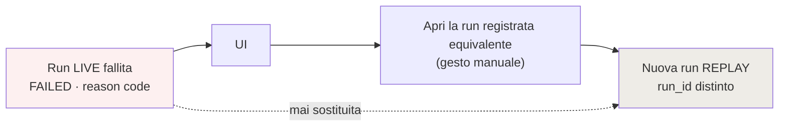

# LIVE contro REPLAY

**VERIFIABLE RESEARCH PIPELINE — NOT CLINICALLY VALIDATED.**

## 1. Il fallback silenzioso, e la sua rimozione

Prima, `research_routes.py` riga 108:

```python
use_replay = replay.has_frozen_case(case_id)
```

Se esistevano artefatti congelati per quel `case_id`, la run era replay. Tutti e
cinque i casi dimostrativi ne hanno, quindi **ogni run avviata dalla Supervisor
UI era replay**, e il chiamante non aveva modo di chiedere altro. `execution_mode`
compariva nella risposta di `POST /runs` ma non era persistito né sulla run né
sugli stage: chi rileggeva la run in seguito non poteva sapere come fosse stata
eseguita.

Ora la modalità è un campo esplicito della richiesta, con precondizioni
verificate **prima** di avviare:

```json
POST /runs { "demo_case_key": "CASE-1-…", "execution_mode": "LIVE" }
```

| Condizione | Risposta |
|---|---|
| `execution_mode` sconosciuto o `HYBRID` | `422` |
| LIVE senza credenziali LLM | `503` |
| LIVE senza cache documentale | `503`, con `RESEARCH_DOCUMENT_CACHE_PATH` nel messaggio |
| REPLAY senza artefatti per il caso | `409` |

Un LIVE impossibile fallisce subito e col proprio motivo, invece di degradare in
un replay travestito.

## 2. Confronto stage per stage

| Stage | LIVE | REPLAY |
|---|---|---|
| 1 · Case input | `GENERATED_NOW` | `GENERATED_NOW` |
| 2 · CaseContext Parser | `GENERATED_NOW` · chiamata reale | `RECORDED_REAL_RUN` |
| 3 · Match verifier | `GENERATED_NOW` | `GENERATED_NOW` |
| 4 · Retrieval plan | `GENERATED_NOW` | `GENERATED_NOW` |
| 5 · KG retrieval | `GENERATED_NOW` | `GENERATED_NOW` |
| 6 · Document Resolution | `DETERMINISTIC_CACHE` · cache letta ora | `RECORDED_REAL_RUN` |
| 7 · SourceUnit | `DETERMINISTIC_CACHE` · testo ri-parsato | `RECORDED_REAL_RUN` |
| 8 · Paper Selection | `GENERATED_NOW` · ricalcolata | `RECORDED_REAL_RUN` |
| 9 · Enricher | `GENERATED_NOW` · chiamata reale | `RECORDED_REAL_RUN` |
| 10 · Validazione | `GENERATED_NOW` · validatore v2 | `RECORDED_REAL_RUN` |
| 11 · Gate | `GENERATED_NOW` | `GENERATED_NOW` |
| 12 · Status | `GENERATED_NOW` | `GENERATED_NOW` |
| 13 · Dossier | `GENERATED_NOW` | `GENERATED_NOW` |
| 14–15 | `NOT_APPLICABLE` | `NOT_APPLICABLE` |

`replay_artifacts_used`: **0** in LIVE, **6** in REPLAY.

## 3. Cosa REPLAY resta buono a fare

Gli artefatti del commit `6ee64c5` **non sono mock**: sono risposte reali di
`gemma4:cloud`, con transport, quote, `source_unit_id`, versioni di prompt, token
e latenza. Restano validi come:

- termine di paragone per una run LIVE sullo stesso caso;
- dimostrazione riproducibile quando la cache non è disponibile;
- prova storica di ciò che il modello aveva prodotto.

Non sono validi come sostituto di una run LIVE, ed è l'unica cosa che il codice
ora impedisce strutturalmente.

## 4. Confronto osservato — CASE-1

| | Pilot `6ee64c5` (REPLAY) | Run live 2026-08-06 |
|---|---|---|
| Decisione | QUOTE | QUOTE |
| SourceUnit | `SU-6e4d5a52…` | `SU-6e4d5a52…` |
| Quote | *…clinically resistant to therapy with panitumumab or cetuximab.* | identica |
| Validazione | `ENRICHMENT_V2_ACCEPTED` | `ENRICHMENT_V2_ACCEPTED` |
| Offset | — | 95 (calcolato ora) |
| Token in/out | registrati | 1638 / 127 |
| Latenza | registrata | 3320 ms |

Il modello ha ri-derivato la stessa frase. Che l'esito coincida è un risultato,
non una premessa: latenza, token e timestamp appartengono a questa run, e
`replay_artifacts_used = 0`.

## 5. CASE-2, e perché resta REPLAY

Eseguire live tutti e cinque i casi costava 12 chiamate; il budget autorizzato è
10. CASE-2 è stato quindi eseguito in **REPLAY esplicito** ed è etichettato come
tale: `execution_mode = REPLAY`, `fully_live = false`,
`replay_artifacts_used = 6`, `llm_calls = 0`.

Non è presentato come live in nessun punto della UI. Vedi
[live_pipeline_limitations.md](live_pipeline_limitations.md).

## 6. Se una run LIVE fallisce

```
stage        FAILED   reason code proprio
run          FAILED   stopped_at = LIVE_STAGE_FAILED | DOCUMENT_CACHE_UNAVAILABLE | NO_DOCUMENT_RESOLVED
```

Conservati: reason code, errore, stage, retry, output parziale degli stage già
eseguiti.

La UI mostra un controllo **separato ed esplicito** — «Apri la run registrata
equivalente» — che avvia una run REPLAY distinta, con il proprio `run_id`. La run
fallita non viene sostituita: resta consultabile con il suo esito.



## 7. Riferimenti

- [live_execution_mode.md](live_execution_mode.md)
- `backend/api/research_routes.py` → `create_run`
- `backend/research_pipeline/replay.py` — invariato
