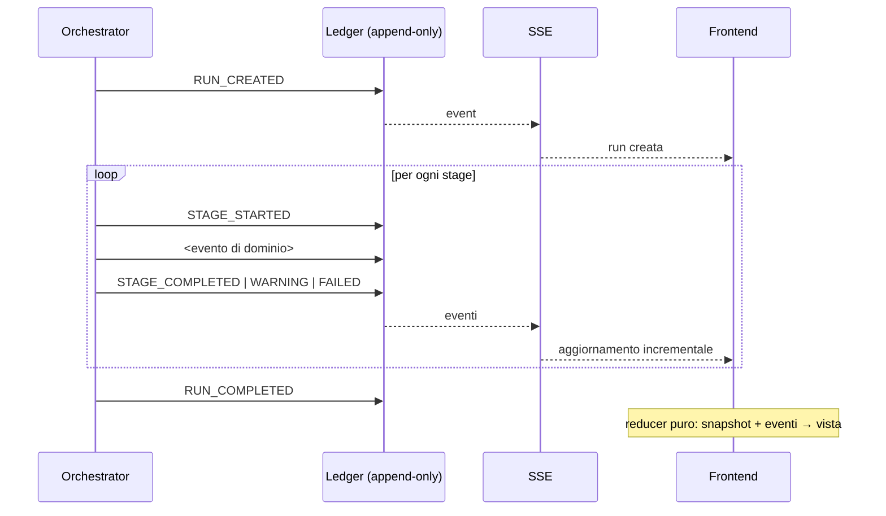

# Pipeline event model — contratto congelato (Fase B)

Fonte architetturale:
[`2026-08-04-verifiable-pipeline-design.md`](../superpowers/specs/2026-08-04-verifiable-pipeline-design.md) §9.

## 1. Principio

L'event log è **la** fonte di verità della run. Snapshot REST e vista frontend
sono proiezioni derivate. Le tre nozioni restano distinte, come già fa lo strato
di controllo esistente:

| Nozione | Dove vive | Mutabile |
|---|---|---|
| evento storico | `agent_events` (append-only) | mai |
| stato corrente | vista derivata, ricostruita | sì, ricalcolabile |
| output canonico | dossier / stage output | versionato |

## 2. Riuso: cosa esiste già

`backend/pipeline/agentic/ledger_schema.py` (schema v2) fornisce già:

| Colonna | Requisito §7 del prompt |
|---|---|
| `event_id` (UNIQUE) | event_id |
| `run_id` | run_id |
| `sequence` (PK con run_id) | ordinamento |
| `event_type` | event_type |
| `actor` + `tool_name` + `tool_version` | producer |
| `created_at` | timestamp |
| `payload_hash` | payload hash |
| `parent_action_id` | causation |
| `generating_action_id` | lineage / correlation |
| `payload_json` (sanitizzato) | payload redatto |
| `previous_hash` + `event_hash` (UNIQUE) | integrità |
| trigger `no_update` / `no_delete` | append-only |

Garanzie già attive: hash-chain verificabile (`verify_chain`, esposta da
`GET /api/v1/agent-runs/{run_id}`), redazione segreti **prima** della scrittura
(`sanitize_text`), bounding payload (`MAX_EVENT_PAYLOAD_BYTES = 64_000`,
`MAX_TEXT_FIELD_CHARS = 600`), scarto di `abstract`/`full_text`/`body`,
omissione mai silenziosa (`omitted_records`, `payload_truncated`).

**Non si riscrive nulla di tutto questo.**

## 3. Unica lacuna: `stage_id` — risolta **senza** migrazione

### 3.1 Perché non si migra a v3

La Fase B proponeva una migrazione additiva v2 → v3 che aggiungesse le colonne
`stage_id` e `stage_type`. **È stata annullata dopo verifica**, per un motivo
che vale la pena registrare.

`benchmarks/mtb_evidence/final_experiment/systems_v1.json` contiene un
`source_manifest` che sigilla gli SHA-256 di **120 sorgenti di runtime**, fra
cui `backend/pipeline/agentic/ledger.py` e `ledger_schema.py`. Il test
`backend/tests/test_final_experiment_harness.py::test_every_frozen_input_validates`
ricalcola quei digest e fallisce se un solo byte cambia.

Quel manifest è il record che attesta **quale codice ha prodotto i risultati
dell'esperimento comparativo finale**. Modificare i file sigillati rompe il
sigillo; aggiornare i digest per far ripassare il test equivarrebbe a dichiarare
che l'esperimento congelato è stato prodotto da codice che allora non esisteva.
È falsificazione del record sperimentale, e ricade nella §27 del prompt.

### 3.2 L'identità di stage viaggia nel payload

`EventLedger.append()` accetta già un `payload` arbitrario, e `payload_json`
**entra nel preimage dell'hash** (`_hash_event_v2`, riga 128). Quindi:

```python
ledger.append(
    run_id, "STAGE_COMPLETED", "casecontext_match_verifier",
    {"stage_id": "stage_3_casecontext_match",
     "stage_type": "CASECONTEXT_MATCH_VERIFIER",
     "essential_fields_pass": True},
    tool_name="casecontext_match_verifier",
    tool_version="end-to-end-pilot-casecontext/1.0",
)
```

`stage_id` è protetto **esattamente quanto lo sarebbe una colonna**: alterarlo
cambia `payload_json`, quindi `event_hash`, quindi rompe la catena. La proprietà
di tamper-evidence è identica.

Costo reale: si perde l'indice SQL `(run_id, stage_id)`. Con run da qualche
decina di eventi, il filtro in Python su `events(run_id)` è irrilevante.

Beneficio: **zero modifiche a file sigillati**, nessun terzo preimage da
mantenere, nessun rischio sull'archivio di audit condiviso col runtime agentico.

### 3.3 Cosa resta invariato

Lo schema v2 copre già tutto il resto della §7. Il research runtime usa un file
di ledger separato via `AGENT_LEDGER_PATH` (`ledger.py:45`, già configurabile),
così non contamina quello agentico.

**Nessun file sigillato viene toccato in tutta la Fase C.**

## 4. Vocabolario eventi

Il vocabolario attuale (`control/events.py`) è quello V2/agentico
(`plan_decision`, `tool_started`, …) e **resta invariato**: serve al percorso
esistente. Il research runtime aggiunge il proprio, in
`backend/research_pipeline/events.py`.

### 4.1 Eventi di run e stage

| Costante | Quando |
|---|---|
| `RUN_CREATED` | run registrata, prima di ogni stage |
| `STAGE_STARTED` | ingresso in uno stage |
| `STAGE_COMPLETED` | uscita con successo |
| `STAGE_WARNING` | successo con warning |
| `STAGE_FAILED` | fallimento |
| `STAGE_SKIPPED` | stage non eseguito (pipeline fermata a monte) |
| `RUN_COMPLETED` | esito finale |

### 4.2 Eventi di dominio

Emessi **in aggiunta** a `STAGE_COMPLETED`, non al suo posto: portano il
risultato specifico dello stage.

| Costante | Stage | Payload essenziale |
|---|---|---|
| `CASECONTEXT_PARSED` | 2 | `case_context`, `schema_version`, `transport_result` |
| `CASECONTEXT_VERIFIED` | 3 | `records[]`, `essential_fields_pass`, `warnings[]` |
| `RETRIEVAL_COMPLETED` | 4 | query deterministica, filtri, repository |
| `CANDIDATES_FOUND` | 5 | `candidate_id[]`, esclusi, `no_match` |
| `DOCUMENT_RESOLVED` | 6 | `document_id`, `availability`, `replayed: true` |
| `SOURCE_UNIT_MATERIALIZED` | 7 | `source_unit_id`, locatori, `content_hash` |
| `PAPER_SELECTED` | 8 | selezionati (≤2), esclusi, criterio |
| `ENRICHMENT_PROPOSED` | 9 | `QUOTE`/`ABSTAIN`, `source_unit_id`, modello, prompt/transport version |
| `ENRICHMENT_VALIDATED` | 10 | `outcome` (10 valori), reason code |
| `GATES_COMPUTED` | 11 | `support_mask`, `direction_consistencies` |
| `STATUS_ASSIGNED` | 12 | `status`, `gate_bucket`, `warnings[]` |
| `DOSSIER_BUILT` | 13 | `dossier_id`, conteggi, `limitations[]` |

`NARRATION_GENERATED` e `NARRATION_VERIFIED` sono definiti nel vocabolario ma
**mai emessi**: stage 14–15 sono `NOT_IMPLEMENTED`. Definirli senza emetterli
tiene il contratto stabile senza simulare esecuzione.

### 4.3 Producer

Ogni evento porta il producer, distinguendo chi ha prodotto il risultato:

```json
{"kind": "DETERMINISTIC | LLM | HYBRID",
 "component": "casecontext_match_verifier",
 "version": "end-to-end-pilot-casecontext/1.0",
 "model": null, "prompt_version": null}
```

`kind: LLM` **solo** per gli stage 2 e 9. Ogni altro stage è `DETERMINISTIC`.
Questa è la proprietà che il relatore deve poter leggere direttamente
dall'evento.

## 5. Redazione — regole aggiuntive del research runtime

Oltre a quanto già garantito da `sanitize_text` e `_bound_value`:

1. **mai** il testo del documento ottenuto unendo indice SourceUnit e document
   store. L'evento porta locatori e `content_hash`, non testo;
2. la `author_claim_quote` è ammessa: è già validata e bounded a
   `MAX_TEXT_FIELD_CHARS`;
3. il testo clinico libero in input è dato sintetico, quindi ammesso, ma
   `_bound_value` lo tronca comunque a 600 caratteri;
4. **nessun chain-of-thought**: sono ammessi solo `prompt_version`, tool call,
   output strutturato, `abstention_reason`, reason code. Il thinking interno del
   modello non entra nel payload, e quindi non può comparire in UI.

## 6. Cosa il replay deve ricostruire

`REPLAYABLE_EVENT_TYPES` esistente contiene solo `TOOL_COMPLETED`. Per il
research runtime l'insieme replayabile è quello degli eventi di dominio §4.2:
da essi la vista della run deve essere ricostruibile senza rileggere gli output
degli stage.

Test di contratto richiesto: `replay(events) == snapshot`, verificato su almeno
un caso completato e un caso fermato.

## 7. Diagramma


