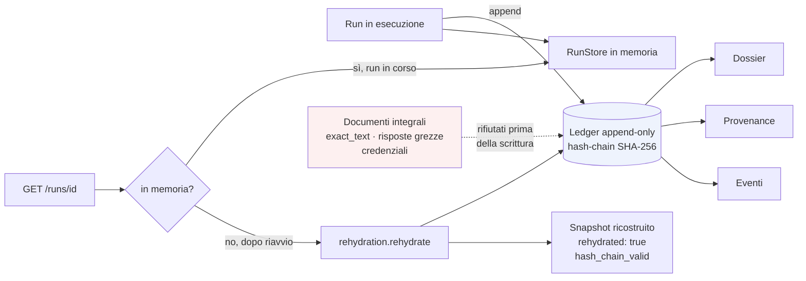

# Persistenza e riapertura delle run

**VERIFIABLE RESEARCH PIPELINE — NOT CLINICALLY VALIDATED.**

## 1. Il problema

`RunStore` era un `dict` in memoria. Un riavvio del backend lo azzerava, e
`GET /runs/{id}` rispondeva 404 — **compresi gli eventi**, che erano su disco con
la catena di hash integra, perché anche quella rotta passava prima dal registro
in memoria.

La fonte canonica esisteva già ed era verificabile. Mancava la proiezione.

## 2. La scelta: derivare, non duplicare

Il ledger append-only (`EventLedger`, SQLite con trigger e hash-chain SHA-256) è
la fonte di verità. La vista della run è **ricalcolata a ogni lettura** dagli
eventi.

Non esiste un file di snapshot da tenere allineato. Se una vista memorizzata e gli
eventi divergessero, sarebbe la vista a essere sbagliata; ricalcolarla rende la
divergenza impossibile per costruzione.

`events.REPLAYABLE_EVENT_TYPES` dichiarava già questa proprietà come contratto.
Ora è esercitata.

## 3. `EventLedger` è sigillato

`agentic/ledger.py` compare in `benchmarks/mtb_evidence/final_experiment/
systems_v1.json`. Non è modificabile e non espone un metodo per elencare le run.

`rehydration.list_run_ids()` esegue quindi una lettura SQL diretta e in **sola
lettura** (`file:…?mode=ro`) sullo stesso file:

```sql
SELECT run_id, MIN(sequence) AS first_seq FROM agent_events
GROUP BY run_id ORDER BY first_seq DESC
```

Nessun byte del modulo sigillato è toccato.

## 4. Cosa serviva negli eventi

Perché la ricostruzione fosse fedele, alcuni campi sono stati aggiunti ai payload:

| Evento | Campi aggiunti | Perché |
|---|---|---|
| `RUN_CREATED` | `input_text` (troncato), `requested_execution_mode`, `document_cache` | senza, una run reidratata non direbbe da quale domanda è partita né come è stata eseguita |
| `STAGE_*` | `warnings`, `errors`, `metrics`, `lineage`, `sequence`, `execution_mode`, `artifact_origin` | ciò che non è nell'evento non sopravvive al processo |
| `RUN_COMPLETED` | `llm_calls`, riepilogo di modalità | valore canonico, non ricalcolabile in lettura |

L'ultimo punto ha corretto un difetto reale: `llm_calls` veniva ricalcolato
sommando le metriche degli stage, il che escludeva il parser — che non
contribuisce ad alcuna metrica di stage — e contava come reali le chiamate
rigiocate. La stessa run riportava due numeri diversi a seconda di dove la si
leggeva.

## 5. Ricostruzione di uno stage

- l'**esito** viene dall'evento terminale (`STAGE_COMPLETED` / `WARNING` /
  `FAILED` / `SKIPPED`);
- l'**`output_preview`** viene dall'evento di dominio, per differenza rispetto
  alle chiavi di servizio;
- `started_at` da `STAGE_STARTED`.

La forma restituita è identica a `PipelineRun.to_dict()`: un client non deve
poter distinguere una run in memoria da una reidratata, altrimenti la persistenza
diventerebbe un secondo contratto da mantenere.

## 6. Run interrotte

Una run i cui eventi si fermano prima di `RUN_COMPLETED` — processo ucciso,
riavvio a metà — è marcata:

```json
{ "recovery_status": "RECOVERED_INCOMPLETE",
  "stages_recorded": 1, "stages_missing": ["stage_2_…", "…"] }
```

Non è dichiarata `FAILED` come esito della pipeline: la pipeline non ha prodotto
quell'esito. Gli stage già registrati restano visibili — sono ciò che la run ha
davvero prodotto prima di sparire.

## 7. Cosa non viene persistito

Documenti integrali · `exact_text` completo · risposte grezze del modello ·
credenziali.

La garanzia è ereditata, non ridichiarata: `events.assert_payload_is_publishable`
rifiuta ricorsivamente testo documentale e ragionamento interno **prima** della
scrittura, e un ledger append-only non consente di rimuovere ciò che vi è già
entrato.

Persistiti: ID, hash, preview redatte (≤ 180 caratteri), output strutturati,
quote accettate, summary, reason code, metriche, lineage, dossier.

Un test legge il file SQLite grezzo e verifica che non contenga `full_text`,
`document_text`, `source_text`, `thinking`, `reasoning`, `Bearer ` né
`OLLAMA_API_KEY`.

## 8. Flusso



## 9. Verificato

Test automatici (13 in `test_run_persistence.py`) e prova manuale con riavvio
reale del processo backend:

```
prima:  status COMPLETED · LIVE · fully_live true · 15 stage · rehydrated false
        ↓ processo terminato e riavviato
dopo:   status COMPLETED · LIVE · fully_live true · 15 stage · rehydrated true
        recovery COMPLETE · hash_chain_valid true · stages_missing []
        dossier 200 · provenance 200 · events 200
        /runs elenca 5 run, tutte reidratate
```

## 10. Riferimenti

- `backend/research_pipeline/rehydration.py`
- `backend/research_pipeline/run_store.py` → `snapshot()`, `list_all()`
- `backend/research_pipeline/tests/test_run_persistence.py`
