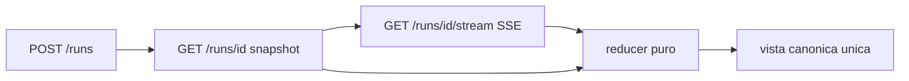

# SSE contract (Fase B)

Endpoint: `GET /api/v1/research/pipeline/runs/{run_id}/stream`
Content-Type: `text/event-stream`

Oggi **nessun endpoint SSE esiste** nel repository: non c'è alcun
`text/event-stream` né `EventSourceResponse`. Questo contratto è quindi
interamente **[NUOVO]**.

## 1. Formato

Un evento SSE per ogni evento del ledger. `id` = `sequence` del ledger, che è
monotono per run: questo rende `Last-Event-ID` direttamente utilizzabile per il
resume, senza mappature aggiuntive.

```
id: 12
event: STAGE_COMPLETED
data: {"event_id":"…","sequence":12,"stage_id":"stage_3_casecontext_match",
       "event_type":"STAGE_COMPLETED","created_at":"…","payload_hash":"…",
       "producer":{"kind":"DETERMINISTIC","component":"casecontext_match_verifier",
                   "version":"…","model":null,"prompt_version":null},
       "payload":{…}}
```

Il `data` è **identico** al record restituito da `GET /runs/{run_id}/events`.
Una sola forma dell'evento: nessuna trasformazione specifica del trasporto, così
il reducer del frontend è unico e testabile su entrambe le fonti.

## 2. Resume

Il client invia `Last-Event-ID: <sequence>`. Il server riprende da
`sequence > Last-Event-ID`.

Se l'header è assente il server invia **l'intero storico** della run e poi
prosegue in tempo reale. Questo rende lo stream sufficiente da solo dopo un
refresh, e risponde al criterio §22 "un refresh non perde la trace".

Su run già conclusa: lo storico viene inviato, poi `RUN_COMPLETED`, poi lo
stream si chiude. Nessuna connessione tenuta aperta inutilmente.

## 3. Heartbeat

Commento SSE ogni 15 secondi:

```
: heartbeat
```

Serve a distinguere una run lenta da una connessione morta senza introdurre
polling. Non è un evento e non entra nel reducer.

## 4. Chiusura

| Condizione | Comportamento |
|---|---|
| `RUN_COMPLETED` emesso | invio evento, poi chiusura |
| run `FAILED` | `RUN_COMPLETED` con `status: FAILED`, poi chiusura |
| run `STOPPED` | `RUN_COMPLETED` con `status: STOPPED` e `stopped_at`, poi chiusura |
| flag disattivato | `404` prima di aprire lo stream |
| run inesistente | `404` |

Una run STOPPED chiude lo stream normalmente: l'arresto è un esito, non un
guasto del trasporto.

## 5. Obblighi del client

1. **deduplicare per `event_id`** — un resume può rinviare un evento già visto;
2. **ordinare per `sequence`**, mai per timestamp;
3. **riconnettere** con backoff esponenziale (1s, 2s, 4s, 8s, max 30s) inviando
   `Last-Event-ID`;
4. **smontare il listener** allo unmount del componente: la §4 del prompt
   segnala esplicitamente gli SSE listener non smontati come difetto da
   eliminare;
5. **non fare polling** in parallelo allo stream;
6. **non simulare eventi**: se lo stream cade e la riconnessione fallisce, la UI
   mostra lo stato di connessione persa, non una run che avanza da sola.

## 6. Rapporto con REST



Lo snapshot dà lo stato iniziale; lo stream dà gli incrementi. Il reducer è la
**stessa funzione** in entrambi i casi:

```
stato = eventi.reduce(applica, snapshot)
```

Test di contratto richiesto: applicare gli eventi allo snapshot deve produrre
esattamente lo snapshot finale ottenuto da `GET /runs/{run_id}` a run conclusa.
È la verifica che frontend e backend non divergano.

## 7. Sicurezza

Valgono le regole di `pipeline_event_model.md` §5: nessun testo documentale,
nessun chain-of-thought, payload sanitizzati e bounded **prima** della scrittura
sul ledger — quindi prima ancora di raggiungere lo stream. Lo stream non applica
redazione propria: trasmette ciò che è già stato reso sicuro alla fonte.
